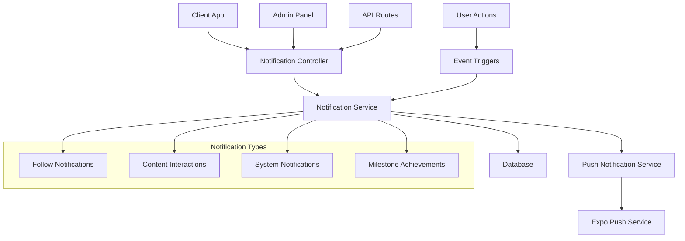

# Notification System Documentation

## Table of Contents

1. [Overview](#overview)
2. [Architecture](#architecture)
3. [Models](#models)
4. [Services](#services)
5. [Controllers](#controllers)
6. [Routes](#routes)
7. [API Endpoints](#api-endpoints)
8. [Implementation Examples](#implementation-examples)
9. [Best Practices](#best-practices)
10. [Troubleshooting](#troubleshooting)
11. [Configuration](#configuration)

## Overview

The Jevah App notification system provides comprehensive in-app and push notification capabilities. It supports multiple notification types, user preferences, device token management, and both individual and bulk notification sending.

### Key Features

- **In-app notifications**: Stored in database with read/unread status
- **Push notifications**: Real-time notifications via Expo Push Service
- **User preferences**: Granular control over notification types
- **Device token management**: Automatic registration and cleanup
- **Bulk operations**: Send to multiple users or all users
- **Rich metadata**: Support for custom data and actions
- **Priority levels**: Low, medium, and high priority notifications

## Architecture



### Components

1. **Notification Model**: MongoDB schema for storing notifications
2. **Notification Service**: Business logic for creating and managing notifications
3. **Push Notification Service**: Handles Expo push notification delivery
4. **Controllers**: HTTP request handlers
5. **Routes**: API endpoint definitions
6. **Middleware**: Authentication and rate limiting

## Models

### Notification Model (`src/models/notification.model.ts`)

```typescript
interface INotification extends Document {
  user: mongoose.Types.ObjectId; // Reference to User
  title: string; // Notification title
  message: string; // Notification message
  isRead: boolean; // Read status (default: false)
  type?: string; // Type: "media", "devotional", "system"
  relatedId?: mongoose.Types.ObjectId; // Related content ID
  createdAt: Date; // Auto-generated timestamp
}
```

**Schema Fields:**

- `user`: Required reference to User model
- `title`: Required string, trimmed
- `message`: Required string
- `isRead`: Boolean, defaults to false
- `type`: Enum with values ["media", "devotional", "system"]
- `relatedId`: Optional ObjectId for related content
- `createdAt`: Auto-generated timestamp (no updatedAt)

### User Model Push Notification Fields

```typescript
interface User {
  pushNotifications?: {
    enabled: boolean; // Global push notification toggle
    deviceTokens: string[]; // Array of Expo push tokens
    preferences: {
      // Notification type preferences
      newFollowers?: boolean;
      mediaLikes?: boolean;
      mediaComments?: boolean;
      mediaShares?: boolean;
      merchPurchases?: boolean;
      songDownloads?: boolean;
      subscriptionUpdates?: boolean;
      securityAlerts?: boolean;
      liveStreams?: boolean;
      newMessages?: boolean;
    };
  };
}
```

## Services

### Notification Service (`src/service/notification.service.ts`)

The main service for creating and managing notifications.

#### Core Methods

##### `createNotification(data: CreateNotificationData)`

Creates both in-app and push notifications.

```typescript
interface CreateNotificationData {
  userId: string;
  type: string;
  title: string;
  message: string;
  metadata?: any;
  priority?: "low" | "medium" | "high";
  relatedId?: string;
}
```

**Process:**

1. Creates in-app notification in database
2. Sends push notification via PushNotificationService
3. Logs success/failure

##### Specialized Notification Methods

- `notifyUserFollow(followerId, followingId)` - New follower notifications
- `notifyContentLike(likerId, contentId, contentType)` - Content like notifications
- `notifyContentComment(commenterId, contentId, contentType, commentText)` - Comment notifications
- `notifyContentDownload(downloaderId, contentId, contentType)` - Download notifications
- `notifyContentBookmark(bookmarkerId, contentId, contentType)` - Bookmark notifications
- `notifyMerchPurchase(buyerId, sellerId, merchItem)` - Purchase notifications
- `notifyMilestone(userId, milestone, count)` - Achievement notifications

##### Utility Methods

- `markAsRead(notificationId, userId)` - Mark single notification as read
- `markAllAsRead(userId)` - Mark all user notifications as read
- `getUserNotifications(userId, page, limit, type)` - Get paginated notifications

### Push Notification Service (`src/service/pushNotification.service.ts`)

Handles Expo push notification delivery and device token management.

#### Core Methods

##### Device Token Management

- `registerDeviceToken(userId, deviceToken)` - Register new device token
- `unregisterDeviceToken(userId, deviceToken)` - Remove device token
- `cleanupInvalidTokens()` - Remove invalid tokens

##### Notification Delivery

- `sendToUser(userId, notification, notificationType)` - Send to single user
- `sendToUsers(userIds, notification, notificationType)` - Send to multiple users
- `sendToRole(role, notification, notificationType)` - Send to users with specific role
- `sendToAll(notification, notificationType)` - Send to all users

##### User Preferences

- `updatePreferences(userId, preferences)` - Update notification preferences
- `setEnabled(userId, enabled)` - Enable/disable push notifications

##### Analytics

- `getStats()` - Get push notification statistics

## Controllers

### Notification Controller (`src/controllers/notification.controller.ts`)

Handles HTTP requests for in-app notifications.

#### Methods

##### `getNotifications(request, response)`

- **Route**: `GET /api/notifications`
- **Auth**: Required
- **Description**: Get user's notifications (limited to 100, sorted by creation date)
- **Response**: Array of notifications

##### `markNotificationAsRead(request, response)`

- **Route**: `PATCH /api/notifications/:id`
- **Auth**: Required
- **Description**: Mark specific notification as read
- **Response**: Updated notification or 404 if not found

##### `markAllNotificationsAsRead(request, response)`

- **Route**: `PATCH /api/notifications/mark-all-read`
- **Auth**: Required
- **Description**: Mark all user notifications as read
- **Response**: Success message

### Push Notification Controller (`src/controllers/pushNotification.controller.ts`)

Handles HTTP requests for push notification management.

#### User Methods

##### `registerDeviceToken(request, response)`

- **Route**: `POST /api/push-notifications/register`
- **Auth**: Required
- **Body**: `{ deviceToken: string }`
- **Description**: Register device token for push notifications

##### `unregisterDeviceToken(request, response)`

- **Route**: `POST /api/push-notifications/unregister`
- **Auth**: Required
- **Body**: `{ deviceToken: string }`
- **Description**: Remove device token

##### `updatePreferences(request, response)`

- **Route**: `PUT /api/push-notifications/preferences`
- **Auth**: Required
- **Body**: `PushNotificationPreferences`
- **Description**: Update notification type preferences

##### `setEnabled(request, response)`

- **Route**: `PUT /api/push-notifications/enabled`
- **Auth**: Required
- **Body**: `{ enabled: boolean }`
- **Description**: Enable/disable push notifications

##### `sendTestNotification(request, response)`

- **Route**: `POST /api/push-notifications/test`
- **Auth**: Required
- **Body**: `{ title?: string, body?: string, data?: any }`
- **Description**: Send test notification to current user

#### Admin Methods

##### `getStats(request, response)`

- **Route**: `GET /api/push-notifications/stats`
- **Auth**: Required
- **Description**: Get push notification statistics

##### `cleanupInvalidTokens(request, response)`

- **Route**: `POST /api/push-notifications/cleanup`
- **Auth**: Required
- **Description**: Clean up invalid device tokens

##### `sendToUsers(request, response)`

- **Route**: `POST /api/push-notifications/send-to-users`
- **Auth**: Required
- **Body**: `{ userIds: string[], notification: PushNotificationData }`
- **Description**: Send notification to specific users

##### `sendToAll(request, response)`

- **Route**: `POST /api/push-notifications/send-to-all`
- **Auth**: Required
- **Body**: `{ notification: PushNotificationData }`
- **Description**: Send notification to all users

## Routes

### Notification Routes (`src/routes/notifications.routes.ts`)

```typescript
// GET /api/notifications - Fetch user notifications
router.get("/", verifyToken, getNotifications);

// PATCH /api/notifications/:id - Mark notification as read
router.patch("/:id", verifyToken, markNotificationAsRead);

// PATCH /api/notifications/mark-all-read - Mark all as read
router.patch("/mark-all-read", verifyToken, markAllNotificationsAsRead);
```

### Push Notification Routes (`src/routes/pushNotification.routes.ts`)

```typescript
// User endpoints
router.post("/register", verifyToken, apiRateLimiter, registerDeviceToken);
router.post("/unregister", verifyToken, apiRateLimiter, unregisterDeviceToken);
router.put("/preferences", verifyToken, apiRateLimiter, updatePreferences);
router.put("/enabled", verifyToken, apiRateLimiter, setEnabled);
router.post("/test", verifyToken, apiRateLimiter, sendTestNotification);

// Admin endpoints
router.get("/stats", verifyToken, apiRateLimiter, getStats);
router.post("/cleanup", verifyToken, apiRateLimiter, cleanupInvalidTokens);
router.post("/send-to-users", verifyToken, apiRateLimiter, sendToUsers);
router.post("/send-to-all", verifyToken, apiRateLimiter, sendToAll);
```

## API Endpoints

### In-App Notifications

#### Get Notifications

```http
GET /api/notifications
Authorization: Bearer <token>
```

**Response:**

```json
{
  "success": true,
  "notifications": [
    {
      "_id": "notification_id",
      "user": "user_id",
      "title": "New Follower",
      "message": "John Doe started following you",
      "isRead": false,
      "type": "follow",
      "relatedId": null,
      "createdAt": "2024-01-15T10:30:00Z"
    }
  ]
}
```

#### Mark Notification as Read

```http
PATCH /api/notifications/:id
Authorization: Bearer <token>
```

**Response:**

```json
{
  "success": true,
  "message": "Notification marked as read",
  "notification": {
    "_id": "notification_id",
    "isRead": true
    // ... other fields
  }
}
```

#### Mark All Notifications as Read

```http
PATCH /api/notifications/mark-all-read
Authorization: Bearer <token>
```

**Response:**

```json
{
  "success": true,
  "message": "All notifications marked as read"
}
```

### Push Notifications

#### Register Device Token

```http
POST /api/push-notifications/register
Authorization: Bearer <token>
Content-Type: application/json

{
  "deviceToken": "ExponentPushToken[xxxxxxxxxxxxxxxxxxxxxx]"
}
```

**Response:**

```json
{
  "success": true,
  "message": "Device token registered successfully"
}
```

#### Update Preferences

```http
PUT /api/push-notifications/preferences
Authorization: Bearer <token>
Content-Type: application/json

{
  "newFollowers": true,
  "mediaLikes": false,
  "mediaComments": true,
  "mediaShares": false,
  "merchPurchases": true,
  "songDownloads": true,
  "subscriptionUpdates": true,
  "securityAlerts": true,
  "liveStreams": false,
  "newMessages": true
}
```

**Response:**

```json
{
  "success": true,
  "message": "Push notification preferences updated successfully"
}
```

#### Send Test Notification

```http
POST /api/push-notifications/test
Authorization: Bearer <token>
Content-Type: application/json

{
  "title": "Test Notification",
  "body": "This is a test message",
  "data": {
    "test": true,
    "timestamp": "2024-01-15T10:30:00Z"
  }
}
```

#### Get Statistics (Admin)

```http
GET /api/push-notifications/stats
Authorization: Bearer <token>
```

**Response:**

```json
{
  "success": true,
  "data": {
    "totalUsers": 1500,
    "usersWithPushEnabled": 1200,
    "totalDeviceTokens": 1800,
    "usersWithTokens": 1200
  }
}
```

#### Send to All Users (Admin)

```http
POST /api/push-notifications/send-to-all
Authorization: Bearer <token>
Content-Type: application/json

{
  "notification": {
    "title": "Important Update",
    "body": "We have an important announcement for all users",
    "data": {
      "type": "announcement",
      "action": "view_details"
    },
    "priority": "high"
  }
}
```

**Response:**

```json
{
  "success": true,
  "message": "Push notifications sent to all users",
  "data": {
    "successCount": 1150,
    "errorCount": 50
  }
}
```

## Implementation Examples

### Creating a Custom Notification

```typescript
import { NotificationService } from "../service/notification.service";

// Create a custom notification
const notification = await NotificationService.createNotification({
  userId: "user_id_here",
  type: "custom",
  title: "Welcome to Jevah!",
  message: "Thank you for joining our community",
  metadata: {
    welcomeBonus: true,
    actionUrl: "/welcome",
  },
  priority: "high",
});
```

### Triggering Notifications from User Actions

```typescript
// In your media controller when a user likes content
export const likeMedia = async (req: Request, res: Response) => {
  try {
    const { mediaId } = req.params;
    const userId = req.userId;

    // Your existing like logic...

    // Trigger notification
    await NotificationService.notifyContentLike(userId, mediaId, "media");

    res.json({ success: true });
  } catch (error) {
    res.status(500).json({ success: false, message: "Error liking media" });
  }
};
```

### Setting Up Push Notifications in Frontend

```typescript
// Register for push notifications
import * as Notifications from "expo-notifications";

const registerForPushNotifications = async () => {
  const { status: existingStatus } = await Notifications.getPermissionsAsync();
  let finalStatus = existingStatus;

  if (existingStatus !== "granted") {
    const { status } = await Notifications.requestPermissionsAsync();
    finalStatus = status;
  }

  if (finalStatus !== "granted") {
    alert("Failed to get push token for push notification!");
    return;
  }

  const token = (await Notifications.getExpoPushTokenAsync()).data;

  // Send token to backend
  await fetch("/api/push-notifications/register", {
    method: "POST",
    headers: {
      "Content-Type": "application/json",
      Authorization: `Bearer ${userToken}`,
    },
    body: JSON.stringify({ deviceToken: token }),
  });
};
```

### Handling Notification Preferences

```typescript
// Update user preferences
const updateNotificationPreferences = async (preferences: any) => {
  await fetch("/api/push-notifications/preferences", {
    method: "PUT",
    headers: {
      "Content-Type": "application/json",
      Authorization: `Bearer ${userToken}`,
    },
    body: JSON.stringify(preferences),
  });
};

// Example usage
await updateNotificationPreferences({
  newFollowers: true,
  mediaLikes: false,
  mediaComments: true,
  // ... other preferences
});
```

## Best Practices

### 1. Notification Timing

- **Immediate**: Critical notifications (security alerts, purchases)
- **Batched**: Social interactions (likes, follows) - consider batching
- **Scheduled**: Marketing notifications during user's active hours

### 2. Content Guidelines

- **Title**: Keep under 50 characters for mobile display
- **Message**: Keep under 100 characters for quick reading
- **Action**: Include clear call-to-action when applicable

### 3. User Experience

- **Respect preferences**: Always check user's notification preferences
- **Avoid spam**: Implement rate limiting for notifications
- **Provide value**: Ensure notifications are relevant and actionable

### 4. Error Handling

- **Graceful degradation**: Continue app functionality if notifications fail
- **Logging**: Log all notification attempts for debugging
- **Retry logic**: Implement retry for failed push notifications

### 5. Performance

- **Database indexing**: Index notification queries by user and createdAt
- **Pagination**: Always paginate notification lists
- **Cleanup**: Regularly clean up old notifications

### 6. Security

- **Token validation**: Validate Expo push tokens before storing
- **User verification**: Ensure users can only manage their own notifications
- **Rate limiting**: Implement rate limiting on notification endpoints

## Troubleshooting

### Common Issues

#### 1. Push Notifications Not Received

**Symptoms:**

- Notifications created in database but not received on device
- No error logs in push notification service

**Solutions:**

- Verify device token is valid: `Expo.isExpoPushToken(token)`
- Check user's push notification preferences
- Ensure user has push notifications enabled
- Verify Expo access token is valid
- Check device's notification permissions

**Debug Steps:**

```typescript
// Check if user has valid tokens
const user = await User.findById(userId);
console.log("User push settings:", user.pushNotifications);

// Test with a simple notification
await PushNotificationService.sendToUser(userId, {
  title: "Test",
  body: "Test message",
  priority: "high",
});
```

#### 2. Invalid Device Tokens

**Symptoms:**

- Push notification errors in logs
- Tokens marked as invalid by Expo

**Solutions:**

- Run cleanup: `POST /api/push-notifications/cleanup`
- Implement automatic token refresh in frontend
- Handle token expiration gracefully

#### 3. Database Performance Issues

**Symptoms:**

- Slow notification queries
- High database load

**Solutions:**

- Add database indexes:
  ```javascript
  // Add to notification model
  notificationSchema.index({ user: 1, createdAt: -1 });
  notificationSchema.index({ user: 1, isRead: 1 });
  ```
- Implement notification archiving for old notifications
- Use pagination for notification lists

#### 4. Rate Limiting Issues

**Symptoms:**

- 429 Too Many Requests errors
- Notifications blocked by rate limiter

**Solutions:**

- Adjust rate limiter settings
- Implement exponential backoff
- Batch notifications when possible

### Debugging Tools

#### 1. Notification Statistics

```http
GET /api/push-notifications/stats
```

Monitor notification delivery rates and user engagement.

#### 2. Test Notifications

```http
POST /api/push-notifications/test
```

Send test notifications to verify setup.

#### 3. Log Analysis

Check application logs for:

- Notification creation success/failure
- Push notification delivery status
- Device token registration issues
- User preference changes

### Monitoring

#### Key Metrics to Monitor

- **Delivery Rate**: Percentage of successful push notifications
- **Open Rate**: Percentage of notifications that are opened
- **Token Health**: Percentage of valid device tokens
- **User Engagement**: Notification interaction rates

#### Alerts to Set Up

- High failure rate for push notifications
- Sudden drop in valid device tokens
- Database performance issues with notifications
- Rate limiting threshold exceeded

## Configuration

### Environment Variables

```bash
# Expo Push Service
EXPO_ACCESS_TOKEN=your_expo_access_token_here

# Database
MONGODB_URI=mongodb://localhost:27017/jevah_app

# Rate Limiting
RATE_LIMIT_WINDOW_MS=900000  # 15 minutes
RATE_LIMIT_MAX_REQUESTS=100
```

### Database Indexes

```javascript
// Add these indexes to your MongoDB
db.notifications.createIndex({ user: 1, createdAt: -1 });
db.notifications.createIndex({ user: 1, isRead: 1 });
db.notifications.createIndex({ type: 1, createdAt: -1 });
db.notifications.createIndex({ createdAt: 1 }, { expireAfterSeconds: 2592000 }); // 30 days
```

### Rate Limiting Configuration

```typescript
// In your rate limiter middleware
const notificationRateLimiter = rateLimit({
  windowMs: 15 * 60 * 1000, // 15 minutes
  max: 50, // Limit each IP to 50 requests per windowMs
  message: "Too many notification requests, please try again later.",
});
```

### Push Notification Settings

```typescript
// Expo configuration
const expo = new Expo({
  accessToken: process.env.EXPO_ACCESS_TOKEN,
  useFcmV1: true, // Use FCM v1 API for better reliability
});
```

---

## Support

For additional support or questions about the notification system:

1. Check the troubleshooting section above
2. Review application logs for error details
3. Test with the provided test endpoints
4. Monitor notification statistics for patterns

The notification system is designed to be robust and scalable, supporting both individual and bulk notification scenarios while respecting user preferences and providing comprehensive error handling.
