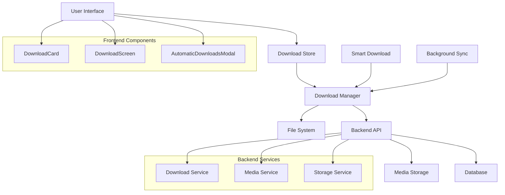

# Offline Download Integration Guide

## Overview

This guide provides comprehensive documentation for integrating the offline download functionality between your React Native frontend and Node.js backend. It covers the complete flow from content discovery to offline playback.

## Table of Contents

1. [Architecture Overview](#architecture-overview)
2. [Backend API Endpoints](#backend-api-endpoints)
3. [Frontend Download Store](#frontend-download-store)
4. [Download Flow Implementation](#download-flow-implementation)
5. [Offline Playback System](#offline-playback-system)
6. [Smart Download Feature](#smart-download-feature)
7. [Error Handling & Recovery](#error-handling--recovery)
8. [Testing & Debugging](#testing--debugging)

## Architecture Overview



## Backend API Endpoints

### Download Management Endpoints

```typescript
// src/routes/downloads.routes.ts
import { Router } from "express";
import { verifyToken } from "../middleware/auth.middleware";
import { apiRateLimiter } from "../middleware/rateLimiter";
import {
  initiateDownload,
  getDownloadStatus,
  pauseDownload,
  resumeDownload,
  cancelDownload,
  getUserDownloads,
  deleteDownload,
  getDownloadUrl,
} from "../controllers/download.controller";

const router = Router();

// POST /api/downloads/initiate - Start download process
router.post("/initiate", verifyToken, apiRateLimiter, initiateDownload);

// GET /api/downloads/status/:id - Get download status
router.get("/status/:id", verifyToken, getDownloadStatus);

// PATCH /api/downloads/pause/:id - Pause download
router.patch("/pause/:id", verifyToken, pauseDownload);

// PATCH /api/downloads/resume/:id - Resume download
router.patch("/resume/:id", verifyToken, resumeDownload);

// DELETE /api/downloads/cancel/:id - Cancel download
router.delete("/cancel/:id", verifyToken, cancelDownload);

// GET /api/downloads/user - Get user's downloads
router.get("/user", verifyToken, getUserDownloads);

// DELETE /api/downloads/:id - Delete downloaded content
router.delete("/:id", verifyToken, deleteDownload);

// GET /api/downloads/url/:id - Get secure download URL
router.get("/url/:id", verifyToken, getDownloadUrl);

export default router;
```

### Download Controller Implementation

```typescript
// src/controllers/download.controller.ts
import { Request, Response } from "express";
import { DownloadService } from "../service/download.service";
import logger from "../utils/logger";

export interface DownloadRequest {
  contentId: string;
  contentType: "video" | "audio" | "ebook" | "live";
  quality?: "low" | "medium" | "high";
  format?: "mp4" | "mp3" | "pdf";
}

export interface DownloadResponse {
  downloadId: string;
  status: "pending" | "downloading" | "completed" | "failed" | "paused";
  progress: number;
  fileUrl?: string;
  fileSize?: number;
  estimatedTime?: number;
}

/**
 * Initiate download process
 */
export const initiateDownload = async (
  req: Request,
  res: Response
): Promise<void> => {
  try {
    const userId = req.userId;
    const { contentId, contentType, quality, format }: DownloadRequest =
      req.body;

    if (!contentId || !contentType) {
      res.status(400).json({
        success: false,
        message: "Content ID and type are required",
      });
      return;
    }

    const download = await DownloadService.initiateDownload({
      userId,
      contentId,
      contentType,
      quality: quality || "medium",
      format: format || "mp4",
    });

    res.status(201).json({
      success: true,
      data: download,
    });
  } catch (error) {
    logger.error("Initiate download error:", error);
    res.status(500).json({
      success: false,
      message: "Failed to initiate download",
    });
  }
};

/**
 * Get download status
 */
export const getDownloadStatus = async (
  req: Request,
  res: Response
): Promise<void> => {
  try {
    const userId = req.userId;
    const downloadId = req.params.id;

    const status = await DownloadService.getDownloadStatus(userId, downloadId);

    if (!status) {
      res.status(404).json({
        success: false,
        message: "Download not found",
      });
      return;
    }

    res.status(200).json({
      success: true,
      data: status,
    });
  } catch (error) {
    logger.error("Get download status error:", error);
    res.status(500).json({
      success: false,
      message: "Failed to get download status",
    });
  }
};

/**
 * Get user's downloads
 */
export const getUserDownloads = async (
  req: Request,
  res: Response
): Promise<void> => {
  try {
    const userId = req.userId;
    const { page = 1, limit = 20, type } = req.query;

    const downloads = await DownloadService.getUserDownloads(
      userId,
      parseInt(page as string),
      parseInt(limit as string),
      type as string
    );

    res.status(200).json({
      success: true,
      data: downloads,
    });
  } catch (error) {
    logger.error("Get user downloads error:", error);
    res.status(500).json({
      success: false,
      message: "Failed to get downloads",
    });
  }
};

/**
 * Get secure download URL
 */
export const getDownloadUrl = async (
  req: Request,
  res: Response
): Promise<void> => {
  try {
    const userId = req.userId;
    const downloadId = req.params.id;

    const downloadUrl = await DownloadService.getSecureDownloadUrl(
      userId,
      downloadId
    );

    if (!downloadUrl) {
      res.status(404).json({
        success: false,
        message: "Download not found or expired",
      });
      return;
    }

    res.status(200).json({
      success: true,
      data: { downloadUrl },
    });
  } catch (error) {
    logger.error("Get download URL error:", error);
    res.status(500).json({
      success: false,
      message: "Failed to get download URL",
    });
  }
};

/**
 * Delete download
 */
export const deleteDownload = async (
  req: Request,
  res: Response
): Promise<void> => {
  try {
    const userId = req.userId;
    const downloadId = req.params.id;

    await DownloadService.deleteDownload(userId, downloadId);

    res.status(200).json({
      success: true,
      message: "Download deleted successfully",
    });
  } catch (error) {
    logger.error("Delete download error:", error);
    res.status(500).json({
      success: false,
      message: "Failed to delete download",
    });
  }
};
```

## Frontend Download Store

### Enhanced Download Store Implementation

```typescript
// store/useDownloadStore.ts
import { create } from "zustand";
import { persist, createJSONStorage } from "zustand/middleware";
import AsyncStorage from "@react-native-async-storage/async-storage";
import { notificationService } from "../services/notificationService";

export interface DownloadItem {
  id: string;
  contentId: string;
  title: string;
  description: string;
  author: string;
  contentType: "video" | "audio" | "ebook" | "live";
  fileUrl: string;
  thumbnailUrl?: string;
  fileSize?: string;
  duration?: number;
  quality: "low" | "medium" | "high";
  format: "mp4" | "mp3" | "pdf";
  status: "pending" | "downloading" | "completed" | "failed" | "paused";
  progress: number;
  downloadedAt: string;
  lastModified: string;
  localPath?: string;
  metadata?: {
    resolution?: string;
    bitrate?: string;
    codec?: string;
  };
}

interface DownloadState {
  downloadedItems: DownloadItem[];
  activeDownloads: Map<string, DownloadItem>;
  isLoaded: boolean;
  smartDownloadEnabled: boolean;
  wifiOnlyDownloads: boolean;
  autoDownloadPreferences: {
    categories: string[];
    quality: "low" | "medium" | "high";
    maxStorage: number; // in MB
  };
}

interface DownloadActions {
  // Core actions
  addDownload: (item: DownloadItem) => void;
  updateDownload: (id: string, updates: Partial<DownloadItem>) => void;
  removeFromDownloads: (id: string) => Promise<void>;
  loadDownloadedItems: () => Promise<void>;

  // Download management
  initiateDownload: (contentId: string, contentType: string) => Promise<void>;
  pauseDownload: (id: string) => Promise<void>;
  resumeDownload: (id: string) => Promise<void>;
  cancelDownload: (id: string) => Promise<void>;

  // Smart download
  setSmartDownloadEnabled: (enabled: boolean) => void;
  updateAutoDownloadPreferences: (
    preferences: Partial<DownloadState["autoDownloadPreferences"]>
  ) => void;

  // Utility
  getDownloadById: (id: string) => DownloadItem | undefined;
  getDownloadsByType: (type: string) => DownloadItem[];
  clearAllDownloads: () => Promise<void>;
}

export const useDownloadStore = create<DownloadState & DownloadActions>()(
  persist(
    (set, get) => ({
      // Initial state
      downloadedItems: [],
      activeDownloads: new Map(),
      isLoaded: false,
      smartDownloadEnabled: false,
      wifiOnlyDownloads: true,
      autoDownloadPreferences: {
        categories: ["video", "audio"],
        quality: "medium",
        maxStorage: 1000, // 1GB
      },

      // Core actions
      addDownload: (item: DownloadItem) => {
        set(state => ({
          downloadedItems: [item, ...state.downloadedItems],
        }));
      },

      updateDownload: (id: string, updates: Partial<DownloadItem>) => {
        set(state => ({
          downloadedItems: state.downloadedItems.map(item =>
            item.id === id
              ? { ...item, ...updates, lastModified: new Date().toISOString() }
              : item
          ),
        }));
      },

      removeFromDownloads: async (id: string) => {
        try {
          const item = get().downloadedItems.find(d => d.id === id);
          if (item?.localPath) {
            // Delete local file
            await FileSystem.deleteAsync(item.localPath, { idempotent: true });
          }

          set(state => ({
            downloadedItems: state.downloadedItems.filter(
              item => item.id !== id
            ),
          }));

          // Notify backend
          await fetch(`${API_BASE_URL}/api/downloads/${id}`, {
            method: "DELETE",
            headers: {
              Authorization: `Bearer ${await authUtils.getStoredToken()}`,
            },
          });
        } catch (error) {
          console.error("Failed to remove download:", error);
        }
      },

      loadDownloadedItems: async () => {
        try {
          set({ isLoaded: false });

          const token = await authUtils.getStoredToken();
          if (!token) return;

          const response = await fetch(`${API_BASE_URL}/api/downloads/user`, {
            headers: {
              Authorization: `Bearer ${token}`,
            },
          });

          if (response.ok) {
            const data = await response.json();
            const downloads = data.data.downloads || [];

            // Merge with local storage
            set(state => ({
              downloadedItems: [
                ...downloads,
                ...state.downloadedItems.filter(
                  local => !downloads.find(remote => remote.id === local.id)
                ),
              ],
              isLoaded: true,
            }));
          } else {
            set({ isLoaded: true });
          }
        } catch (error) {
          console.error("Failed to load downloads:", error);
          set({ isLoaded: true });
        }
      },

      // Download management
      initiateDownload: async (contentId: string, contentType: string) => {
        try {
          const token = await authUtils.getStoredToken();
          if (!token) return;

          const response = await fetch(
            `${API_BASE_URL}/api/downloads/initiate`,
            {
              method: "POST",
              headers: {
                "Content-Type": "application/json",
                Authorization: `Bearer ${token}`,
              },
              body: JSON.stringify({
                contentId,
                contentType,
                quality: get().autoDownloadPreferences.quality,
              }),
            }
          );

          if (response.ok) {
            const data = await response.json();
            const downloadItem: DownloadItem = {
              id: data.data.downloadId,
              contentId,
              title: data.data.title || "Unknown Title",
              description: data.data.description || "",
              author: data.data.author || "Unknown Author",
              contentType: contentType as any,
              fileUrl: data.data.fileUrl || "",
              thumbnailUrl: data.data.thumbnailUrl,
              fileSize: data.data.fileSize,
              duration: data.data.duration,
              quality: data.data.quality || "medium",
              format: data.data.format || "mp4",
              status: data.data.status || "pending",
              progress: data.data.progress || 0,
              downloadedAt: new Date().toISOString(),
              lastModified: new Date().toISOString(),
            };

            get().addDownload(downloadItem);

            // Start monitoring download progress
            get().monitorDownloadProgress(downloadItem.id);
          }
        } catch (error) {
          console.error("Failed to initiate download:", error);
        }
      },

      pauseDownload: async (id: string) => {
        try {
          const token = await authUtils.getStoredToken();
          await fetch(`${API_BASE_URL}/api/downloads/pause/${id}`, {
            method: "PATCH",
            headers: {
              Authorization: `Bearer ${token}`,
            },
          });

          get().updateDownload(id, { status: "paused" });
        } catch (error) {
          console.error("Failed to pause download:", error);
        }
      },

      resumeDownload: async (id: string) => {
        try {
          const token = await authUtils.getStoredToken();
          await fetch(`${API_BASE_URL}/api/downloads/resume/${id}`, {
            method: "PATCH",
            headers: {
              Authorization: `Bearer ${token}`,
            },
          });

          get().updateDownload(id, { status: "downloading" });
          get().monitorDownloadProgress(id);
        } catch (error) {
          console.error("Failed to resume download:", error);
        }
      },

      cancelDownload: async (id: string) => {
        try {
          const token = await authUtils.getStoredToken();
          await fetch(`${API_BASE_URL}/api/downloads/cancel/${id}`, {
            method: "DELETE",
            headers: {
              Authorization: `Bearer ${token}`,
            },
          });

          get().removeFromDownloads(id);
        } catch (error) {
          console.error("Failed to cancel download:", error);
        }
      },

      // Smart download
      setSmartDownloadEnabled: (enabled: boolean) => {
        set({ smartDownloadEnabled: enabled });

        if (enabled) {
          // Start smart download monitoring
          get().startSmartDownloadMonitoring();
        } else {
          // Stop smart download monitoring
          get().stopSmartDownloadMonitoring();
        }
      },

      updateAutoDownloadPreferences: preferences => {
        set(state => ({
          autoDownloadPreferences: {
            ...state.autoDownloadPreferences,
            ...preferences,
          },
        }));
      },

      // Utility functions
      getDownloadById: (id: string) => {
        return get().downloadedItems.find(item => item.id === id);
      },

      getDownloadsByType: (type: string) => {
        return get().downloadedItems.filter(item => item.contentType === type);
      },

      clearAllDownloads: async () => {
        try {
          // Delete all local files
          for (const item of get().downloadedItems) {
            if (item.localPath) {
              await FileSystem.deleteAsync(item.localPath, {
                idempotent: true,
              });
            }
          }

          set({ downloadedItems: [] });
        } catch (error) {
          console.error("Failed to clear downloads:", error);
        }
      },

      // Internal methods
      monitorDownloadProgress: async (downloadId: string) => {
        const interval = setInterval(async () => {
          try {
            const token = await authUtils.getStoredToken();
            const response = await fetch(
              `${API_BASE_URL}/api/downloads/status/${downloadId}`,
              {
                headers: {
                  Authorization: `Bearer ${token}`,
                },
              }
            );

            if (response.ok) {
              const data = await response.json();
              const status = data.data;

              get().updateDownload(downloadId, {
                status: status.status,
                progress: status.progress,
                fileUrl: status.fileUrl,
                fileSize: status.fileSize,
              });

              if (status.status === "completed" || status.status === "failed") {
                clearInterval(interval);

                if (status.status === "completed") {
                  // Download completed notification
                  await notificationService.createNotification({
                    userId: await authUtils.getCurrentUserId(),
                    type: "download_complete",
                    title: "Download Complete",
                    message: `Your download has finished successfully`,
                    metadata: { downloadId },
                  });
                }
              }
            }
          } catch (error) {
            console.error("Failed to monitor download progress:", error);
            clearInterval(interval);
          }
        }, 2000); // Check every 2 seconds
      },

      startSmartDownloadMonitoring: () => {
        // Implementation for smart download monitoring
        // This would monitor user behavior and automatically download content
        console.log("Smart download monitoring started");
      },

      stopSmartDownloadMonitoring: () => {
        // Stop smart download monitoring
        console.log("Smart download monitoring stopped");
      },
    }),
    {
      name: "download-store",
      storage: createJSONStorage(() => AsyncStorage),
      partialize: state => ({
        downloadedItems: state.downloadedItems,
        smartDownloadEnabled: state.smartDownloadEnabled,
        autoDownloadPreferences: state.autoDownloadPreferences,
      }),
    }
  )
);
```

## Download Flow Implementation

### Download Manager Service

```typescript
// services/downloadManager.ts
import * as FileSystem from "expo-file-system";
import { API_BASE_URL } from "../config/api";
import { authUtils } from "../utils/authUtils";

export class DownloadManager {
  private static instance: DownloadManager;
  private activeDownloads: Map<string, AbortController> = new Map();

  static getInstance(): DownloadManager {
    if (!DownloadManager.instance) {
      DownloadManager.instance = new DownloadManager();
    }
    return DownloadManager.instance;
  }

  async downloadFile(
    downloadId: string,
    fileUrl: string,
    fileName: string,
    onProgress?: (progress: number) => void
  ): Promise<string> {
    try {
      const token = await authUtils.getStoredToken();
      if (!token) throw new Error("No authentication token");

      // Create abort controller for cancellation
      const abortController = new AbortController();
      this.activeDownloads.set(downloadId, abortController);

      // Get secure download URL from backend
      const secureUrlResponse = await fetch(
        `${API_BASE_URL}/api/downloads/url/${downloadId}`,
        {
          headers: {
            Authorization: `Bearer ${token}`,
          },
        }
      );

      if (!secureUrlResponse.ok) {
        throw new Error("Failed to get secure download URL");
      }

      const { downloadUrl } = await secureUrlResponse.json();

      // Create local file path
      const localPath = `${FileSystem.documentDirectory}downloads/${fileName}`;

      // Ensure downloads directory exists
      await FileSystem.makeDirectoryAsync(
        `${FileSystem.documentDirectory}downloads/`,
        { intermediates: true }
      );

      // Download file with progress tracking
      const downloadResult = await FileSystem.downloadAsync(
        downloadUrl,
        localPath,
        {
          headers: {
            Authorization: `Bearer ${token}`,
          },
        }
      );

      if (downloadResult.status === 200) {
        this.activeDownloads.delete(downloadId);
        return localPath;
      } else {
        throw new Error(
          `Download failed with status: ${downloadResult.status}`
        );
      }
    } catch (error) {
      this.activeDownloads.delete(downloadId);
      throw error;
    }
  }

  async cancelDownload(downloadId: string): Promise<void> {
    const abortController = this.activeDownloads.get(downloadId);
    if (abortController) {
      abortController.abort();
      this.activeDownloads.delete(downloadId);
    }
  }

  async getFileInfo(filePath: string): Promise<{
    size: number;
    exists: boolean;
    uri: string;
  }> {
    try {
      const info = await FileSystem.getInfoAsync(filePath);
      return {
        size: info.size || 0,
        exists: info.exists,
        uri: info.uri,
      };
    } catch (error) {
      return {
        size: 0,
        exists: false,
        uri: "",
      };
    }
  }

  async deleteFile(filePath: string): Promise<void> {
    try {
      await FileSystem.deleteAsync(filePath, { idempotent: true });
    } catch (error) {
      console.error("Failed to delete file:", error);
    }
  }
}
```

## Offline Playback System

### Enhanced DownloadCard Component

```typescript
// components/DownloadCard.tsx
import React, { useState, useRef, useEffect } from 'react';
import {
  View,
  Text,
  TouchableOpacity,
  Image,
  Alert,
} from 'react-native';
import { Audio, ResizeMode, Video } from 'expo-av';
import { Pause, Play, Volume2, Trash2, Download } from 'lucide-react-native';
import Ionicons from 'react-native-vector-icons/Ionicons';
import { useDownloadStore } from '../store/useDownloadStore';
import { DownloadManager } from '../services/downloadManager';

interface DownloadCardProps {
  item: DownloadItem;
  onDelete?: (id: string) => void;
}

export const DownloadCard: React.FC<DownloadCardProps> = ({ item, onDelete }) => {
  const [isPlaying, setIsPlaying] = useState(false);
  const [isMuted, setIsMuted] = useState(false);
  const [progress, setProgress] = useState(0);
  const [duration, setDuration] = useState(0);
  const [position, setPosition] = useState(0);
  const [isDownloading, setIsDownloading] = useState(false);

  const videoRef = useRef<Video>(null);
  const audioRef = useRef<Audio.Sound>(null);
  const downloadManager = DownloadManager.getInstance();

  const { updateDownload, removeFromDownloads } = useDownloadStore();

  const isVideo = item.contentType === 'video';
  const isAudio = item.contentType === 'audio';

  useEffect(() => {
    return () => {
      if (audioRef.current) {
        audioRef.current.unloadAsync();
      }
    };
  }, []);

  const handleDownload = async () => {
    if (item.status === 'completed' && item.localPath) {
      Alert.alert('Already Downloaded', 'This content is already available offline');
      return;
    }

    try {
      setIsDownloading(true);

      const fileName = `${item.id}.${item.format}`;
      const localPath = await downloadManager.downloadFile(
        item.id,
        item.fileUrl,
        fileName,
        (progress) => {
          updateDownload(item.id, { progress });
        }
      );

      updateDownload(item.id, {
        status: 'completed',
        localPath,
        progress: 100,
      });

      Alert.alert('Success', 'Download completed successfully');
    } catch (error) {
      console.error('Download failed:', error);
      updateDownload(item.id, { status: 'failed' });
      Alert.alert('Error', 'Download failed. Please try again.');
    } finally {
      setIsDownloading(false);
    }
  };

  const handleDelete = async () => {
    Alert.alert(
      'Delete Download',
      'Are you sure you want to delete this download?',
      [
        { text: 'Cancel', style: 'cancel' },
        {
          text: 'Delete',
          style: 'destructive',
          onPress: async () => {
            await removeFromDownloads(item.id);
            onDelete?.(item.id);
          },
        },
      ]
    );
  };

  const togglePlay = async () => {
    try {
      if (isVideo) {
        if (isPlaying) {
          await videoRef.current?.pauseAsync();
        } else {
          await videoRef.current?.playAsync();
        }
        setIsPlaying(!isPlaying);
      } else if (isAudio) {
        if (isPlaying) {
          await audioRef.current?.pauseAsync();
        } else {
          if (!audioRef.current) {
            const { sound } = await Audio.Sound.createAsync(
              { uri: item.localPath || item.fileUrl },
              { shouldPlay: true }
            );
            audioRef.current = sound;
            sound.setOnPlaybackStatusUpdate((status) => {
              if (status.isLoaded) {
                setProgress(status.positionMillis / status.durationMillis);
                setPosition(status.positionMillis);
                setDuration(status.durationMillis);
                if (status.didJustFinish) {
                  setIsPlaying(false);
                  setProgress(0);
                  setPosition(0);
                }
              }
            });
          } else {
            await audioRef.current.playAsync();
          }
        }
        setIsPlaying(!isPlaying);
      }
    } catch (error) {
      console.error('Error toggling playback:', error);
      Alert.alert('Playback Error', 'Failed to play media');
    }
  };

  const toggleMute = async () => {
    try {
      if (isVideo) {
        await videoRef.current?.setIsMutedAsync(!isMuted);
      } else if (isAudio) {
        await audioRef.current?.setVolumeAsync(isMuted ? 1 : 0);
      }
      setIsMuted(!isMuted);
    } catch (error) {
      console.error('Error toggling mute:', error);
    }
  };

  const formatTime = (milliseconds: number) => {
    const totalSeconds = Math.floor(milliseconds / 1000);
    const minutes = Math.floor(totalSeconds / 60);
    const seconds = totalSeconds % 60;
    return `${minutes}:${seconds.toString().padStart(2, '0')}`;
  };

  const getStatusColor = () => {
    switch (item.status) {
      case 'completed': return '#256E63';
      case 'downloading': return '#F59E0B';
      case 'failed': return '#EF4444';
      case 'paused': return '#6B7280';
      default: return '#6B7280';
    }
  };

  return (
    <View className="mb-5 flex-row w-[362px] gap-6 justify-between">
      {/* Thumbnail/Video/Audio Display */}
      <View className="w-[60px] h-[72px] rounded-xl overflow-hidden">
        {isVideo && item.status === 'completed' ? (
          <Video
            ref={videoRef}
            source={{ uri: item.localPath || item.fileUrl }}
            style={{ width: "100%", height: "100%" }}
            resizeMode={ResizeMode.COVER}
            useNativeControls={false}
            isMuted={isMuted}
            onPlaybackStatusUpdate={(status) => {
              if (status.isLoaded) {
                setProgress(status.positionMillis / status.durationMillis);
                setPosition(status.positionMillis);
                setDuration(status.durationMillis);
                setIsPlaying(status.isPlaying);
                if (status.didJustFinish) {
                  setIsPlaying(false);
                  setProgress(0);
                  setPosition(0);
                }
              }
            }}
          />
        ) : (
          <Image
            source={
              item.thumbnailUrl
                ? { uri: item.thumbnailUrl }
                : require("../../assets/images/1.png")
            }
            className="w-full h-full"
            resizeMode="cover"
          />
        )}
      </View>

      <View className="flex-col w-[268px]">
        <Text className="mt-2 font-rubik-semibold text-[16px] text-[#1D2939]">
          {item.title}
        </Text>
        <Text
          className="text-[#667085] text-sm mt-2 font-rubik"
          numberOfLines={2}
        >
          {item.description}
        </Text>

        {/* Download Progress */}
        {item.status === 'downloading' && (
          <View className="mt-2">
            <View className="w-full h-2 bg-gray-200 rounded-full">
              <View
                className="h-2 bg-[#256E63] rounded-full"
                style={{ width: `${item.progress}%` }}
              />
            </View>
            <Text className="text-xs text-gray-500 mt-1">
              {Math.round(item.progress)}% downloaded
            </Text>
          </View>
        )}

        {/* Playback Controls */}
        {(item.status === 'completed' && (isVideo || isAudio)) && (
          <View className="flex-row items-center mt-3">
            <TouchableOpacity className="mr-3" onPress={togglePlay}>
              {isPlaying ? (
                <Pause size={18} color="black" />
              ) : (
                <Play size={18} color="black" />
              )}
            </TouchableOpacity>

            {/* Progress Bar */}
            <View className="flex-1 mr-3">
              <View className="w-[200px] h-1 bg-gray-300 rounded-full">
                <View
                  className="h-1 bg-black rounded-full"
                  style={{ width: `${progress * 100}%` }}
                />
              </View>
              {duration > 0 && (
                <View className="flex-row justify-between mt-1">
                  <Text className="text-xs text-gray-500 font-rubik">
                    {formatTime(position)}
                  </Text>
                  <Text className="text-xs text-gray-500 font-rubik">
                    {formatTime(duration)}
                  </Text>
                </View>
              )}
            </View>

            <TouchableOpacity onPress={toggleMute}>
              <Volume2
                size={18}
                color={isMuted ? "gray" : "black"}
              />
            </TouchableOpacity>
          </View>
        )}

        {/* Action Buttons */}
        <View className="flex-row items-center justify-between mt-3">
          <View className="flex-row items-center">
            {item.status !== 'completed' && (
              <TouchableOpacity
                onPress={handleDownload}
                disabled={isDownloading}
                className="mr-3"
              >
                <Download
                  size={16}
                  color={isDownloading ? "gray" : "#256E63"}
                />
              </TouchableOpacity>
            )}

            <TouchableOpacity onPress={handleDelete}>
              <Trash2 size={16} color="#EF4444" />
            </TouchableOpacity>
          </View>

          {/* Status & Metadata */}
          <View className="flex-row items-center">
            <View className="flex-row items-center">
              <Ionicons name="time-outline" size={12} color="#667085" />
              <Text className="ml-1 text-xs text-[#667085] font-rubik">
                {new Date(item.downloadedAt).toLocaleDateString()}
              </Text>
            </View>
            <View className="w-1 h-1 bg-orange-300 mx-2 rounded-sm" />
            <View className="flex-row items-center">
              <Ionicons name="document-outline" size={12} color="#667085" />
              <Text className="ml-1 text-xs text-[#667085] font-rubik">
                {item.fileSize || "Unknown"}
              </Text>
            </View>
            <View className="w-1 h-1 bg-orange-300 mx-2 rounded-sm" />
            <View className="flex-row items-center">
              <Ionicons name="checkmark-circle-outline" size={12} color={getStatusColor()} />
              <Text className="ml-1 text-xs font-rubik-semibold" style={{ color: getStatusColor() }}>
                {item.status.toUpperCase()}
              </Text>
            </View>
          </View>
        </View>
      </View>
    </View>
  );
};
```

## Smart Download Feature

### Smart Download Service

```typescript
// services/smartDownloadService.ts
import NetInfo from "@react-native-netinfo/netinfo";
import { useDownloadStore } from "../store/useDownloadStore";
import { notificationService } from "./notificationService";

export class SmartDownloadService {
  private static instance: SmartDownloadService;
  private isMonitoring = false;
  private monitoringInterval: NodeJS.Timeout | null = null;

  static getInstance(): SmartDownloadService {
    if (!SmartDownloadService.instance) {
      SmartDownloadService.instance = new SmartDownloadService();
    }
    return SmartDownloadService.instance;
  }

  async startMonitoring(): Promise<void> {
    if (this.isMonitoring) return;

    this.isMonitoring = true;
    console.log("Smart download monitoring started");

    // Monitor network changes
    NetInfo.addEventListener(state => {
      if (state.isConnected && state.type === "wifi") {
        this.processPendingDownloads();
      }
    });

    // Periodic check for new content to download
    this.monitoringInterval = setInterval(() => {
      this.checkForNewContent();
    }, 30000); // Check every 30 seconds
  }

  stopMonitoring(): void {
    if (this.monitoringInterval) {
      clearInterval(this.monitoringInterval);
      this.monitoringInterval = null;
    }
    this.isMonitoring = false;
    console.log("Smart download monitoring stopped");
  }

  private async processPendingDownloads(): Promise<void> {
    try {
      const store = useDownloadStore.getState();
      const pendingDownloads = store.downloadedItems.filter(
        item => item.status === "pending" || item.status === "paused"
      );

      for (const download of pendingDownloads) {
        await store.resumeDownload(download.id);
      }
    } catch (error) {
      console.error("Failed to process pending downloads:", error);
    }
  }

  private async checkForNewContent(): Promise<void> {
    try {
      // This would integrate with your content recommendation system
      // to automatically download content based on user preferences
      const store = useDownloadStore.getState();

      if (!store.smartDownloadEnabled) return;

      // Check if user is on WiFi
      const netInfo = await NetInfo.fetch();
      if (!netInfo.isConnected || netInfo.type !== "wifi") return;

      // Check available storage
      const availableStorage = await this.getAvailableStorage();
      if (availableStorage < 100) return; // Less than 100MB available

      // Get recommended content for auto-download
      const recommendedContent = await this.getRecommendedContent();

      for (const content of recommendedContent) {
        if (store.autoDownloadPreferences.categories.includes(content.type)) {
          await store.initiateDownload(content.id, content.type);
        }
      }
    } catch (error) {
      console.error("Failed to check for new content:", error);
    }
  }

  private async getAvailableStorage(): Promise<number> {
    try {
      const info = await FileSystem.getFreeDiskStorageAsync();
      return info / (1024 * 1024); // Convert to MB
    } catch (error) {
      console.error("Failed to get storage info:", error);
      return 0;
    }
  }

  private async getRecommendedContent(): Promise<any[]> {
    // This would call your recommendation API
    // For now, return empty array
    return [];
  }
}
```

## Error Handling & Recovery

### Download Error Handler

```typescript
// utils/downloadErrorHandler.ts
export class DownloadErrorHandler {
  static handleError(error: any, downloadId: string): void {
    console.error("Download error:", error);

    const errorMessages = {
      NETWORK_ERROR:
        "Network connection lost. Download will resume when connection is restored.",
      STORAGE_FULL:
        "Insufficient storage space. Please free up some space and try again.",
      FILE_CORRUPTED:
        "Downloaded file is corrupted. Please delete and re-download.",
      AUTHENTICATION_FAILED: "Authentication failed. Please log in again.",
      SERVER_ERROR: "Server error occurred. Please try again later.",
      TIMEOUT:
        "Download timed out. Please check your connection and try again.",
    };

    const errorType = this.getErrorType(error);
    const message = errorMessages[errorType] || "An unexpected error occurred.";

    // Update download status
    const store = useDownloadStore.getState();
    store.updateDownload(downloadId, {
      status: "failed",
      metadata: {
        ...store.getDownloadById(downloadId)?.metadata,
        error: errorType,
        errorMessage: message,
      },
    });

    // Show user notification
    Alert.alert("Download Failed", message, [
      { text: "OK" },
      { text: "Retry", onPress: () => store.resumeDownload(downloadId) },
    ]);
  }

  private static getErrorType(error: any): string {
    if (error.message?.includes("network")) return "NETWORK_ERROR";
    if (error.message?.includes("storage")) return "STORAGE_FULL";
    if (error.message?.includes("corrupt")) return "FILE_CORRUPTED";
    if (error.message?.includes("auth")) return "AUTHENTICATION_FAILED";
    if (error.message?.includes("timeout")) return "TIMEOUT";
    if (error.status >= 500) return "SERVER_ERROR";
    return "UNKNOWN_ERROR";
  }
}
```

## Testing & Debugging

### Download Test Suite

```typescript
// utils/downloadTests.ts
import { useDownloadStore } from "../store/useDownloadStore";
import { DownloadManager } from "../services/downloadManager";

export const runDownloadTests = async () => {
  console.log("🧪 Running download tests...");

  try {
    // Test 1: Store initialization
    console.log("Test 1: Store initialization");
    const store = useDownloadStore.getState();
    console.log("✅ Store initialized:", store.isLoaded);

    // Test 2: Add download
    console.log("Test 2: Add download");
    const testDownload = {
      id: "test-1",
      contentId: "content-1",
      title: "Test Video",
      description: "Test description",
      author: "Test Author",
      contentType: "video" as const,
      fileUrl: "https://example.com/test.mp4",
      thumbnailUrl: "https://example.com/thumb.jpg",
      fileSize: "10MB",
      duration: 120,
      quality: "medium" as const,
      format: "mp4" as const,
      status: "pending" as const,
      progress: 0,
      downloadedAt: new Date().toISOString(),
      lastModified: new Date().toISOString(),
    };

    store.addDownload(testDownload);
    console.log("✅ Download added");

    // Test 3: Update download
    console.log("Test 3: Update download");
    store.updateDownload("test-1", { progress: 50, status: "downloading" });
    console.log("✅ Download updated");

    // Test 4: Get download by ID
    console.log("Test 4: Get download by ID");
    const retrievedDownload = store.getDownloadById("test-1");
    console.log("✅ Download retrieved:", retrievedDownload?.title);

    // Test 5: Filter downloads by type
    console.log("Test 5: Filter downloads by type");
    const videoDownloads = store.getDownloadsByType("video");
    console.log("✅ Video downloads:", videoDownloads.length);

    // Test 6: Download manager
    console.log("Test 6: Download manager");
    const downloadManager = DownloadManager.getInstance();
    console.log("✅ Download manager initialized");

    // Test 7: File system operations
    console.log("Test 7: File system operations");
    const testPath = `${FileSystem.documentDirectory}test.txt`;
    await FileSystem.writeAsStringAsync(testPath, "test content");
    const fileInfo = await downloadManager.getFileInfo(testPath);
    console.log("✅ File operations:", fileInfo.exists);

    // Cleanup
    await FileSystem.deleteAsync(testPath, { idempotent: true });
    store.removeFromDownloads("test-1");

    console.log("🎉 All download tests passed!");
  } catch (error) {
    console.error("❌ Download tests failed:", error);
  }
};
```

This comprehensive guide provides everything needed to implement the offline download functionality with your existing UI, including backend API endpoints, frontend store management, download progress tracking, smart download features, and error handling.
