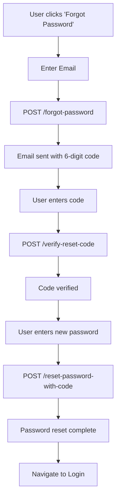

# 🔐 React Native Password Reset & Forgot Password Implementation Guide

## 📋 Overview

This guide provides a complete implementation for password reset and forgot password functionality in your React Native application using the Jevah backend API. The flow consists of three main steps:

1. **Forgot Password** - Request a verification code
2. **Verify Code** - Validate the received code
3. **Reset Password** - Set new password

---

## 🌐 API Base URL

```
https://jevahapp-backend.onrender.com/api/auth
```

---

## 🔄 Complete Flow Overview



---

## 📡 API Endpoints

### 1. **Forgot Password (Step 1)**

**Endpoint:** `POST /auth/forgot-password`

**Purpose:** Initiates password reset by sending a 6-digit verification code to user's email.

#### Request Body:

```typescript
interface ForgotPasswordRequest {
  email: string;
}
```

#### Response:

```typescript
// Success (200)
{
  "success": true,
  "message": "Password reset code sent to your email"
}

// User Not Found (404)
{
  "success": false,
  "message": "User not found"
}

// Rate Limited (429)
{
  "success": false,
  "message": "Too many requests. Please try again later."
}
```

### 2. **Verify Reset Code (Step 2)**

**Endpoint:** `POST /auth/verify-reset-code`

**Purpose:** Validates the 6-digit verification code sent to user's email.

#### Request Body:

```typescript
interface VerifyResetCodeRequest {
  email: string;
  code: string; // 6-digit verification code
}
```

#### Response:

```typescript
// Success (200)
{
  "success": true,
  "message": "Reset code verified successfully"
}

// Invalid/Expired Code (400)
{
  "success": false,
  "message": "Invalid or expired reset code"
}
```

### 3. **Reset Password (Step 3)**

**Endpoint:** `POST /auth/reset-password-with-code`

**Purpose:** Sets the new password after successful code verification.

#### Request Body:

```typescript
interface ResetPasswordRequest {
  email: string;
  code: string; // 6-digit verification code
  newPassword: string; // Minimum 6 characters
}
```

#### Response:

```typescript
// Success (200)
{
  "success": true,
  "message": "Password reset successfully"
}

// Invalid/Expired Code (400)
{
  "success": false,
  "message": "Invalid or expired reset code"
}

// Weak Password (400)
{
  "success": false,
  "message": "Password must be at least 6 characters long"
}
```

---

## 🛠️ Complete React Native Implementation

### 1. **API Service Class**

```typescript
// services/authService.ts
class AuthService {
  private baseURL: string = "https://jevahapp-backend.onrender.com/api/auth";

  async forgotPassword(email: string) {
    try {
      const response = await fetch(`${this.baseURL}/forgot-password`, {
        method: "POST",
        headers: {
          "Content-Type": "application/json",
        },
        body: JSON.stringify({ email }),
      });

      const data = await response.json();
      return { success: response.ok, data };
    } catch (error) {
      return { success: false, error: "Network error occurred" };
    }
  }

  async verifyResetCode(email: string, code: string) {
    try {
      const response = await fetch(`${this.baseURL}/verify-reset-code`, {
        method: "POST",
        headers: {
          "Content-Type": "application/json",
        },
        body: JSON.stringify({ email, code }),
      });

      const data = await response.json();
      return { success: response.ok, data };
    } catch (error) {
      return { success: false, error: "Network error occurred" };
    }
  }

  async resetPasswordWithCode(
    email: string,
    code: string,
    newPassword: string
  ) {
    try {
      const response = await fetch(`${this.baseURL}/reset-password-with-code`, {
        method: "POST",
        headers: {
          "Content-Type": "application/json",
        },
        body: JSON.stringify({
          email,
          code,
          newPassword,
        }),
      });

      const data = await response.json();
      return { success: response.ok, data };
    } catch (error) {
      return { success: false, error: "Network error occurred" };
    }
  }
}

export default new AuthService();
```

### 2. **Forgot Password Screen**

```typescript
// screens/ForgotPasswordScreen.tsx
import React, { useState } from 'react';
import {
  View,
  Text,
  TextInput,
  TouchableOpacity,
  StyleSheet,
  Alert,
  ActivityIndicator,
  KeyboardAvoidingView,
  Platform,
} from 'react-native';
import authService from '../services/authService';

const ForgotPasswordScreen = ({ navigation }) => {
  const [email, setEmail] = useState('');
  const [loading, setLoading] = useState(false);

  const validateEmail = (email: string) => {
    const emailRegex = /^[^\s@]+@[^\s@]+\.[^\s@]+$/;
    return emailRegex.test(email);
  };

  const handleForgotPassword = async () => {
    if (!email.trim()) {
      Alert.alert('Error', 'Please enter your email address');
      return;
    }

    if (!validateEmail(email.trim())) {
      Alert.alert('Error', 'Please enter a valid email address');
      return;
    }

    setLoading(true);
    try {
      const result = await authService.forgotPassword(email.trim());

      if (result.success) {
        Alert.alert(
          'Success',
          'Verification code sent to your email',
          [
            {
              text: 'OK',
              onPress: () => navigation.navigate('VerifyCode', { email: email.trim() }),
            },
          ]
        );
      } else {
        Alert.alert('Error', result.data?.message || 'Something went wrong');
      }
    } catch (error) {
      Alert.alert('Error', 'Network error occurred');
    } finally {
      setLoading(false);
    }
  };

  return (
    <KeyboardAvoidingView
      style={styles.container}
      behavior={Platform.OS === 'ios' ? 'padding' : 'height'}
    >
      <View style={styles.content}>
        <Text style={styles.title}>Forgot Password</Text>
        <Text style={styles.subtitle}>
          Enter your email address to receive a verification code
        </Text>

        <TextInput
          style={styles.input}
          placeholder="Email Address"
          value={email}
          onChangeText={setEmail}
          keyboardType="email-address"
          autoCapitalize="none"
          autoCorrect={false}
          autoComplete="email"
        />

        <TouchableOpacity
          style={[styles.button, loading && styles.buttonDisabled]}
          onPress={handleForgotPassword}
          disabled={loading}
        >
          {loading ? (
            <ActivityIndicator color="#fff" />
          ) : (
            <Text style={styles.buttonText}>Send Verification Code</Text>
          )}
        </TouchableOpacity>

        <TouchableOpacity
          style={styles.backButton}
          onPress={() => navigation.goBack()}
        >
          <Text style={styles.backButtonText}>Back to Login</Text>
        </TouchableOpacity>
      </View>
    </KeyboardAvoidingView>
  );
};

const styles = StyleSheet.create({
  container: {
    flex: 1,
    backgroundColor: '#fff',
  },
  content: {
    flex: 1,
    padding: 20,
    justifyContent: 'center',
  },
  title: {
    fontSize: 28,
    fontWeight: 'bold',
    textAlign: 'center',
    marginBottom: 10,
    color: '#333',
  },
  subtitle: {
    fontSize: 16,
    textAlign: 'center',
    color: '#666',
    marginBottom: 40,
    lineHeight: 22,
  },
  input: {
    borderWidth: 1,
    borderColor: '#ddd',
    borderRadius: 12,
    padding: 16,
    marginBottom: 24,
    fontSize: 16,
    backgroundColor: '#f8f9fa',
  },
  button: {
    backgroundColor: '#007AFF',
    padding: 16,
    borderRadius: 12,
    alignItems: 'center',
    marginBottom: 20,
    shadowColor: '#007AFF',
    shadowOffset: { width: 0, height: 2 },
    shadowOpacity: 0.2,
    shadowRadius: 4,
    elevation: 3,
  },
  buttonDisabled: {
    opacity: 0.6,
  },
  buttonText: {
    color: '#fff',
    fontSize: 16,
    fontWeight: '600',
  },
  backButton: {
    alignItems: 'center',
    padding: 10,
  },
  backButtonText: {
    color: '#007AFF',
    fontSize: 16,
    fontWeight: '500',
  },
});

export default ForgotPasswordScreen;
```

### 3. **Verify Code Screen**

```typescript
// screens/VerifyCodeScreen.tsx
import React, { useState, useRef, useEffect } from 'react';
import {
  View,
  Text,
  TextInput,
  TouchableOpacity,
  StyleSheet,
  Alert,
  ActivityIndicator,
  KeyboardAvoidingView,
  Platform,
} from 'react-native';
import authService from '../services/authService';

const VerifyCodeScreen = ({ navigation, route }) => {
  const { email } = route.params;
  const [code, setCode] = useState('');
  const [loading, setLoading] = useState(false);
  const [resendLoading, setResendLoading] = useState(false);
  const [countdown, setCountdown] = useState(0);
  const inputRef = useRef(null);

  useEffect(() => {
    if (countdown > 0) {
      const timer = setTimeout(() => setCountdown(countdown - 1), 1000);
      return () => clearTimeout(timer);
    }
  }, [countdown]);

  const handleVerifyCode = async () => {
    if (!code.trim() || code.length !== 6) {
      Alert.alert('Error', 'Please enter the 6-digit verification code');
      return;
    }

    setLoading(true);
    try {
      const result = await authService.verifyResetCode(email, code.trim());

      if (result.success) {
        navigation.navigate('ResetPassword', { email, code: code.trim() });
      } else {
        Alert.alert('Error', result.data?.message || 'Invalid code');
      }
    } catch (error) {
      Alert.alert('Error', 'Network error occurred');
    } finally {
      setLoading(false);
    }
  };

  const handleResendCode = async () => {
    if (countdown > 0) return;

    setResendLoading(true);
    try {
      const result = await authService.forgotPassword(email);

      if (result.success) {
        Alert.alert('Success', 'New verification code sent to your email');
        setCountdown(60); // 60 second cooldown
      } else {
        Alert.alert('Error', result.data?.message || 'Failed to resend code');
      }
    } catch (error) {
      Alert.alert('Error', 'Network error occurred');
    } finally {
      setResendLoading(false);
    }
  };

  return (
    <KeyboardAvoidingView
      style={styles.container}
      behavior={Platform.OS === 'ios' ? 'padding' : 'height'}
    >
      <View style={styles.content}>
        <Text style={styles.title}>Verify Code</Text>
        <Text style={styles.subtitle}>
          Enter the 6-digit code sent to{'\n'}
          <Text style={styles.email}>{email}</Text>
        </Text>

        <TextInput
          ref={inputRef}
          style={styles.input}
          placeholder="000000"
          value={code}
          onChangeText={setCode}
          keyboardType="numeric"
          maxLength={6}
          autoFocus
          autoComplete="one-time-code"
        />

        <TouchableOpacity
          style={[styles.button, loading && styles.buttonDisabled]}
          onPress={handleVerifyCode}
          disabled={loading}
        >
          {loading ? (
            <ActivityIndicator color="#fff" />
          ) : (
            <Text style={styles.buttonText}>Verify Code</Text>
          )}
        </TouchableOpacity>

        <TouchableOpacity
          style={[styles.resendButton, countdown > 0 && styles.resendButtonDisabled]}
          onPress={handleResendCode}
          disabled={resendLoading || countdown > 0}
        >
          {resendLoading ? (
            <ActivityIndicator color="#007AFF" size="small" />
          ) : (
            <Text style={[styles.resendButtonText, countdown > 0 && styles.resendButtonTextDisabled]}>
              {countdown > 0 ? `Resend in ${countdown}s` : 'Resend Code'}
            </Text>
          )}
        </TouchableOpacity>

        <TouchableOpacity
          style={styles.backButton}
          onPress={() => navigation.goBack()}
        >
          <Text style={styles.backButtonText}>Back to Forgot Password</Text>
        </TouchableOpacity>
      </View>
    </KeyboardAvoidingView>
  );
};

const styles = StyleSheet.create({
  container: {
    flex: 1,
    backgroundColor: '#fff',
  },
  content: {
    flex: 1,
    padding: 20,
    justifyContent: 'center',
  },
  title: {
    fontSize: 28,
    fontWeight: 'bold',
    textAlign: 'center',
    marginBottom: 10,
    color: '#333',
  },
  subtitle: {
    fontSize: 16,
    textAlign: 'center',
    color: '#666',
    marginBottom: 40,
    lineHeight: 22,
  },
  email: {
    fontWeight: '600',
    color: '#007AFF',
  },
  input: {
    borderWidth: 1,
    borderColor: '#ddd',
    borderRadius: 12,
    padding: 16,
    marginBottom: 24,
    fontSize: 24,
    textAlign: 'center',
    letterSpacing: 8,
    backgroundColor: '#f8f9fa',
    fontWeight: '600',
  },
  button: {
    backgroundColor: '#007AFF',
    padding: 16,
    borderRadius: 12,
    alignItems: 'center',
    marginBottom: 20,
    shadowColor: '#007AFF',
    shadowOffset: { width: 0, height: 2 },
    shadowOpacity: 0.2,
    shadowRadius: 4,
    elevation: 3,
  },
  buttonDisabled: {
    opacity: 0.6,
  },
  buttonText: {
    color: '#fff',
    fontSize: 16,
    fontWeight: '600',
  },
  resendButton: {
    alignItems: 'center',
    padding: 10,
    marginBottom: 20,
  },
  resendButtonDisabled: {
    opacity: 0.5,
  },
  resendButtonText: {
    color: '#007AFF',
    fontSize: 16,
    fontWeight: '500',
  },
  resendButtonTextDisabled: {
    color: '#999',
  },
  backButton: {
    alignItems: 'center',
    padding: 10,
  },
  backButtonText: {
    color: '#007AFF',
    fontSize: 16,
    fontWeight: '500',
  },
});

export default VerifyCodeScreen;
```

### 4. **Reset Password Screen**

```typescript
// screens/ResetPasswordScreen.tsx
import React, { useState } from 'react';
import {
  View,
  Text,
  TextInput,
  TouchableOpacity,
  StyleSheet,
  Alert,
  ActivityIndicator,
  KeyboardAvoidingView,
  Platform,
} from 'react-native';
import authService from '../services/authService';

const ResetPasswordScreen = ({ navigation, route }) => {
  const { email, code } = route.params;
  const [newPassword, setNewPassword] = useState('');
  const [confirmPassword, setConfirmPassword] = useState('');
  const [showPassword, setShowPassword] = useState(false);
  const [showConfirmPassword, setShowConfirmPassword] = useState(false);
  const [loading, setLoading] = useState(false);

  const validatePassword = (password: string) => {
    return password.length >= 6;
  };

  const handleResetPassword = async () => {
    if (!newPassword.trim()) {
      Alert.alert('Error', 'Please enter a new password');
      return;
    }

    if (!validatePassword(newPassword)) {
      Alert.alert('Error', 'Password must be at least 6 characters long');
      return;
    }

    if (newPassword !== confirmPassword) {
      Alert.alert('Error', 'Passwords do not match');
      return;
    }

    setLoading(true);
    try {
      const result = await authService.resetPasswordWithCode(email, code, newPassword);

      if (result.success) {
        Alert.alert(
          'Success',
          'Password reset successfully',
          [
            {
              text: 'OK',
              onPress: () => navigation.navigate('Login'),
            },
          ]
        );
      } else {
        Alert.alert('Error', result.data?.message || 'Failed to reset password');
      }
    } catch (error) {
      Alert.alert('Error', 'Network error occurred');
    } finally {
      setLoading(false);
    }
  };

  return (
    <KeyboardAvoidingView
      style={styles.container}
      behavior={Platform.OS === 'ios' ? 'padding' : 'height'}
    >
      <View style={styles.content}>
        <Text style={styles.title}>Reset Password</Text>
        <Text style={styles.subtitle}>
          Enter your new password
        </Text>

        <View style={styles.inputContainer}>
          <TextInput
            style={styles.input}
            placeholder="New Password"
            value={newPassword}
            onChangeText={setNewPassword}
            secureTextEntry={!showPassword}
            autoCapitalize="none"
            autoComplete="new-password"
          />
          <TouchableOpacity
            style={styles.eyeButton}
            onPress={() => setShowPassword(!showPassword)}
          >
            <Text style={styles.eyeButtonText}>
              {showPassword ? '👁️' : '👁️‍🗨️'}
            </Text>
          </TouchableOpacity>
        </View>

        <View style={styles.inputContainer}>
          <TextInput
            style={styles.input}
            placeholder="Confirm New Password"
            value={confirmPassword}
            onChangeText={setConfirmPassword}
            secureTextEntry={!showConfirmPassword}
            autoCapitalize="none"
            autoComplete="new-password"
          />
          <TouchableOpacity
            style={styles.eyeButton}
            onPress={() => setShowConfirmPassword(!showConfirmPassword)}
          >
            <Text style={styles.eyeButtonText}>
              {showConfirmPassword ? '👁️' : '👁️‍🗨️'}
            </Text>
          </TouchableOpacity>
        </View>

        <Text style={styles.passwordHint}>
          Password must be at least 6 characters long
        </Text>

        <TouchableOpacity
          style={[styles.button, loading && styles.buttonDisabled]}
          onPress={handleResetPassword}
          disabled={loading}
        >
          {loading ? (
            <ActivityIndicator color="#fff" />
          ) : (
            <Text style={styles.buttonText}>Reset Password</Text>
          )}
        </TouchableOpacity>

        <TouchableOpacity
          style={styles.backButton}
          onPress={() => navigation.goBack()}
        >
          <Text style={styles.backButtonText}>Back to Verify Code</Text>
        </TouchableOpacity>
      </View>
    </KeyboardAvoidingView>
  );
};

const styles = StyleSheet.create({
  container: {
    flex: 1,
    backgroundColor: '#fff',
  },
  content: {
    flex: 1,
    padding: 20,
    justifyContent: 'center',
  },
  title: {
    fontSize: 28,
    fontWeight: 'bold',
    textAlign: 'center',
    marginBottom: 10,
    color: '#333',
  },
  subtitle: {
    fontSize: 16,
    textAlign: 'center',
    color: '#666',
    marginBottom: 40,
    lineHeight: 22,
  },
  inputContainer: {
    position: 'relative',
    marginBottom: 20,
  },
  input: {
    borderWidth: 1,
    borderColor: '#ddd',
    borderRadius: 12,
    padding: 16,
    paddingRight: 50,
    fontSize: 16,
    backgroundColor: '#f8f9fa',
  },
  eyeButton: {
    position: 'absolute',
    right: 16,
    top: 16,
    padding: 4,
  },
  eyeButtonText: {
    fontSize: 20,
  },
  passwordHint: {
    fontSize: 14,
    color: '#666',
    textAlign: 'center',
    marginBottom: 24,
    fontStyle: 'italic',
  },
  button: {
    backgroundColor: '#007AFF',
    padding: 16,
    borderRadius: 12,
    alignItems: 'center',
    marginBottom: 20,
    shadowColor: '#007AFF',
    shadowOffset: { width: 0, height: 2 },
    shadowOpacity: 0.2,
    shadowRadius: 4,
    elevation: 3,
  },
  buttonDisabled: {
    opacity: 0.6,
  },
  buttonText: {
    color: '#fff',
    fontSize: 16,
    fontWeight: '600',
  },
  backButton: {
    alignItems: 'center',
    padding: 10,
  },
  backButtonText: {
    color: '#007AFF',
    fontSize: 16,
    fontWeight: '500',
  },
});

export default ResetPasswordScreen;
```

### 5. **Navigation Setup**

```typescript
// navigation/AuthNavigator.tsx
import React from 'react';
import { createStackNavigator } from '@react-navigation/stack';
import LoginScreen from '../screens/LoginScreen';
import ForgotPasswordScreen from '../screens/ForgotPasswordScreen';
import VerifyCodeScreen from '../screens/VerifyCodeScreen';
import ResetPasswordScreen from '../screens/ResetPasswordScreen';

const Stack = createStackNavigator();

const AuthNavigator = () => {
  return (
    <Stack.Navigator
      screenOptions={{
        headerShown: false,
        cardStyle: { backgroundColor: '#fff' }
      }}
    >
      <Stack.Screen name="Login" component={LoginScreen} />
      <Stack.Screen name="ForgotPassword" component={ForgotPasswordScreen} />
      <Stack.Screen name="VerifyCode" component={VerifyCodeScreen} />
      <Stack.Screen name="ResetPassword" component={ResetPasswordScreen} />
    </Stack.Navigator>
  );
};

export default AuthNavigator;
```

### 6. **Login Screen Integration**

```typescript
// screens/LoginScreen.tsx
// Add this button to your existing login screen

<TouchableOpacity
  style={styles.forgotPasswordButton}
  onPress={() => navigation.navigate('ForgotPassword')}
>
  <Text style={styles.forgotPasswordText}>Forgot Password?</Text>
</TouchableOpacity>

// Add these styles
const styles = StyleSheet.create({
  // ... existing styles
  forgotPasswordButton: {
    alignItems: 'center',
    padding: 10,
    marginTop: 10,
  },
  forgotPasswordText: {
    color: '#007AFF',
    fontSize: 16,
    fontWeight: '500',
  },
});
```

---

## 🚨 Error Handling

### Common Error Responses

| Status Code | Error Message                                 | Description              | Frontend Action                   |
| ----------- | --------------------------------------------- | ------------------------ | --------------------------------- |
| 400         | "Email is required"                           | Missing email field      | Show validation error             |
| 400         | "Email and verification code are required"    | Missing required fields  | Show validation error             |
| 400         | "Invalid or expired reset code"               | Code is wrong or expired | Show error, allow resend          |
| 400         | "Password must be at least 6 characters long" | Password too short       | Show validation error             |
| 404         | "User not found"                              | Email doesn't exist      | Show generic message for security |
| 429         | "Too many requests"                           | Rate limit exceeded      | Show cooldown message             |

### Error Handling Best Practices

1. **Show user-friendly messages** instead of technical errors
2. **Implement retry logic** for network errors
3. **Add loading states** during API calls
4. **Validate input** before making API calls
5. **Handle rate limiting** gracefully with cooldown timers
6. **Don't reveal if email exists** for security reasons

---

## 🔒 Security Considerations

### Backend Security Features

1. **Code Expiration**: Verification codes expire after 10 minutes
2. **Rate Limiting**: Prevents abuse of endpoints
3. **Secure Communication**: HTTPS required
4. **Input Validation**: Server-side validation
5. **Session Management**: Clear sessions after password reset

### Frontend Security Best Practices

1. **Input Validation**: Validate email format and password strength
2. **Secure Storage**: Use secure storage for any sensitive data
3. **Network Security**: Always use HTTPS
4. **Error Messages**: Don't reveal sensitive information in error messages
5. **Auto-complete**: Use appropriate auto-complete attributes

---

## 🧪 Testing Checklist

### Functional Testing

- [ ] Test with valid email address
- [ ] Test with invalid email address
- [ ] Test with expired verification code
- [ ] Test with incorrect verification code
- [ ] Test password strength validation
- [ ] Test password confirmation matching
- [ ] Test rate limiting behavior
- [ ] Test network error handling

### UI/UX Testing

- [ ] Test navigation flow
- [ ] Test loading states
- [ ] Test error states
- [ ] Test keyboard behavior
- [ ] Test screen orientation
- [ ] Test accessibility features
- [ ] Test dark mode (if applicable)

### Edge Cases

- [ ] Test with very long email addresses
- [ ] Test with special characters in password
- [ ] Test rapid button tapping
- [ ] Test app backgrounding during flow
- [ ] Test network interruption during API calls

---

## 📱 Additional Features

### 1. **Biometric Authentication Integration**

```typescript
// After successful password reset, offer biometric setup
import * as LocalAuthentication from "expo-local-authentication";

const setupBiometricAuth = async () => {
  const hasHardware = await LocalAuthentication.hasHardwareAsync();
  const isEnrolled = await LocalAuthentication.isEnrolledAsync();

  if (hasHardware && isEnrolled) {
    // Offer to enable biometric login
  }
};
```

### 2. **Analytics Tracking**

```typescript
// Track password reset events
const trackPasswordResetEvent = (step: string, success: boolean) => {
  // Implement your analytics tracking
  analytics.track("password_reset", {
    step,
    success,
    timestamp: new Date().toISOString(),
  });
};
```

### 3. **Offline Support**

```typescript
// Check network connectivity
import NetInfo from "@react-native-community/netinfo";

const checkNetworkConnection = async () => {
  const state = await NetInfo.fetch();
  return state.isConnected;
};
```

---

## 🔧 Configuration

### Environment Variables

```typescript
// config/api.ts
export const API_CONFIG = {
  BASE_URL: __DEV__
    ? "http://localhost:3000/api/auth"
    : "https://jevahapp-backend.onrender.com/api/auth",
  TIMEOUT: 10000,
  RETRY_ATTEMPTS: 3,
};
```

### Rate Limiting Configuration

```typescript
// The backend implements rate limiting:
// - forgot-password: 3 requests per 15 minutes
// - verify-reset-code: 5 requests per 15 minutes
// - reset-password-with-code: 3 requests per 15 minutes
```

---

## 📞 Support

For any issues or questions regarding the password reset implementation:

1. **Check the API documentation** for endpoint details
2. **Review error logs** for debugging
3. **Test with Postman** to verify API behavior
4. **Contact the backend team** for API-related issues

---

## 📝 Notes

- **Verification codes are 6-digit alphanumeric** (uppercase letters and numbers)
- **Codes expire after 10 minutes** for security
- **Email templates include Jevah branding**
- **All endpoints return consistent JSON response format**
- **Consider implementing biometric authentication** for enhanced security
- **Add analytics tracking** for password reset attempts and success rates

This implementation provides a complete, secure, and user-friendly password reset flow for your React Native application.


