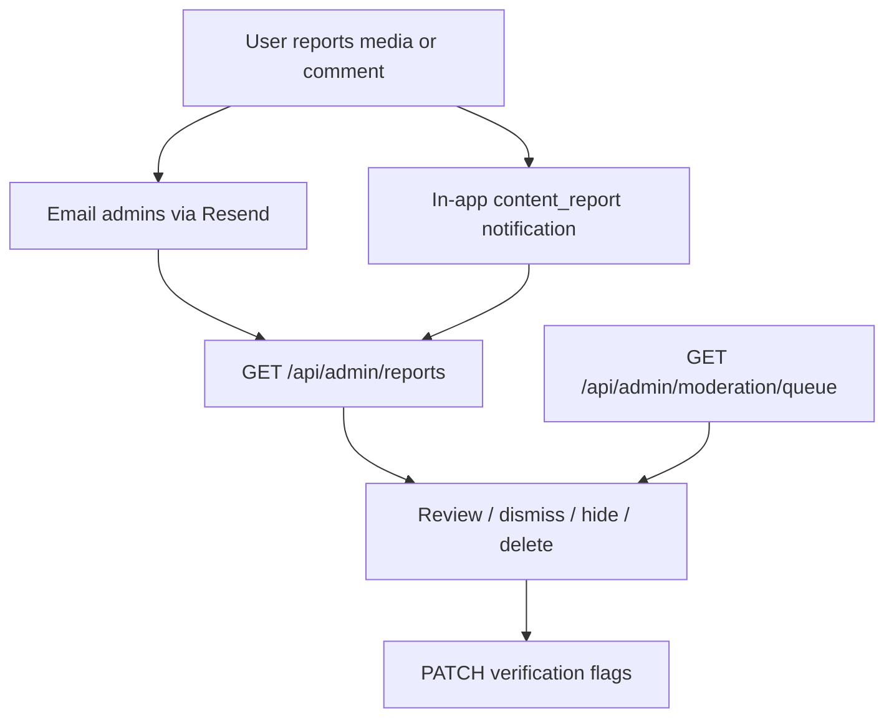

# Admin API

Canonical admin endpoints for the Jevah dashboard. All routes require:

```http
Authorization: Bearer <access_token>
```

Caller must have `role: "admin"` (`requireAdmin`).

**Frontend UI guide:** [FRONTEND_ADMIN.md](./FRONTEND_ADMIN.md) · **Moderation handoff:** [FRONTEND_MODERATION.md](./FRONTEND_MODERATION.md)

---

## Flow overview



---

## Dashboard

| Method | Path | Description |
|--------|------|-------------|
| GET | `/api/admin/dashboard/analytics` | Platform stats (users, content, moderation, reports, verification) |
| GET | `/api/admin/dashboard/feed` | Combined feed: uploads, review, reports, admin actions + onlineCount |
| GET | `/api/admin/dashboard/timeseries` | Chart points `metric=signups\|uploads\|reports\|activeUsers` + `range=7d\|30d` |
| GET | `/api/admin/config` | Platform feature flags / maintenance |
| PATCH | `/api/admin/config` | Update flags (kill switches) |
| GET | `/api/admin/system/health` | Ops health: mongo / redis / queues / version |
| GET | `/api/app/config` | **Public** (no auth) — mobile reads same shape |
| GET | `/api/admin/activity` | Admin activity (`scope=all` master-only) |
| GET | `/api/admin/media/recent` | Recent uploads (filter `moderationStatus`, `uploadedBy`) |
| POST | `/api/admin/email` | Email users by `userIds` and/or `emails` (Resend) |

### Analytics payload (key fields)

```json
{
  "success": true,
  "data": {
    "users": { "total": 0, "banned": 0, "roleDistribution": {} },
    "content": { "total": 0 },
    "moderation": { "pending": 0, "rejected": 0 },
    "reports": { "total": 0, "pending": 0, "comments": 0 },
    "verification": { "unverifiedArtists": 0 }
  }
}
```

### Email body

```json
{
  "userIds": ["…"],
  "emails": ["user@example.com"],
  "churchIds": ["…"],
  "subject": "Notice from Jevah",
  "message": "Plain text (auto-wrapped as HTML)",
  "html": "<p>Optional raw HTML instead of message</p>"
}
```

`churchIds` resolves each church’s `contactEmail` (skipped if missing).

---

## Users

| Method | Path | Description |
|--------|------|-------------|
| GET | `/api/admin/users` | List/filter users (+ `isOnline`, `onlineCount`) |
| GET | `/api/admin/users/presence` | Online/offline list (`status=online\|offline\|all`) |
| GET | `/api/admin/users/:id` | User detail + stats + recent media/reports + moderation history |
| POST | `/api/admin/users/:id/ban` | Ban (`reason?`, `duration?` days, `revokeSessions?` default **true**) |
| POST | `/api/admin/users/:id/unban` | Unban (**master only** for other admins) |
| POST | `/api/admin/users/:id/warn` | Soft warn (in-app + optional email) |
| PATCH | `/api/admin/users/:id/role` | Change role (**master admin only**) |
| PATCH | `/api/admin/users/:id/verification` | Set verification flags |
| DELETE | `/api/users/:userId` | Hard-delete user (also admin; **cannot delete master**; **master only** for other admins) |

**Presence:** online = active Socket.IO JWT connection (mobile or web). Offline users include `lastSeenAt` / `lastLoginAt`.

### Master / super-admin (`support@jevahapp.com`)

| Rule | Backend |
|------|---------|
| Default email | `support@jevahapp.com` (override with `SUPER_ADMIN_EMAIL`) |
| Seed | `SUPER_ADMIN_PASSWORD='…' npm run seed:super-admin` |
| Role changes | **Only** master may `PATCH …/role` |
| Ban master | Blocked (`MASTER_ADMIN_PROTECTED`) |
| Demote master | Blocked |
| Ban other admins | Master only |
| Login /me flag | `user.isMasterAdmin: true` |

Frontend login allowlist is UX; JWT + these rules are the real gate.

### Verification body

```json
{
  "isVerifiedCreator": true,
  "isVerifiedVendor": false,
  "isVerifiedChurch": false,
  "isVerifiedArtist": true
}
```

At least one boolean required. Also updates `artistProfile.isVerifiedArtist` when artist flag is set.

**Legacy:** `POST /api/auth/artist/:userId/verify` (now `requireAdmin`) still works; prefer the verification PATCH above.

---

## Reports inbox (canonical)

| Method | Path | Description |
|--------|------|-------------|
| GET | `/api/admin/reports` | Unified inbox (`type=media\|comment\|all`, `status`, `hidden`, page/limit) |
| GET | `/api/admin/reports/media/:reportId` | Media report detail + uploader + sibling reports |
| POST | `/api/admin/reports/media/:reportId/review` | `reviewed` \| `resolved` \| `dismissed` + `adminNotes?` |
| POST | `/api/admin/reports/media/bulk-review` | Bulk review (max 50; same semantics; partial success) |
| DELETE | `/api/admin/reports/media/:mediaId/content` | Permanently delete media + resolve reports |
| GET | `/api/admin/reports/comments` | Reported comments inbox |
| GET | `/api/admin/reports/comments/:commentId` | Comment card for report drawer |
| POST | `/api/admin/reports/comments/:commentId/hide` | Hide comment (`reason?`) |
| POST | `/api/admin/reports/comments/:commentId/unhide` | Unhide |
| POST | `/api/admin/reports/comments/:commentId/dismiss` | Clear `reportCount` / `reportedBy` without hide |

### Review body

```json
{
  "status": "resolved",
  "adminNotes": "Violates community guidelines"
}
```

- `resolved` → media `moderationStatus: rejected`, `isHidden: true`, uploader notified (`content_moderation`)
- `dismissed` / `reviewed` → report status only

### User-facing report intake (not admin)

| Method | Path | Who |
|--------|------|-----|
| POST | `/api/media/:id/report` | Any auth user |
| POST | `/api/content/comments/:commentId/report` | Any auth user |

### Legacy media admin paths (still work)

Prefer `/api/admin/reports/*` for new UI:

| Legacy | Prefer |
|--------|--------|
| `GET /api/media/reports/pending` | `GET /api/admin/reports?type=media&status=pending` |
| `POST /api/media/reports/:reportId/review` | `POST /api/admin/reports/media/:reportId/review` |
| `DELETE /api/media/reports/:id/delete` | `DELETE /api/admin/reports/media/:mediaId/content` |

---

## Content moderation queue

| Method | Path | Description |
|--------|------|-------------|
| GET | `/api/admin/moderation/queue` | Shaped media cards + preview URLs (`pending`+`under_review` by default) |
| GET | `/api/admin/moderation/:id` | Single media card + latest AI case summary |
| GET | `/api/admin/moderation/:id/case` | Full ModerationCase history (AI evidence) |
| PATCH | `/api/admin/moderation/:id/status` | `approved` \| `rejected` \| `under_review` + `adminNotes?` |
| POST | `/api/admin/moderation/bulk` | Bulk status (max 50; partial success) |
| PATCH | `/api/admin/media/:id` | Admin metadata edit (`title`, `description`, `adminModerationNotes`, `category`) |
| POST | `/api/admin/media/:id/preview-refresh` | Re-issue signed `preview.*` (TTL ~3600s) |
| GET | `/api/admin/media/search` | Paginated AdminMediaCard search (`q`, filters) |
| DELETE | `/api/admin/media/:id` | Admin force-delete any media |
| DELETE | `/api/media/:id` | Owner or admin delete |

Queue/detail cards expose `preview.mediaUrl` / `preview.thumbnailUrl` (signed when content is still private/staged). When `preview.signed === true`, call `POST …/preview-refresh` (or re-`GET` detail) before expiry. See [FRONTEND_MODERATION.md](./FRONTEND_MODERATION.md).

### Ban body

```json
{
  "reason": "Spam",
  "duration": 7,
  "revokeSessions": true
}
```

`duration` = days (omit = permanent). `revokeSessions` defaults to **true**: revokes all refresh tokens + disconnects Socket.IO (`force-logout` event). Access JWT is rejected on next `verifyToken` via `isBanned`.

### Bulk moderation

```http
POST /api/admin/moderation/bulk
{
  "mediaIds": ["…", "…"],
  "status": "approved" | "rejected" | "under_review",
  "adminNotes": "optional"
}
```

Max 50 IDs. Same side effects as single-item status update. Response:

```json
{ "success": true, "data": { "updated": ["…"], "failed": [{ "id": "…", "message": "…" }] } }
```

### Bulk report review

```http
POST /api/admin/reports/media/bulk-review
{
  "reportIds": ["…"],
  "status": "dismissed" | "reviewed" | "resolved",
  "adminNotes": "…"
}
```

`resolved` hides media + notifies uploader (same as single).

---

## Churches & catalog

Churches in Mongo power **onboarding church search** (`GET /api/places/suggest`). When an admin adds a church with `isListed: true` (default), users can find and select it during profile completion.

| Method | Path | Description |
|--------|------|-------------|
| GET | `/api/admin/churches` | Paginated list (`search`, `isVerified`, `isListed`, `source`, `hasContactEmail`) |
| POST | `/api/admin/churches` | **Add church** for onboarding catalog (+ contact fields) |
| PATCH | `/api/admin/churches/:id` | Update name/contact/`isListed`/`isVerified`/notes |
| DELETE | `/api/admin/churches/:id` | Remove church (+ branches by default) |
| PATCH | `/api/admin/churches/:id/verification` | `{ "isVerified": true }` only |
| POST | `/api/churches` | Same create (legacy mount) |
| POST | `/api/churches/:id/branches` | Add branch |
| POST | `/api/churches/bulk` | Bulk upsert |
| POST | `/api/audio/copyright-free` | Create copyright-free song |
| PUT | `/api/audio/copyright-free/:songId` | Update |
| DELETE | `/api/audio/copyright-free/:songId` | Delete |

### Create church body

```json
{
  "name": "Redeemed Christian Church of God",
  "state": "Lagos",
  "lga": "Ikeja",
  "address": "…",
  "denomination": "Pentecostal",
  "website": "https://…",
  "contactName": "Pastor Ada",
  "contactEmail": "church@example.com",
  "contactPhone": "+234…",
  "source": "outreach",
  "isVerified": true,
  "isListed": true,
  "adminNotes": "Reached out via Instagram July 2026"
}
```

- `isListed: true` → immediately searchable in onboarding (`/api/places/suggest`)
- `isListed: false` → draft / hidden until ready
- `source: "outreach"` when a church asked to be added

### Email churches

```http
POST /api/admin/email
{
  "churchIds": ["64f…", "64a…"],
  "subject": "Welcome to Jevah",
  "message": "Thanks for joining our church directory…"
}
```

Uses each church’s `contactEmail`. Churches without email are skipped (`churchesSkippedNoEmail` in response). You can mix `churchIds` with `userIds` / `emails`.

### Onboarding selection (mobile)

```http
GET /api/places/suggest?q=redeemed
# complete profile:
POST /api/auth/complete-profile   # or your complete-profile route
{ "churchId": "…", "churchBranchId": "…", … }
```

Full UI recipes: [FRONTEND_MODERATION.md](./FRONTEND_MODERATION.md) § Churches.

---

## Notifications to admins

When a user reports media/comments (or AI rejects upload):

| Channel | Type |
|---------|------|
| Email (Resend) | Admin report / moderation alert |
| In-app | `content_report`, `moderation_alert` |
| Uploader (after remove) | `content_moderation` |

No Socket.IO event for new reports — dashboard should poll `GET /api/admin/reports` or analytics.

---

## Audit

| Method | Path | Description |
|--------|------|-------------|
| GET | `/api/admin/activity` | Current admin’s actions (default) |
| GET | `/api/admin/activity?scope=all` | **Master only** — org-wide (`actorId`, `action`, `from`, `to`, page/limit) |
| GET | `/api/logs/logs` | Legacy log viewer (prefer `/activity`) |

### Platform config body

```json
{
  "uploadsEnabled": true,
  "registrationEnabled": true,
  "liveStreamingEnabled": true,
  "maintenanceMode": false,
  "maintenanceMessage": "Back soon",
  "minAppVersion": { "ios": "1.2.0", "android": "1.2.0" }
}
```

Mobile / public clients: `GET /api/app/config` (same `data` shape, no auth).

**Enforcement:** `registrationEnabled` / `maintenanceMode` gate `POST /api/auth/register*`. `uploadsEnabled` / `maintenanceMode` gate media upload + staging intent/finalize (`UPLOADS_DISABLED` / `MAINTENANCE_MODE`).

### System health

```http
GET /api/admin/system/health
```

```json
{
  "success": true,
  "data": {
    "status": "ok",
    "api": "ok",
    "mongo": "ok",
    "redis": "ok",
    "storage": "ok",
    "queues": {
      "moderation": { "waiting": 0, "failed": 0 },
      "email": { "waiting": 0, "failed": 0 }
    },
    "version": "gitsha",
    "uptimeSeconds": 12345
  }
}
```

Media report detail also returns `sla: { createdAt, ageHours, slaHours, breached }` and `history[]` (default SLA window: `REPORT_SLA_HOURS=24`).
