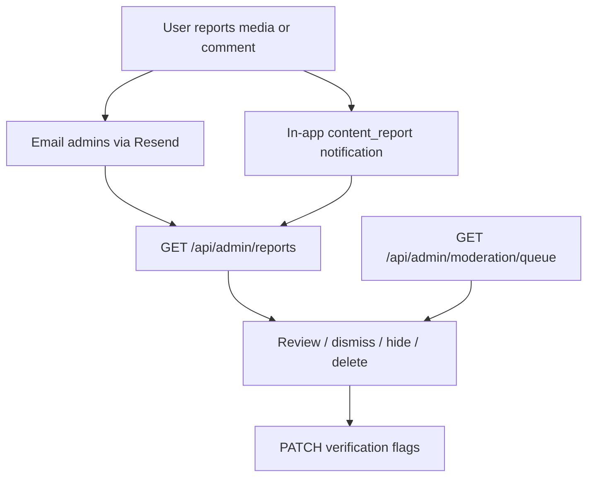

# Admin API

Canonical admin endpoints for the Jevah dashboard. All routes require:

```http
Authorization: Bearer <access_token>
```

Caller must have `role: "admin"` (`requireAdmin`).

**Frontend UI guide:** [FRONTEND_ADMIN.md](./FRONTEND_ADMIN.md)

---

## Flow overview



---

## Dashboard

| Method | Path | Description |
|--------|------|-------------|
| GET | `/api/admin/dashboard/analytics` | Platform stats (users, content, moderation, reports, verification) |
| GET | `/api/admin/dashboard/feed` | Combined feed: uploads, review, reports, admin actions + onlineCount |
| GET | `/api/admin/activity` | Current admin’s activity log |
| GET | `/api/admin/media/recent` | Recent uploads (filter `moderationStatus`, `uploadedBy`) |
| POST | `/api/admin/email` | Email users by `userIds` and/or `emails` (Resend) |

### Analytics payload (key fields)

```json
{
  "success": true,
  "data": {
    "users": { "total": 0, "banned": 0, "roleDistribution": {} },
    "content": { "total": 0 },
    "moderation": { "pending": 0, "rejected": 0 },
    "reports": { "total": 0, "pending": 0, "comments": 0 },
    "verification": { "unverifiedArtists": 0 }
  }
}
```

### Email body

```json
{
  "userIds": ["…"],
  "emails": ["user@example.com"],
  "subject": "Notice from Jevah",
  "message": "Plain text (auto-wrapped as HTML)",
  "html": "<p>Optional raw HTML instead of message</p>"
}
```

---

## Users

| Method | Path | Description |
|--------|------|-------------|
| GET | `/api/admin/users` | List/filter users (+ `isOnline`, `onlineCount`) |
| GET | `/api/admin/users/presence` | Online/offline list (`status=online\|offline\|all`) |
| GET | `/api/admin/users/:id` | User detail + stats |
| POST | `/api/admin/users/:id/ban` | Ban (`reason?`, `duration?` days) |
| POST | `/api/admin/users/:id/unban` | Unban |
| PATCH | `/api/admin/users/:id/role` | Change role |
| PATCH | `/api/admin/users/:id/verification` | Set verification flags |
| DELETE | `/api/users/:userId` | Hard-delete user (also admin) |

**Presence:** online = active Socket.IO JWT connection (mobile or web). Offline users include `lastSeenAt` / `lastLoginAt`.

### Verification body

```json
{
  "isVerifiedCreator": true,
  "isVerifiedVendor": false,
  "isVerifiedChurch": false,
  "isVerifiedArtist": true
}
```

At least one boolean required. Also updates `artistProfile.isVerifiedArtist` when artist flag is set.

**Legacy:** `POST /api/auth/artist/:userId/verify` (now `requireAdmin`) still works; prefer the verification PATCH above.

---

## Reports inbox (canonical)

| Method | Path | Description |
|--------|------|-------------|
| GET | `/api/admin/reports` | Unified inbox (`type=media\|comment\|all`, `status`, `hidden`, page/limit) |
| GET | `/api/admin/reports/media/:reportId` | Media report detail + uploader + sibling reports |
| POST | `/api/admin/reports/media/:reportId/review` | `reviewed` \| `resolved` \| `dismissed` + `adminNotes?` |
| DELETE | `/api/admin/reports/media/:mediaId/content` | Permanently delete media + resolve reports |
| GET | `/api/admin/reports/comments` | Reported comments inbox |
| POST | `/api/admin/reports/comments/:commentId/hide` | Hide comment (`reason?`) |
| POST | `/api/admin/reports/comments/:commentId/unhide` | Unhide |
| POST | `/api/admin/reports/comments/:commentId/dismiss` | Clear `reportCount` / `reportedBy` without hide |

### Review body

```json
{
  "status": "resolved",
  "adminNotes": "Violates community guidelines"
}
```

- `resolved` → media `moderationStatus: rejected`, `isHidden: true`, uploader notified (`content_moderation`)
- `dismissed` / `reviewed` → report status only

### User-facing report intake (not admin)

| Method | Path | Who |
|--------|------|-----|
| POST | `/api/media/:id/report` | Any auth user |
| POST | `/api/content/comments/:commentId/report` | Any auth user |

### Legacy media admin paths (still work)

Prefer `/api/admin/reports/*` for new UI:

| Legacy | Prefer |
|--------|--------|
| `GET /api/media/reports/pending` | `GET /api/admin/reports?type=media&status=pending` |
| `POST /api/media/reports/:reportId/review` | `POST /api/admin/reports/media/:reportId/review` |
| `DELETE /api/media/reports/:id/delete` | `DELETE /api/admin/reports/media/:mediaId/content` |

---

## Content moderation queue

| Method | Path | Description |
|--------|------|-------------|
| GET | `/api/admin/moderation/queue` | Media with moderation status filter |
| PATCH | `/api/admin/moderation/:id/status` | `approved` \| `rejected` \| `under_review` + `adminNotes?` |
| DELETE | `/api/admin/media/:id` | Admin force-delete any media |
| DELETE | `/api/media/:id` | Owner or admin delete |

---

## Churches & catalog

| Method | Path | Description |
|--------|------|-------------|
| PATCH | `/api/admin/churches/:id/verification` | `{ "isVerified": true }` |
| POST | `/api/churches` | Create church (admin) |
| POST | `/api/churches/:id/branches` | Add branch |
| POST | `/api/churches/bulk` | Bulk upsert |
| POST | `/api/audio/copyright-free` | Create copyright-free song |
| PUT | `/api/audio/copyright-free/:songId` | Update |
| DELETE | `/api/audio/copyright-free/:songId` | Delete |

---

## Notifications to admins

When a user reports media/comments (or AI rejects upload):

| Channel | Type |
|---------|------|
| Email (Resend) | Admin report / moderation alert |
| In-app | `content_report`, `moderation_alert` |
| Uploader (after remove) | `content_moderation` |

No Socket.IO event for new reports — dashboard should poll `GET /api/admin/reports` or analytics.

---

## Audit

| Method | Path | Description |
|--------|------|-------------|
| GET | `/api/admin/activity` | Recent admin actions |
| GET | `/api/logs/logs` | Full audit log viewer |
