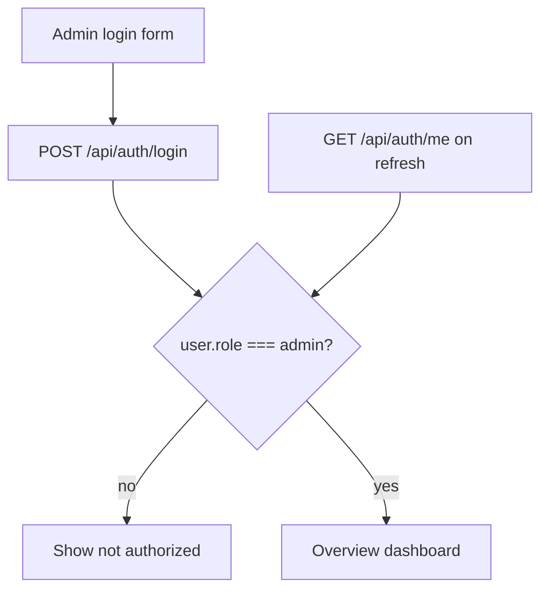

# Frontend Admin Guide

How to build the **admin web dashboard** (and optional admin views on mobile) against Jevah’s MongoDB-backed auth and `/api/admin` APIs.

Companion API reference: [ADMIN.md](./ADMIN.md).  
**Content moderation / reports handoff (feed this to implementers):** [FRONTEND_MODERATION.md](./FRONTEND_MODERATION.md).

Same users collection powers **mobile app** and **admin web** — an account with `role: "admin"` can sign in on either; only the web dashboard should mount the admin routes/UI.

---

## 1. Login flow (use our backend auth)

Admin UI must use the **email/password JWT** path against MongoDB (or OAuth that returns an app JWT). Do **not** rely on Clerk-only login for the dashboard — `POST /api/auth/clerk-login` returns a user object but **no** `accessToken` for Bearer `/api/admin/*` calls.

### 1.1 Sign-in screen

```
┌─────────────────────────────────────┐
│           Jevah Admin               │
│  Email     [________________]       │
│  Password  [________________]       │
│  □ Remember me                      │
│           [ Sign in ]               │
└─────────────────────────────────────┘
```

```http
POST /api/auth/login
Content-Type: application/json

{
  "email": "admin@jevahapp.com",
  "password": "••••••••",
  "rememberMe": true
}
```

**Success (200):**

```json
{
  "success": true,
  "token": "<jwt>",
  "accessToken": "<jwt>",
  "tokenType": "bearer",
  "expiresIn": 604800,
  "user": {
    "id": "…",
    "email": "admin@jevahapp.com",
    "firstName": "Ada",
    "lastName": "Admin",
    "avatar": null,
    "role": "admin",
    "isProfileComplete": true
  }
}
```

### 1.2 Gate: only admins enter the dashboard

```ts
const { accessToken, user } = await login(email, password);

if (user.role !== "admin") {
  showError("This account is not an admin.");
  return;
}

// Optional: prefer API flag over hardcoding email
// user.isMasterAdmin === true for support@jevahapp.com
```

**Master account:** `support@jevahapp.com` (seeded via `npm run seed:super-admin`). Only that account can change roles on the API. See [ADMIN.md](./ADMIN.md) § Master / super-admin.

On every boot / refresh:

```http
GET /api/auth/me
Authorization: Bearer <accessToken>
```

If `role !== "admin"` → clear token → `/login`.  
If `401` → refresh (`POST /api/auth/refresh` with cookie/body) or re-login.  
Banned admins get **403** from `verifyToken`.

### 1.3 Auth headers on all admin calls

```http
Authorization: Bearer <accessToken>
Content-Type: application/json
```

**Mobile users** keep using the same `POST /api/auth/login` against the same Mongo users — only `role` decides whether the **web** product shows the admin shell.

### 1.4 Optional Socket.IO after login

Connect with the same JWT so presence counts work:

```ts
io(SOCKET_URL, { auth: { token: accessToken } });
```

When a user (mobile or web) is connected, they appear **online** in `GET /api/admin/users/presence`.

### 1.5 Logout

```http
POST /api/auth/logout
Authorization: Bearer <accessToken>
```

Clear token, disconnect socket, redirect to login.



---

## 2. Landing dashboard (what admin sees after login)

On `/admin` load these in parallel:

| Call | UI |
|------|-----|
| `GET /api/admin/dashboard/analytics` | KPI cards |
| `GET /api/admin/dashboard/feed` | Activity stream: uploads, review items, reports, admin deletes/emails |
| `GET /api/admin/users/presence?status=online&limit=20` | Online now strip |
| `GET /api/admin/media/recent?limit=10` | Latest uploads preview |
| `GET /api/admin/moderation/queue?limit=5` | “On review” preview |

### KPI cards → deep links

| Field | Label | Goes to |
|-------|--------|---------|
| `reports.pending` | Media reports | Reports tab |
| `reports.comments` | Reported comments | Comment reports |
| `moderation.pending` | Items on review | Moderation queue |
| `users.banned` | Banned | Users `?isBanned=true` |
| `verification.unverifiedArtists` | Unverified artists | Users `?role=artist` |
| Feed `onlineCount` | Online now | Users → Presence |

### Feed event types (`GET /api/admin/dashboard/feed`)

| `type` | Meaning | Primary action |
|--------|---------|----------------|
| `upload` | Someone uploaded content | Open media / moderation |
| `review` | Pending / under_review | Approve / reject |
| `report` | User reported media | Open report detail |
| `delete_media` | Admin deleted content | Activity log |
| `send_email` | Admin emailed users | Activity log |
| `admin_action` | Other admin actions | Activity log |

Poll feed + analytics every **30–60s** (no report websocket yet).

---

## 3. Recommended screens

| Screen | Primary endpoints | Jobs |
|--------|-------------------|------|
| **Login** | `POST /api/auth/login`, `GET /api/auth/me` | Email/password → role gate |
| **Overview** | `…/dashboard/analytics`, `…/dashboard/feed`, `…/media/recent`, `…/users/presence` | KPIs, uploads, review, online |
| **Users** | `GET /api/admin/users`, presence, ban/role/verification | Manage accounts |
| **Compose email** | `POST /api/admin/email` | Mail users by id or email |
| **Reports** | `GET /api/admin/reports` | Media + comment inbox |
| **Moderation** | `GET /api/admin/moderation/queue` | Approve / reject AI-held uploads |
| **Churches** | `GET/POST/PATCH/DELETE /api/admin/churches` + email via `churchIds` | Catalog for onboarding + outreach |
| **Audio library** | `/api/audio/copyright-free` CRUD | Curated songs |
| **Activity** | `GET /api/admin/activity` | Audit of *your* admin actions |

---

## 4. Users: list, online/offline, email

### List (includes live `isOnline`)

```http
GET /api/admin/users?page=1&limit=20&search=ada&role=artist&isBanned=false
```

Each user includes `isOnline`, `lastLoginAt`, `lastSeenAt`. Response also has `onlineCount`.

### Presence page / filter

```http
GET /api/admin/users/presence?status=online&page=1&limit=50
GET /api/admin/users/presence?status=offline
GET /api/admin/users/presence?status=all&search=john
```

| Status | Definition |
|--------|------------|
| **online** | Has an active Socket.IO connection (mobile or web) with a valid JWT |
| **offline** | Not in the socket map; show `lastSeenAt` or `lastLoginAt` |

Green/gray dots in the user table = `isOnline`.

### Ban / verification

```http
POST /api/admin/users/:id/ban
{ "reason": "Spam", "duration": 7 }

PATCH /api/admin/users/:id/verification
{
  "isVerifiedCreator": true,
  "isVerifiedArtist": true
}
```

| Flag | Meaning |
|------|---------|
| `isVerifiedCreator` | Can upload as creator |
| `isVerifiedVendor` | Merch vendor |
| `isVerifiedChurch` | Church admin user |
| `isVerifiedArtist` | Artist badge / features |

### Send email to account emails

From user row (single) or multi-select:

```http
POST /api/admin/email
{
  "userIds": ["64f…", "64a…"],
  "emails": ["extra@example.com"],
  "subject": "Account notice",
  "message": "Plain text body (converted to HTML). Or pass html instead."
}
```

Max **100** recipients per request. Uses Resend (same stack as verify/reset mails). Audited as `send_email`.

UI: subject + message fields, recipient chips from selected users’ emails stored on the User document in Mongo.

---

## 5. Uploads & items on review

### Recent uploads (dashboard “someone uploaded”)

```http
GET /api/admin/media/recent?page=1&limit=20
GET /api/admin/media/recent?moderationStatus=under_review
```

Each row: title, type, thumbnail, uploader, `moderationStatus`, timestamps.

### Moderation queue

```http
GET /api/admin/moderation/queue?status=under_review&page=1
GET /api/admin/moderation/:mediaId
GET /api/admin/moderation/:mediaId/case

PATCH /api/admin/moderation/:mediaId/status
{ "status": "approved" | "rejected" | "under_review", "adminNotes": "…" }

PATCH /api/admin/media/:mediaId
{ "title": "…", "description": "…", "adminModerationNotes": "…" }
```

Hard delete (also removes files):

```http
DELETE /api/admin/media/:mediaId
```

Full contracts, card shapes, and report action wiring: [FRONTEND_MODERATION.md](./FRONTEND_MODERATION.md).

---

## 6. Reports inbox

```http
GET /api/admin/reports?type=all&status=pending&page=1&limit=20
GET /api/admin/reports/media/:reportId
POST /api/admin/reports/media/:reportId/review
DELETE /api/admin/reports/media/:mediaId/content
```

| Kind | Actions |
|------|---------|
| **media** | dismiss / reviewed / resolve (hide) / delete forever / ban uploader |
| **comment** | hide / unhide / dismiss reports |

**Implement detail + mutations next** — see [FRONTEND_MODERATION.md §5](./FRONTEND_MODERATION.md). Prefer `/api/admin/reports/*` over legacy `/api/media/reports/*`.

---

## 7. QA path: user report → admin action

1. Mobile/web user reports media → admins get email + in-app `content_report`
2. Overview `reports.pending` / feed `report` event
3. Admin reviews → resolve / delete
4. Uploader gets `content_moderation` notification

```http
POST /api/media/:id/report
{ "reason": "spam", "description": "optional" }

POST /api/content/comments/:commentId/report
{ "reason": "harassment" }
```

---

## 8. Error handling

| Status | Meaning | UI |
|--------|---------|-----|
| 401 | Missing/expired token | Re-login |
| 403 | Not admin / banned | “Not authorized” / lock |
| 404 | Already deleted | Toast + remove row |
| 400 | Bad body | Show `message` |

---

## 9. Suggested app structure

```
AdminApp
├── LoginPage                 → POST /api/auth/login + role gate
├── AdminShell (nav)
│   └── OnlineCountBadge      → presence.onlineCount
├── OverviewPage
│   ├── KpiCards              → analytics
│   ├── ActivityFeed          → dashboard/feed
│   ├── RecentUploadsRail     → media/recent
│   └── OnlineUsersStrip      → users/presence?status=online
├── UsersPage
│   ├── UserTable (+ isOnline)
│   ├── PresenceFilter
│   ├── BanModal / RoleSelect / VerificationSwitches
│   └── ComposeEmailModal     → POST /api/admin/email
├── ReportsPage
├── ModerationQueuePage
├── ChurchesPage
├── AudioLibraryPage
└── ActivityPage              → GET /api/admin/activity
```

### Auth storage recommendation

- `accessToken` in memory + `localStorage` (or httpOnly cookie if you proxy)
- On `rememberMe`, backend may also set refresh cookie; call `POST /api/auth/refresh` before forcing login
- Never ship admin screens in the public marketing site without the role gate

---

## 10. Auth & data model (Mongo)

Users live in the **`User`** collection (`src/models/user.model.ts`). Relevant fields for admin UI:

| Field | Use |
|-------|-----|
| `email` / `password` | Email login (mobile + web) |
| `role` | Must be `"admin"` for dashboard |
| `isBanned`, `banUntil`, `banReason` | Ban UI + login blocked |
| `lastLoginAt` | Set on successful login |
| `lastSeenAt` | Set when last socket disconnects |
| `isVerifiedCreator` / `Vendor` / `Church` / `Artist` | Verification toggles |
| `isEmailVerified` | Filter on users list |

Roles enum includes: `learner`, `parent`, `educator`, `moderator`, `admin`, `content_creator`, `vendor`, `church_admin`, `artist`.

**Moderators** can hide comments via `POST /api/content/comments/:id/hide` but **cannot** call `/api/admin/*`. Keep the web console admin-only in v1.
