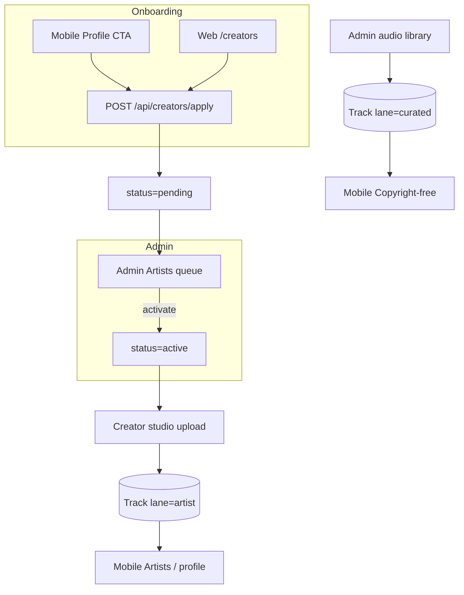

**Status:** Backend contracts corroborated for mobile (see [BACKEND_CREATORS_GOSPEL_MOBILE_HANDOFF.md](./BACKEND_CREATORS_GOSPEL_MOBILE_HANDOFF.md)).

## Architecture decision

**Artist uploads do not belong on Copyright-free, and do not need a separate AllContentTikTok top-level tab.**

| Surface | Behavior |
|---------|----------|
| AllContentTikTok → MUSIC | Mounts `music.tsx` (existing) |
| Music → Copyright-free | Curated beds only (`/api/audio/copyright-free`) |
| Music → Artists | Creator originals only (`/api/music/tracks?lane=artist`) |
| Creator hub | Apply → wait → upload → manage tracks |

Reason: TikTok feed is video/sermon/ebook chrome. Music already has its own player + modal UX. A second shelf **inside Music** keeps shelves pure without polluting CF or the vertical feed.

## Mobile DoD (FE) + Backend

- [x] Profile entry + Apply + Pending + Hub (`capabilities.nextStep`)
- [x] Music tabs: Copyright-free \| Artists (strict filters, no mix)
- [x] Artist profile + play (shared player)
- [x] Active upload: intent → PUT → finalize (`uploadUrl` aliases)
- [x] Studio my-tracks list + publish/delete
- [x] Never call `/api/admin/*` from mobile
- [x] Backend gap handoff written + shelf integrity + playCount + engagement aliases

## FE files

- `app/services/creators/` — API, types, upload pipeline
- `app/services/music-catalog/` — TrackCard + Artists catalog
- `app/hooks/useCreatorMe.ts`
- `app/components/creators/*`
- `app/creators/index.tsx` · `apply.tsx` · `upload.tsx`
- `app/artists/ArtistProfile.tsx`
- `app/categories/music.tsx` · `music/MusicLaneTabs.tsx`
- `ProfileSummary` → `CreatorStatusBanner`

---

# Frontend Creators Handoff — Spotify for Gospel

**Audience:** Mobile app + public creator web + admin web  
**Backend:** `jevahapp-backend` (`main`)  
**Date:** 30 July 2026  
**Related:** [FRONTEND_AUDIO_TRACKS.md](./FRONTEND_AUDIO_TRACKS.md) · [ADMIN.md](./ADMIN.md) · [BACKEND_CREATORS_GOSPEL_MOBILE_HANDOFF.md](./BACKEND_CREATORS_GOSPEL_MOBILE_HANDOFF.md)


This is the **source of truth** for Creator (artist / minister / podcaster) UX on **mobile and web**, how each screen talks to the API, and how catalog surfaces stay scalable (one Track model, many shelves).

---

## 0. Product architecture (read first)

### One catalog, two lanes

| Lane | Who fills it | App shelf |
|------|----------------|-----------|
| `curated` | Admins (Jevah copyright-free / picks) | **Copyright-free** / worship beds |
| `artist` | Accepted creators | **Artists**, profile pages, gospel browse |

**Do not** build a second songs database. Same `Track` document, same player component, different filters and navigation.



### DRY / SOLID for FE teams

| Principle | How to apply in UI |
|-----------|-------------------|
| **DRY** | One `TrackCard` / `ArtistCard` type + one audio player; map `playbackUrl \|\| fileUrl` once |
| **Single responsibility** | Apply screen ≠ Studio ≠ Public profile ≠ Admin review |
| **Open/closed** | Drive buttons from `capabilities.*` / `nextStep` — don’t hard-code status if/else in 10 places |
| **Interface segregation** | Public browse APIs vs creator “me” APIs vs admin APIs — don’t call admin from mobile |
| **Dependency inversion** | UI depends on presenters (`data.artist`, `data.capabilities`), not raw Mongo shapes |

---

## 1. Auth & clients

All creator mutations need:

```http
Authorization: Bearer <access_token>
```

| Client | Apply? | Studio upload? | Approve artists? |
|--------|--------|----------------|------------------|
| **Mobile app** | Yes | Yes (when active) | No |
| **Public web** (`/creators`) | Yes | Yes (when active) | No |
| **Admin web** | No (use admin stub create) | Curated library only | Yes |

Same endpoints for mobile and public web. Only layout and navigation differ.

---

## 2. Core API contract

### 2.1 Creator session (hub brain)

```http
GET /api/creators/me
POST /api/creators/apply
```

**`GET /api/creators/me` → `data`**

```ts
type CreatorMe = {
  artist: ArtistCard | null;
  capabilities: {
    canApply: boolean;
    canEditProfile: boolean;
    canUploadTracks: boolean;
    canPublishTracks: boolean;
    showPendingBanner: boolean;
    showCreatorHub: boolean;
    showPublicProfile: boolean;
    publicProfilePath: string | null; // e.g. "/artists/jevah-worship"
    nextStep:
      | "apply"
      | "wait_review"
      | "upload_first_track"
      | "manage_catalog"
      | "contact_support";
    statusMessage: string; // ready-made banner copy
  };
  status: "pending" | "active" | "suspended" | null;
  canUpload: boolean;
  nextStep: string;
};
```

**`POST /api/creators/apply` body**

```json
{
  "displayName": "Grace Collective",
  "bio": "Gospel worship from Lagos",
  "genres": ["gospel", "afro_gospel"],
  "creatorTypes": ["artist", "minister"],
  "socials": { "instagram": "…", "youtube": "…", "spotify": "…" },
  "applicationNote": "We lead youth worship",
  "avatarUrl": "https://…"
}
```

`creatorTypes`: `artist` | `minister` | `podcaster` (multi-select, ≥1 required).  
`genres`: ≥1 from `TRACK_GENRES` (`gospel`, `contemporary_christian`, `afro_gospel`, `hymn`, `choir`, `rap_gospel`, `highlife_gospel`, `other`).  
`displayName`: required, 2–80 chars. Optional empties omitted.  
Validation errors: `400` + `fieldErrors`. Response uses the same `CreatorMe` shape (`201` new, `200` if already applied).

See [FRONTEND_CREATOR_APPLY_HANDOFF.md](./FRONTEND_CREATOR_APPLY_HANDOFF.md) for Spotify-style web apply UX.  
Email must be verified before apply — see [FRONTEND_ARTIST_EMAIL_VERIFICATION_HANDOFF.md](./FRONTEND_ARTIST_EMAIL_VERIFICATION_HANDOFF.md).

### 2.2 Creator studio (active only)

| Method | Path | Notes |
|--------|------|--------|
| GET | `/api/creators/me/tracks` | Own tracks incl. drafts |
| GET/POST | `/api/creators/releases` | Studio releases (see [FRONTEND_ARTIST_RELEASES_HANDOFF.md](./FRONTEND_ARTIST_RELEASES_HANDOFF.md)) |
| POST | `/api/creators/tracks/upload-intent` | Presign R2; optional `releaseId` + `trackNumber` |
| POST | `/api/creators/tracks/:trackId/finalize` | `{ publish?: true }` |
| PATCH | `/api/creators/tracks/:id` | Metadata / visibility |
| DELETE | `/api/creators/tracks/:id` | Hard delete + R2 purge |

Upload body mirrors admin (see [FRONTEND_AUDIO_TRACKS.md](./FRONTEND_AUDIO_TRACKS.md)):

```json
{
  "title": "Still Waters",
  "artistName": "Grace Collective",
  "genre": "gospel",
  "category": "worship",
  "language": "en",
  "contentType": "audio/mpeg",
  "fileName": "still-waters.mp3",
  "fileSizeBytes": 5242880,
  "coverContentType": "image/jpeg",
  "coverFileName": "cover.jpg",
  "coverFileSizeBytes": 120000
}
```

Limits: audio **100MB**, cover **5MB**, PUT TTL **900s**.  
`403 CREATOR_NOT_ACTIVE` if still pending/suspended.

### 2.3 Public catalog (listeners)

| Method | Path | UI shelf |
|--------|------|----------|
| GET | `/api/audio/copyright-free` | **Copyright-free** (curated only) |
| GET | `/api/music/tracks?lane=artist` | **Artists / Gospel** browse |
| GET | `/api/artists/:slug` | Artist profile header |
| GET | `/api/artists/:slug/tracks` | Artist discography |

Optional: `?search=` · `?genre=` · `page` · `limit`.

**TrackCard fields (player):**  
`id`, `title`, `artistName` / `singer`, `playbackUrl` / `fileUrl` / `audioUrl`, `thumbnailUrl`, `durationSec`, `lane`, `processingStatus`, `playCount`.

### 2.4 Admin review

| Method | Path |
|--------|------|
| GET | `/api/admin/artists?status=pending` |
| PATCH | `/api/admin/artists/:id` `{ "status": "active", "isVerified": true }` |
| PATCH | `/api/admin/artists/:id/verification` |
| POST | `/api/admin/artists` | Manual stub (outreach) |
| GET | `/api/admin/audio/tracks?lane=curated\|artist` | Moderation / ops |

---

## 3. Mobile UI — screens & placement

### 3.1 Information architecture

```
Tab: Home | Bible | Music | Community | Profile
                              │
                    Music tab (listener)
                    ├─ Copyright-free   → GET /api/audio/copyright-free
                    └─ Artists / Gospel → GET /api/music/tracks?lane=artist
                              │
                    Profile
                    └─ Become a creator / Creator hub  → GET /api/creators/me
```

**Where to put “Become a creator”**
1. **Primary:** Profile → list row / card (“Share your music on Jevah”)
2. **Secondary (later):** Music → Artists empty state (“Are you an artist?”)
3. **Do not** put on Home feed chrome every session

### 3.2 Screen map (build these)

| Screen ID | Route (suggested) | When shown | API |
|-----------|-------------------|------------|-----|
| `CreatorEntry` | `/profile/creator` | `nextStep === apply` or entry point | `GET /me` |
| `CreatorApply` | `/profile/creator/apply` | Apply form | `POST /apply` |
| `CreatorPending` | `/profile/creator` | `showPendingBanner` | `GET /me` poll / resume |
| `CreatorHub` | `/profile/creator` | `showCreatorHub && active` | `GET /me` + `GET /me/tracks` |
| `CreatorUpload` | `/profile/creator/upload` | `canUploadTracks` | intent → PUT → finalize |
| `CreatorTrackEdit` | `/profile/creator/tracks/:id` | Own track | PATCH / DELETE |
| `MusicCopyrightFree` | `/music/copyright-free` | Always | CF list |
| `MusicArtistsBrowse` | `/music/artists` | Always | `/api/music/tracks?lane=artist` |
| `ArtistProfile` | `/artists/:slug` | Deep link / browse | `/api/artists/:slug` + `/tracks` |
| `NowPlaying` | global mini-player | Any track | uses TrackCard URLs |

### 3.3 Mobile flows (step-by-step)

#### A) First-time apply
1. Profile → **Become a creator**
2. If `capabilities.canApply` → show Apply form (types chips, name, bio, genres, socials)
3. Submit → toast → navigate to Pending state using `capabilities.statusMessage`
4. Hide upload CTA while `canUploadTracks === false`

#### B) Pending
1. Hub shows banner from `statusMessage`
2. Optional pull-to-refresh `GET /me`
3. No upload button (or disabled with tooltip “Under review”)

#### C) Approved → first upload
1. `nextStep === upload_first_track` → hero CTA **Upload your first song**
2. Dropzone / document picker → progress on PUT
3. Finalize → optimistic insert into My tracks
4. If `publish: true`, track appears on public profile after refresh

#### D) Listener discovery
1. Music → segment control: **Copyright-free** | **Artists**
2. Artists grid/list → tap row → Artist profile → play
3. Player: **same component** as copyright-free (`playbackUrl || fileUrl`)

#### E) Suspended
1. Hub shows `contact_support` copy; no upload

### 3.4 Mobile UI states checklist

| State | UI |
|-------|-----|
| Loading `/me` | Skeleton on Profile creator row |
| `artist === null` | CTA “Become a creator” |
| pending | Amber banner + disabled upload |
| active, 0 tracks | Empty studio + Upload CTA |
| active, N tracks | List with draft/published badges (`visibility`, `processingStatus`) |
| processing | Spinner / “Processing…” on row |
| failed | Retry finalize or re-upload |
| offline | Queue message; don’t lose local file picker state |

### 3.5 Suggested mobile components (reuse)

- `CreatorStatusBanner` ← `capabilities.statusMessage` + `nextStep`
- `CreatorTypeChips` ← artist / minister / podcaster
- `TrackRow` ← shared with copyright-free
- `UploadTrackSheet` ← intent/finalize machine
- `LaneTabs` ← Copyright-free vs Artists

---

## 4. Public web UI — screens & placement

### 4.1 Site map

| Path | Purpose |
|------|---------|
| `/creators` | Marketing + CTA Login / Apply |
| `/creators/apply` | Same apply form as mobile |
| `/creators/studio` | Hub + uploads (auth, active) |
| `/creators/studio/upload` | Presign uploader |
| `/artists/:slug` | Public profile (SSR/CSR) |
| `/music` or `/listen` | Optional web listen (Artists + CF) |

Admin stays on `/admin/artists`, `/admin/audio` — **not** under `/creators`.

### 4.2 Web flows

#### Apply (desktop)
1. Landing explains Artists / Ministers / Podcasters
2. Login (same JWT as app if shared auth, or web login)
3. Multi-step form (types → profile → review → submit)
4. Success → studio shell in **pending** mode

#### Studio (active)
1. Sidebar: Overview | My tracks | Upload | Public profile link  
2. Upload: dropzone + metadata + progress (same API as mobile)  
3. Table: title, status, visibility, plays, actions  

#### Public artist page
1. Header: avatar, name, verified badge, genres, bio, socials  
2. Track list from `/api/artists/:slug/tracks`  
3. Play button → web audio element / shared player  

### 4.3 Web vs mobile differences (same APIs)

| Concern | Mobile | Web |
|---------|--------|-----|
| File pick | Native picker | Drag-and-drop |
| Navigation | Profile stack | `/creators/studio` |
| Marketing | Short copy | Longer landing |
| Admin | N/A | Separate app |

---

## 5. Admin web UI (review only)

| Screen | Behavior |
|--------|----------|
| **Artists → Pending** | Table from `GET /api/admin/artists?status=pending` |
| **Row actions** | Activate / Suspend / Verify |
| **On activate** | Prefer `sendOnboardEmail: true` **or** toast from response `reminders[]` → `POST /api/admin/email/artist-onboard` |
| **Dashboard banner** | Render `GET …/dashboard/analytics` → `data.reminders` (artist onboard) |
| **Audio library** | Tabs: Curated \| Artist catalog (`lane` query) |
| **Do not** | Show “Become a creator” for admins as the apply path |

On activate, mobile/web `GET /me` flips `canUploadTracks: true`. Always remind admins to send the **artist onboard email** ([FRONTEND_MARKETING_EMAIL_HANDOFF.md](./FRONTEND_MARKETING_EMAIL_HANDOFF.md) §4).

---

## 6. Routing capabilities → UI (copy-paste switch)

```ts
switch (data.capabilities.nextStep) {
  case "apply":
    return <BecomeCreatorCTA />;
  case "wait_review":
    return <PendingBanner message={data.capabilities.statusMessage} />;
  case "upload_first_track":
    return <EmptyStudio onUpload={…} />;
  case "manage_catalog":
    return <TrackTable tracks={…} />;
  case "contact_support":
    return <SuspendedState />;
}
```

Prefer this over scattering `if (status === "pending")` across screens.

---

## 7. Upload state machine (mobile + web)

```text
idle → picking → intent_created → putting_audio → putting_cover?
    → finalizing → ready | failed
```

- Disable “Publish” until PUT(s) finish  
- On `OBJECT_MISSING`, tell user to retry PUT then finalize  
- Show `processingStatus` from TrackCard after finalize  

---

## 8. What must stay separate in the UI (product)

| Shelf | Source | Never mix by default |
|-------|--------|----------------------|
| Copyright-free | `lane=curated` via `/api/audio/copyright-free` | Artist originals |
| Artists / Gospel | `lane=artist` via `/api/music/tracks` or profile | Admin CF beds |

Featuring an artist track on a “Jevah picks” rail is a **curation feature** later — not “dump everything in one list.”

---

## 9. Notifications (recommended FE)

| Event | UX |
|-------|-----|
| Application received | Toast + pending screen |
| Approved (when push/email lands) | Deep link → Creator hub / upload |
| Suspended | Hub banner |

Poll `GET /me` on Profile focus until push exists.

---

## 10. Security & abuse (FE must respect)

- Never call `/api/admin/*` from mobile/public web  
- Hide upload unless `capabilities.canUploadTracks`  
- Don’t display draft/pending tracks on public profile (API already filters)  
- Max file size client-side before intent (100MB / 5MB)  
- Presigned PUT: send exact `Content-Type` from intent headers  

---

## 11. Definition of done (FE)

### Mobile
- [ ] Profile entry + Apply + Pending + Hub  
- [ ] Music tabs: Copyright-free \| Artists  
- [ ] Artist profile + play  
- [ ] Active upload via creators intent/finalize  
- [ ] Shared player for both lanes  

### Public web
- [ ] `/creators` landing + apply + studio  
- [ ] `/artists/:slug` public page  

### Admin
- [ ] Pending artists queue + activate  
- [ ] Audio tabs by lane  

### Backend already provides
- Apply / me + capabilities  
- Creator upload pipeline  
- Public artist + music browse  
- Curated CF list unchanged for existing app music  

---

## 12. Quick “where do I put the button?”

| Platform | Put apply here |
|----------|----------------|
| Mobile | **Profile → Become a creator** |
| Public web | **/creators** hero CTA |
| Admin web | **Don’t** — use Artists admin queue |

| Platform | Put upload here |
|----------|-----------------|
| Mobile | **Creator hub** (only if `canUploadTracks`) |
| Public web | **/creators/studio/upload** |
| Admin | **/admin/audio** for **curated**; artist lane optional ops |

---

## 13. Bottom line

- **Both mobile and web** use `/api/creators/*` for apply + studio.  
- **Admin** accepts creators; does not replace the apply funnel.  
- **Long-term scalable model:** one Track, `lane` + `artistId`, separate **UI shelves**.  
- Drive every screen off **`capabilities` / `nextStep`** so gospel Spotify growth (albums, radio, podcasts) adds surfaces without rewriting onboarding.
