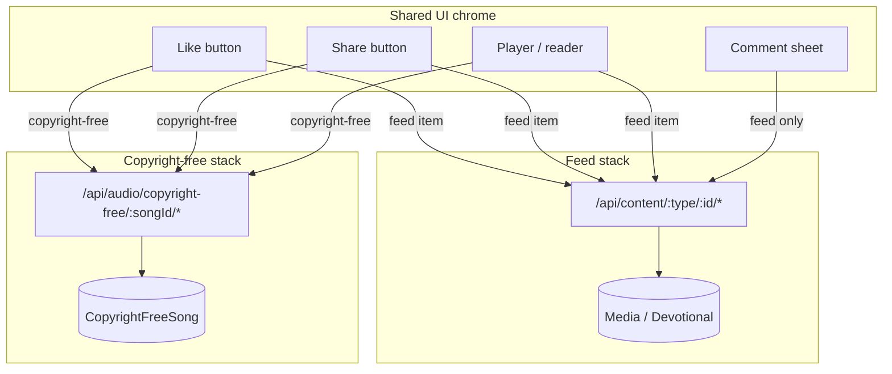

# Frontend Engagement Guide

How to wire **likes, views, shares, and comments** into the Jevah UI.  
This doc is written for mobile/web clients integrating with the backend.

**Related:** [ENGAGEMENT.md](./ENGAGEMENT.md) (API reference) · [WEBSOCKETS.md](./WEBSOCKETS.md) (realtime)

---

## 1. Two separate engagement stacks

The app has **two products** that look similar in the UI but use different APIs and data stores.

| | Feed content | Copyright-free music |
|---|---|---|
| **What** | Videos, feed audio, ebooks, podcasts, merch, devotionals | Curated royalty-free song library |
| **Collection** | `Media`, `Devotional`, etc. | `CopyrightFreeSong` |
| **Base path** | `/api/content/*` | `/api/audio/copyright-free/*` |
| **Comments** | Yes (feed + devotionals) | **No** |
| **Batch metadata** | `POST /api/content/batch-metadata` | Fetch per song (`GET …/:songId`) |
| **View auth** | Optional (anonymous with `deviceId` / `sessionId`) | **Required** |
| **Like storage** | `Like` + Redis fast path | `CopyrightFreeSongInteraction.hasLiked` |



**Rule:** If the screen is the copyright-free music player/library, never call `/api/content/*`. If it is the main feed or detail page for user-uploaded content, never call `/api/audio/copyright-free/*`.

---

## 2. Recommended UI state model

Each content card or detail screen should hold a single **engagement state** object:

```ts
type EngagementState = {
  contentId: string;
  contentType: "media" | "ebook" | "podcast" | "devotional" | "copyright_free_song";

  // Counts (display on icons)
  likeCount: number;
  viewCount: number;
  shareCount: number;
  commentCount: number;
  saveCount?: number; // copyright-free only

  // Current user (filled when authenticated)
  liked: boolean;
  viewed: boolean;
  shared: boolean;
  saved: boolean;

  // UI flags
  likePending: boolean;
  sharePending: boolean;
};
```

### Hydration strategy

| Screen | How to load initial state |
|--------|---------------------------|
| **Feed list** (many items) | `POST /api/content/batch-metadata` with `items: [{ contentType, contentId }, …]` |
| **Single feed detail** | `GET /api/content/:contentType/:contentId/metadata` |
| **Copyright-free song** | `GET /api/audio/copyright-free/:songId` (counts on song object) |
| **After login** | Re-fetch metadata or batch-metadata so `userInteraction` populates |

Batch metadata body (canonical):

```json
{
  "items": [
    { "contentType": "media", "contentId": "507f1f77bcf86cd799439011" },
    { "contentType": "ebook", "contentId": "507f1f77bcf86cd799439012" }
  ]
}
```

Batch response item shape:

```json
{
  "id": "507f1f77bcf86cd799439011",
  "likes": 10,
  "saves": 2,
  "shares": 1,
  "views": 42,
  "comments": 5,
  "userInteraction": {
    "liked": true,
    "saved": false,
    "shared": false,
    "viewed": true
  }
}
```

Use `ebook` / `podcast` in batch `contentType` when that is how the feed item is typed; the backend normalizes them to `media` internally for likes/views.

---

## 3. Like / Unlike

### 3a. Feed content (video, audio, ebook, podcast, merch)

**Endpoint:** `POST /api/content/:contentType/:contentId/like`  
**Auth:** Required  
**Rate limit:** 10 req/min per user

**Response:**

```json
{
  "success": true,
  "message": "Content liked",
  "data": { "liked": true, "likeCount": 11 }
}
```

`liked` is the **new** state after toggle (same endpoint for like and unlike).

#### UI pattern (optimistic update)

1. User taps heart → flip `liked` and adjust `likeCount` immediately.
2. Set `likePending = true`; debounce rapid taps (300–500 ms) or ignore while pending.
3. `POST` like endpoint.
4. On success → replace local state with `data.liked` and `data.likeCount`.
5. On failure → revert optimistic state; show toast.
6. On `401` → open login, revert state.

```ts
async function toggleFeedLike(contentType: string, contentId: string, state: EngagementState) {
  const prev = { liked: state.liked, likeCount: state.likeCount };
  state.liked = !state.liked;
  state.likeCount += state.liked ? 1 : -1;

  try {
    const res = await api.post(`/api/content/${contentType}/${contentId}/like`);
    state.liked = res.data.liked;
    state.likeCount = res.data.likeCount;
  } catch {
    state.liked = prev.liked;
    state.likeCount = prev.likeCount;
  }
}
```

#### Content type in URL

| Feed item | Use in URL |
|-----------|------------|
| Video | `media` |
| Feed audio / music upload | `media` |
| Ebook | `ebook` (or `media`) |
| Podcast | `podcast` (or `media`) |
| Merch | `merch` |
| Devotional like | `POST /api/devotionals/:id/like` (not `/api/content`) |

### 3b. Copyright-free music

**Endpoint:** `POST /api/audio/copyright-free/:songId/like`  
**Auth:** Required

**Response** (richer than feed — includes view count):

```json
{
  "success": true,
  "data": {
    "liked": true,
    "likeCount": 11,
    "viewCount": 42,
    "listenCount": 0
  }
}
```

- `viewCount` is normalized: backend enforces `viewCount >= likeCount`.
- `listenCount` is always `0` today (reserved).
- No Redis fast path; response is authoritative from DB.

Use the same optimistic pattern as feed, but call the copyright-free endpoint and update `viewCount` from the response if shown in the player chrome.

### 3c. Realtime like updates (other users)

Join the content room when the detail view or player mounts:

```ts
// Feed video/audio/ebook
socket.emit("join-content", { contentId: mediaId, contentType: "media" });

// Copyright-free song
socket.emit("join-content", { contentId: songId, contentType: "audio" });
```

Listen for:

| Stack | Events | Payload highlights |
|-------|--------|-------------------|
| Feed | `like-updated`, `content-like-update` | `contentId`, `likeCount`, `userLiked` |
| Feed (socket-initiated) | `content-reaction`, `count-update` | `liked`, `likeCount`, full counts |
| Copyright-free | `copyright-free-song-interaction-updated` | `songId`, `liked`, `likeCount`, `viewCount` |

**Important:** Always persist likes via **HTTP POST**. Sockets are for receiving other users' updates, not as the sole write path.

When applying socket updates, skip overwriting if `likePending` is true for the current user (avoid flicker from your own action).

---

## 4. Share

### 4a. Feed content

**Endpoint:** `POST /api/content/:contentType/:contentId/share`  
**Auth:** Required  
**Body (optional):** `{ "platform": "whatsapp" }`

**Response:**

```json
{
  "success": true,
  "data": { "shared": true, "shareCount": 5, "platform": "whatsapp" }
}
```

#### UI flow

1. User taps Share → open native share sheet / platform picker.
2. After the user completes the share action (or picks a platform), call the API.
3. Increment `shareCount` in UI from response.
4. Optionally fetch share URLs from `GET /api/interactions/media/:mediaId/share-urls` for pre-built links.

Share is **record-on-action**: the backend increments count when you POST. Do not POST on sheet open alone — wait until share is committed.

### 4b. Copyright-free music

**Endpoint:** `POST /api/audio/copyright-free/:songId/share`  
**Auth:** Required

**Response:**

```json
{
  "success": true,
  "data": { "shareCount": 3, "likeCount": 10, "viewCount": 42 }
}
```

Update all three counts if your player bar displays them.

---

## 5. View tracking

Views power the “plays / views” counter and should be driven by the **media player or reader**, not by list scroll alone.

### 5a. Feed content

**Endpoint:** `POST /api/content/:contentType/:contentId/view`  
**Auth:** Optional — anonymous views need `deviceId` or `sessionId` in body

**Body:**

```json
{
  "durationMs": 5000,
  "progressPct": 30,
  "isComplete": false,
  "source": "feed",
  "sessionId": "uuid",
  "deviceId": "uuid"
}
```

`progressPct` accepts `0–100` or `0–1`.

**Response:**

```json
{
  "success": true,
  "data": { "viewCount": 43, "hasViewed": true, "counted": true }
}
```

- `counted: false` → threshold not met or deduped; **do not** bump UI count.
- `counted: true` → set `viewCount` from response.

#### Qualification thresholds

| Kind | Counts when |
|------|-------------|
| Video | ≥ 3 s **or** ≥ 25% progress **or** complete |
| Audio / podcast | ≥ 10 s **or** ≥ 20% progress **or** complete |
| Ebook / devotional | ≥ 10 s **or** ≥ 10% progress **or** complete |

**Dedupe:** 1 counted view per user/device/session per content per **hour**.

#### Player integration

```ts
// Pseudocode — call on pause, unmount, or every 10–15 s while playing
function maybeRecordView(player: Player, contentType: string, contentId: string) {
  if (player.hasReportedView) return;

  api.post(`/api/content/${contentType}/${contentId}/view`, {
    durationMs: player.currentTimeMs,
    progressPct: player.progressPct,
    isComplete: player.isComplete,
    source: "feed",
    sessionId: getOrCreateSessionId(),
    deviceId: getDeviceId(),
  }).then(res => {
    if (res.data.counted) {
      player.hasReportedView = true;
      engagement.viewCount = res.data.viewCount;
    }
  });
}
```

Feed realtime: `view-updated`, `content:viewCountUpdated` (global broadcast). Prefer HTTP response for the acting user.

### 5b. Copyright-free music

**Endpoint:** `POST /api/audio/copyright-free/:songId/view`  
**Auth:** **Required**

**Body:**

```json
{ "durationMs": 4000, "progressPct": 30, "isComplete": false }
```

**Threshold:** ≥ 3 s **or** ≥ 25% progress **or** complete  
**Dedupe:** **One view per user per song (lifetime)**

**Response:**

```json
{
  "success": true,
  "data": { "viewCount": 43, "hasViewed": true }
}
```

Also listen for `copyright-free-song-interaction-updated` on room `content:audio:{songId}`.

**Deprecated:** `POST …/playback/track` — use `/view` only.

---

## 6. Comments (feed only)

Comments apply to **feed media** and **devotionals** only.  
Copyright-free songs have **no** comment API — hide the comment icon on that player.

### Supported content types

| URL `contentType` | Works for |
|-------------------|-----------|
| `media` | Video, feed audio, ebooks, podcasts (stored in Media) |
| `devotional` | Devotionals |

Use `media` in the path for ebooks/podcasts even if the feed tags them as `ebook` / `podcast`.

### 6a. List comments

`GET /api/content/:contentType/:contentId/comments?page=1&limit=20&sortBy=newest`

`sortBy`: `newest` | `oldest` | `top`

**Response:**

```json
{
  "success": true,
  "data": {
    "comments": [/* Comment */],
    "total": 25,
    "totalComments": 25,
    "hasMore": true,
    "page": 1,
    "limit": 20
  }
}
```

**Comment object:**

```json
{
  "id": "...",
  "_id": "...",
  "content": "Great message!",
  "comment": "Great message!",
  "authorId": "...",
  "userId": "...",
  "user": {
    "id": "...",
    "firstName": "Jane",
    "lastName": "Doe",
    "avatar": "https://..."
  },
  "createdAt": "2026-07-13T12:00:00.000Z",
  "likesCount": 2,
  "likes": 2,
  "replyCount": 1,
  "parentCommentId": null,
  "replies": [/* nested Comment */],
  "isLiked": false
}
```

`content` and `comment` are duplicates for backward compatibility — bind UI to `content`.

Supports `ETag` / `304` caching — send `If-None-Match` on refresh to save bandwidth.

### 6b. Add comment

`POST /api/content/:contentType/:contentId/comment`  
**Auth:** Required · **Rate limit:** 5 req/min

**Body:**

```json
{
  "content": "My comment text",
  "parentCommentId": "optional-for-replies"
}
```

**Response:** `201` with `data` = formatted comment (same shape as list).

#### UI flow

1. Append comment optimistically **or** show loading on send button.
2. On `201`, prepend to list (or append reply under parent).
3. Increment `commentCount` on the parent content card.
4. Clear input; scroll to new comment.

Replies: pass `parentCommentId` of the top-level comment. Load more replies via  
`GET /api/content/comments/:commentId/replies?page=1&limit=20`.

### 6c. Edit comment

`PATCH /api/content/comments/:commentId`  
**Auth:** Required (owner only)

**Body:** `{ "content": "Updated text" }`

**Response:** `200` with `data` = updated comment.

UI: inline edit mode → save → replace item in list by `id`. Show “edited” label client-side if desired (backend does not flag edits).

### 6d. Delete comment

`DELETE /api/content/comments/:commentId`  
**Auth:** Required (owner only)

**Response:** `{ "success": true, "message": "Comment removed successfully" }`

UI: remove from list; decrement `commentCount`; if reply, decrement parent's `replyCount`.

Legacy alias: `DELETE /api/interactions/comments/:commentId` (same handler).

### 6e. Like a comment

`POST /api/interactions/comments/:commentId/reaction`  
**Body:** `{ "reactionType": "like" }` (default)

**Response:**

```json
{
  "success": true,
  "data": { "liked": true, "totalLikes": 3 }
}
```

Toggle behavior — same endpoint for like/unlike on comments.

### 6f. Report comment

`POST /api/content/comments/:commentId/report`  
**Body:** `{ "reason": "spam", "description": "optional" }`

Reasons: `inappropriate_content`, `non_gospel_content`, `explicit_language`, `violence`, `sexual_content`, `blasphemy`, `spam`, `copyright`, `other`

UI: report sheet → single report per user per comment. Handle `400` “already reported” gracefully.

### 6g. Comment realtime

When the comment thread is open:

```ts
socket.emit("join-content", { contentId: mediaId, contentType: "media" });
socket.on("content-comment", (payload) => { /* prepend if not own */ });
socket.on("count-update", ({ commentCount }) => { /* update badge */ });
```

HTTP add remains the write path for the current user's comments. Merge socket events only for **other** users (compare `user.id`).

---

## 7. Putting it together — screen recipes

### Feed card (list)

```
Mount → batch-metadata for visible IDs
Render → icons from EngagementState
Tap like → POST .../like (optimistic)
Tap share → native share → POST .../share
Tap comment → navigate to detail / open sheet
Player in card → POST .../view when threshold met (muted autoplay cards)
```

### Feed detail / fullscreen player

```
Mount → GET metadata + join-content socket room
Hydrate → counts + userInteraction
Like / share → same as card
Player → periodic view POSTs until counted: true
Comments sheet → GET comments, POST/PATCH/DELETE as above
Unmount → leave-content
```

### Copyright-free player

```
Mount → GET /api/audio/copyright-free/:songId
       → join-content { contentType: "audio" }
Hide comment UI
Like → POST .../like
Share → POST .../share
Player → POST .../view (auth required)
Listen → copyright-free-song-interaction-updated
```

---

## 8. Error handling

| Status | Meaning | UI action |
|--------|---------|-----------|
| `401` | Not logged in | Prompt login; revert optimistic state |
| `400` | Bad id / validation | Toast; revert |
| `404` | Content deleted | Remove card / show unavailable |
| `429` | Rate limited | Toast “Slow down”; re-enable after cooldown |
| `500` | Server error | Revert optimistic; optional retry |

Engagement endpoints fail **softly** for sockets (request still succeeds if WS emit fails).

---

## 9. SDK helpers

Package: `packages/jevah-js-sdk`

| Method | Use |
|--------|-----|
| `toggleContentLike(contentType, contentId)` | Feed like |
| `recordContentView(contentType, contentId, viewData)` | Feed view |
| `shareContent(contentType, contentId, shareData)` | Feed share |
| `getBatchContentMetadata(ids, contentType)` | Feed list hydration |
| `getContentMetadata(contentType, contentId)` | Detail hydration |
| `addComment` / `getComments` / `editComment` / `deleteComment` | Comments |

Copyright-free methods are not yet first-class in the SDK — call `/api/audio/copyright-free/:songId/*` directly or extend the SDK.

---

## 10. Common mistakes

| Mistake | Fix |
|---------|-----|
| Liking copyright-free via `/api/content/media/:id/like` | Use `/api/audio/copyright-free/:songId/like` |
| Querying `Media` for copyright-free counts | Use song API / copyright-free endpoints |
| Batch metadata for copyright-free songs | Per-song GET only |
| Showing comments on copyright-free player | Hide — not supported |
| Relying only on sockets for likes | Always POST HTTP first |
| Incrementing view count when `counted: false` | Check `data.counted` |
| Using `contentIds` array in batch-metadata | Use `items: [{ contentType, contentId }]` |
| Double-toggling like on fast tap | Debounce or `likePending` guard |

---

## 11. Quick reference

### Feed

| Action | Method | Path |
|--------|--------|------|
| Like / unlike | POST | `/api/content/:contentType/:contentId/like` |
| Share | POST | `/api/content/:contentType/:contentId/share` |
| View | POST | `/api/content/:contentType/:contentId/view` |
| Metadata | GET | `/api/content/:contentType/:contentId/metadata` |
| Batch metadata | POST | `/api/content/batch-metadata` |
| Add comment | POST | `/api/content/:contentType/:contentId/comment` |
| List comments | GET | `/api/content/:contentType/:contentId/comments` |
| Edit comment | PATCH | `/api/content/comments/:commentId` |
| Delete comment | DELETE | `/api/content/comments/:commentId` |
| Report comment | POST | `/api/content/comments/:commentId/report` |
| Comment like | POST | `/api/interactions/comments/:commentId/reaction` |

### Copyright-free

| Action | Method | Path |
|--------|--------|------|
| Like / unlike | POST | `/api/audio/copyright-free/:songId/like` |
| Share | POST | `/api/audio/copyright-free/:songId/share` |
| View | POST | `/api/audio/copyright-free/:songId/view` |
| Get song + counts | GET | `/api/audio/copyright-free/:songId` |

---

## Staged media upload (preferred)

Prefer direct-to-storage uploads so large Nigerian mobile videos are not buffered in the API process.

```text
1. Client computes SHA-256 of the file bytes
2. POST /api/media/upload/intent  (body includes checksumSha256) → mediaId, stagingKey, uploadUrl
3. PUT object to storage (private staging key)
4. POST /api/media/upload/:mediaId/finalize → HTTP 202, job queued
5. Worker: verify hash → reuse prior decision OR sample evidence across full timeline → moderate → transcode
6. Poll GET /api/media/upload/:mediaId/status  (or listen to socket progress)
7. When status ready + moderationStatus approved → appear in feed/search
```

Legacy `POST /api/media/upload` (multipart) remains for older clients but has a lower buffered-video ceiling. Content under review is **private** (not a hard 403 without a reviewable ID).

Public surfaces require `moderationStatus === "approved"` and `isHidden !== true`.
