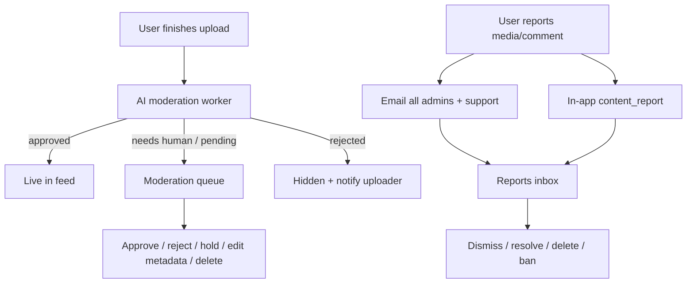
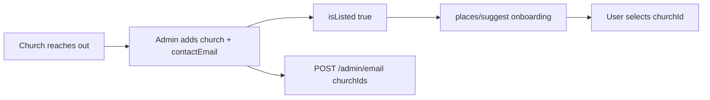

# Frontend Moderation & Admin Console — Implementation Guide

**Audience:** Jevah web admin frontend (Vite/React)  
**Companion docs:** [ADMIN.md](./ADMIN.md) · [FRONTEND_ADMIN.md](./FRONTEND_ADMIN.md)  
**Last updated:** 20 July 2026

This document is the **source of truth** for wiring content moderation, reports, and related admin actions. It matches the live backend in `jevahapp-backend`. Feed this to the frontend team so UI and API stay aligned.

---

## 1. What the admin console must do

Admins manage **two lanes** of content safety, plus users/catalog:

| Lane | Meaning | Primary screen |
|------|---------|----------------|
| **Upload moderation queue** | New uploads AI held or pending human decision | `/admin/moderation` |
| **Reports inbox** | Users flagged live/published content or comments | `/admin/reports` |
| **Users / email / activity** | Ban, verify, message, audit | Already mostly built |
| **Churches / audio library** | Catalog CRUD | Optional P2 screens |



---

## 2. Auth (unchanged — keep what you built)

```http
Authorization: Bearer <accessToken>
```

- Login: `POST /api/auth/login` → require `user.role === "admin"`
- Boot: `GET /api/auth/me`
- Base URL: set `VITE_API_URL` to the API root **including** `/api`  
  Example: `https://api.jevahapp.com/api` or local `http://localhost:4000/api`  
  (Backend default port in docker-compose is **4000**, not 3001.)

---

## 3. Media card shape (use everywhere)

Queue, moderation detail, report detail, and status PATCH now return a **stable card**:

```ts
type AdminMediaPreview = {
  mediaUrl: string | null;      // play / open this
  thumbnailUrl: string | null;
  playbackUrl: string | null;
  hlsUrl: string | null;
  signed: boolean;              // if true, refresh before expiresInSeconds
  expiresInSeconds: number | null;
};

type AdminMediaCard = {
  id: string;
  title: string;
  description: string | null;
  contentType: string;
  category: string | null;
  moderationStatus: "pending" | "approved" | "rejected" | "under_review";
  publicationState: "draft" | "staged" | "publishing" | "live" | "tombstoned" | null;
  isHidden: boolean;
  reportCount: number;
  likeCount: number;
  viewCount: number;
  adminModerationNotes: string | null;
  moderationResult: {
    isApproved: boolean;
    confidence: number | null;
    reason: string | null;
    flags: string[];
    requiresReview: boolean;
    moderatedAt: string | null;
  } | null;
  processing: {
    status: string | null;
    error: string | null;
    progress: number | null;
    updatedAt: string | null;
  } | null;
  preview: AdminMediaPreview;
  uploader: {
    id: string;
    firstName?: string;
    lastName?: string;
    email?: string;
    username?: string;
  } | null;
  createdAt: string;
  updatedAt: string;
};
```

**UI rule:** Always play/display from `preview.mediaUrl` / `preview.thumbnailUrl`. If `preview.signed === true`, call `POST /api/admin/media/:id/preview-refresh` before expiry (default ~3600s) or on player error (re-`GET` detail also works).

```http
POST /api/admin/media/:id/preview-refresh
Authorization: Bearer <adminToken>
```

```json
{
  "success": true,
  "data": {
    "preview": { "mediaUrl": "…", "thumbnailUrl": "…", "signed": true, "expiresInSeconds": 3600 },
    "media": { /* full AdminMediaCard */ }
  }
}
```

---

## 4. Screen: Moderation queue (uploads)

### 4.1 List

```http
GET /api/admin/moderation/queue?page=1&limit=20
GET /api/admin/moderation/queue?status=under_review&page=1
```

| Query | Default | Notes |
|-------|---------|--------|
| `status` | omit → `pending` **and** `under_review` | Or pass one of `pending`, `under_review`, `approved`, `rejected` |
| `page` / `limit` | 1 / 20 (max 100) | |

**Response:**

```json
{
  "success": true,
  "data": {
    "media": [ /* AdminMediaCard[] */ ],
    "items": [ /* same array — alias */ ],
    "pagination": { "page": 1, "limit": 20, "total": 12, "pages": 1 }
  }
}
```

### 4.2 Detail pane (open when row selected)

```http
GET /api/admin/moderation/:mediaId
```

```json
{
  "success": true,
  "data": {
    "media": { /* AdminMediaCard */ },
    "moderationCase": {
      "id": "…",
      "decision": {
        "isApproved": false,
        "confidence": 0.62,
        "reason": "…",
        "flags": ["sexual_content"],
        "requiresReview": true
      },
      "scores": {},
      "modalityCoverage": { "title": true, "frames": true, "frameCount": 8 },
      "languageCandidates": ["en", "yo"],
      "provider": "google-gemini",
      "modelId": "…",
      "promptVersion": "v2-ng-multilingual",
      "policyVersion": "christian-platform-v2",
      "reviewerOutcome": null,
      "createdAt": "…"
    }
  }
}
```

`moderationCase` may be `null` (legacy uploads / no AI run yet). Still show `media.moderationResult` if present.

### 4.3 Full AI case history

```http
GET /api/admin/moderation/:mediaId/case
```

```json
{
  "success": true,
  "data": {
    "mediaId": "…",
    "cases": [ /* newest first, up to 20 */ ]
  }
}
```

Use for an “AI evidence” expandable panel (confidence, flags, modality coverage, languages, usage).

### 4.4 Approve / reject / hold

```http
PATCH /api/admin/moderation/:mediaId/status
Content-Type: application/json

{
  "status": "approved",
  "adminNotes": "Looks fine — gospel teaching"
}
```

| `status` | Effect |
|----------|--------|
| `approved` | Publish path: may enqueue processing if still staged; else set live + visible |
| `rejected` | Hide / tombstone; email uploader (Resend) |
| `under_review` | Keep held for later |

**Response** includes updated `AdminMediaCard` in `data`. Optimistic UI: remove from queue on approve/reject, toast on error.

### 4.5 Edit metadata (title / description / notes)

**New.** Does **not** replace the media file.

```http
PATCH /api/admin/media/:mediaId
Content-Type: application/json

{
  "title": "Corrected sermon title",
  "description": "…",
  "adminModerationNotes": "Fixed typo before approve",
  "category": "teachings"
}
```

At least one field required. Returns updated `AdminMediaCard`.

### 4.6 Hard delete

```http
DELETE /api/admin/media/:mediaId
```

Deletes files + resolves pending reports on that media. Confirm modal required.

### 4.7 Suggested queue UX

```
┌─ Filters: All pending | under_review | rejected ─┐
├──────────────┬────────────────────────────────────┤
│ List         │ Preview (video/audio/ebook thumb) │
│ title, type  │ AI flags · confidence · reason    │
│ uploader     │ processing.status                 │
│ age          │ Notes [____________]              │
│              │ [Approve] [Hold] [Reject]         │
│              │ [Edit metadata] [Delete] [Ban]    │
└──────────────┴────────────────────────────────────┘
```

Keyboard (optional polish): `A` approve, `R` reject, `J`/`K` next/prev.

---

## 5. Screen: Reports inbox

### 5.1 List (you already call this)

```http
GET /api/admin/reports?type=all&status=pending&page=1&limit=20
GET /api/admin/reports?type=media&status=pending
GET /api/admin/reports?type=comment&status=pending
```

`status=all` returns every status. Default `status` is `pending`.

Each item has `kind: "media" | "comment"`.

### 5.2 Media report detail — **wire this next (P1)**

```http
GET /api/admin/reports/media/:reportId
```

**Response (shaped):**

```json
{
  "success": true,
  "data": {
    "report": {
      "id": "…",
      "status": "pending",
      "reason": "spam",
      "description": "…",
      "adminNotes": null,
      "createdAt": "…",
      "reporter": { "id": "…", "firstName": "…", "email": "…" },
      "reviewedBy": null
    },
    "media": { /* AdminMediaCard with preview URLs */ },
    "uploader": { "id": "…", "email": "…" },
    "siblingReports": [ /* other reports on same media */ ],
    "actions": {
      "review": ["reviewed", "resolved", "dismissed"],
      "deleteContent": true,
      "banUploader": true
    }
  }
}
```

**Play the reported item** via `data.media.preview.mediaUrl`.

### 5.3 Review / dismiss / resolve

```http
POST /api/admin/reports/media/:reportId/review
Content-Type: application/json

{
  "status": "resolved",
  "adminNotes": "Violates community guidelines"
}
```

| Status | Meaning |
|--------|---------|
| `dismissed` | False alarm — report closed only |
| `reviewed` | Seen / noted — report closed only |
| `resolved` | Hide media (`rejected` + `isHidden`), notify uploader (`content_moderation`) |

### 5.4 Delete reported content forever

```http
DELETE /api/admin/reports/media/:mediaId/content
```

Note: path uses **mediaId**, not reportId.

### 5.5 Comment reports

```http
GET  /api/admin/reports/comments?page=1&limit=20&hidden=false
POST /api/admin/reports/comments/:commentId/hide
POST /api/admin/reports/comments/:commentId/unhide
POST /api/admin/reports/comments/:commentId/dismiss
```

Hide body (optional): `{ "reason": "harassment" }`.

### 5.6 Ban uploader from report detail

```http
POST /api/admin/users/:uploaderId/ban
{
  "reason": "Repeated policy violations",
  "duration": 7,
  "revokeSessions": true
}
```

`duration` = days (omit for permanent). `revokeSessions` defaults to **true** (kills refresh tokens + Socket.IO; next API call gets `403` Account is banned).

### 5.6b Bulk actions

```http
POST /api/admin/moderation/bulk
{
  "mediaIds": ["…"],
  "status": "approved" | "rejected" | "under_review",
  "adminNotes": "optional"
}
```

```http
POST /api/admin/reports/media/bulk-review
{
  "reportIds": ["…"],
  "status": "dismissed" | "reviewed" | "resolved",
  "adminNotes": "…"
}
```

Both return `{ success, data: { updated: string[], failed: [{ id, message }] } }` (max 50). Same side effects as single-item actions.

### 5.7 Emails & notifications (backend — no UI work)

When a user reports **media**:

1. Resend email to **every** `role: "admin"` user email + `support@jevahapp.com`
2. In-app notification type `content_report` for each admin
3. At **3+** reports on same media → also moderation alert email; media often forced `under_review`

Comment reports also notify admins (`content_report`).

Dashboard should still **poll** reports/analytics every 30–60s (no report websocket yet).

---

## 6. Overview KPIs (already wired)

| Endpoint | Use |
|----------|-----|
| `GET /api/admin/dashboard/analytics` | `moderation.pending`, `reports.pending`, `reports.comments`, … |
| `GET /api/admin/dashboard/feed` | Activity stream |
| `GET /api/admin/media/recent` | Latest uploads |
| `GET /api/admin/moderation/queue?limit=5` | On-review preview |
| `GET /api/admin/users/presence?status=online` | Online strip |

Deep-link KPIs → `/admin/reports`, `/admin/moderation`, `/admin/users`.

---

## 7. Users, email, activity (already mostly done)

| Method | Path | Job |
|--------|------|-----|
| GET | `/api/admin/users` | List + filters |
| GET | `/api/admin/users/presence` | Online/offline |
| GET | `/api/admin/users/:id` | Detail |
| POST | `/api/admin/users/:id/ban` | Ban |
| POST | `/api/admin/users/:id/unban` | Unban |
| PATCH | `/api/admin/users/:id/role` | Role |
| PATCH | `/api/admin/users/:id/verification` | Creator/vendor/church/artist flags |
| POST | `/api/admin/email` | Compose email |
| GET | `/api/admin/activity` | Audit |

Verification body example:

```json
{
  "isVerifiedCreator": true,
  "isVerifiedArtist": true
}
```

---

## 8. Churches catalog (onboarding + outreach)

**Why this exists:** During mobile onboarding, users search churches via `GET /api/places/suggest`. That search reads the **Church** collection. Admins add churches here so new partners who reach out can appear in the picker — and can be emailed from the dashboard.



### Admin screen: `/admin/churches`

| Action | Endpoint |
|--------|----------|
| List / search | `GET /api/admin/churches?search=&isListed=&isVerified=&source=outreach&hasContactEmail=true` |
| Add church | `POST /api/admin/churches` |
| Edit | `PATCH /api/admin/churches/:id` |
| Verify badge | `PATCH /api/admin/churches/:id/verification` `{ "isVerified": true }` |
| Unlist (hide from onboarding without delete) | `PATCH …` `{ "isListed": false }` |
| Delete | `DELETE /api/admin/churches/:id` |
| Email selected | `POST /api/admin/email` `{ "churchIds": ["…"], "subject", "message" }` |
| Add branch | `POST /api/churches/:id/branches` |

### Create body (copy-paste)

```json
{
  "name": "Living Faith Church",
  "state": "Oyo",
  "lga": "Ibadan North",
  "address": "Km 1, …",
  "denomination": "Pentecostal",
  "contactName": "Admin Office",
  "contactEmail": "info@church.org",
  "contactPhone": "+2348012345678",
  "website": "https://church.org",
  "source": "outreach",
  "isVerified": false,
  "isListed": true,
  "adminNotes": "WhatsApp request 20 Jul 2026"
}
```

**Required:** `name`, `state`.  
**Recommended for outreach:** `contactEmail` (needed to email them later).

### Email churches from Compose / Churches page

```http
POST /api/admin/email
Authorization: Bearer <adminToken>
Content-Type: application/json

{
  "churchIds": ["64fabc…", "64fdef…"],
  "subject": "You're on Jevah",
  "message": "Hi — your church is now selectable during Jevah onboarding."
}
```

Response includes `churchesEmailed` and `churchesSkippedNoEmail` (no `contactEmail` on record).

You can still pass `userIds` / `emails` in the same request.

### Mobile onboarding (already using suggest)

1. User types in church picker → `GET /api/places/suggest?q=…` (only `isListed !== false`)
2. On complete profile, send:

```json
{
  "churchId": "<id from suggest result>",
  "churchBranchId": "<optional branch id>",
  "hasConsentedToPrivacyPolicy": true
}
```

Route: `POST /api/auth/complete-profile` (also mirrored under users where applicable). Backend accepts `churchId` / `churchBranchId`.

### UI checklist for ChurchesPage

- [ ] Table: name, state, contactEmail, source, isListed, isVerified
- [ ] “Add church” form (esp. contact fields + source=`outreach`)
- [ ] Toggle listed / verified
- [ ] Multi-select → “Email churches”
- [ ] Empty contact warning before send
- [ ] Deep link from Overview optional KPI later

---

## 8b. Copyright-free audio (P2)

| Method | Path | Auth |
|--------|------|------|
| GET | `/api/audio/copyright-free` | Public list |
| GET | `/api/audio/copyright-free/:songId` | Public |
| POST | `/api/audio/copyright-free` | Admin — create |
| PUT | `/api/audio/copyright-free/:songId` | Admin — update |
| DELETE | `/api/audio/copyright-free/:songId` | Admin — delete |

Create body: `{ title, singer, fileUrl, thumbnailUrl?, category?, duration? }`.

---

## 9. Capability checklist (backend ✅ vs frontend)

| Capability | Backend | Frontend target |
|------------|---------|-----------------|
| See uploads pending review | ✅ queue + recent + feed | ✅ keep |
| Preview private/staged media | ✅ signed `preview.*` | Use `preview.mediaUrl` |
| Manual approve / reject / hold | ✅ | ✅ keep |
| Edit title/description/notes | ✅ `PATCH /api/admin/media/:id` | **Add** |
| View AI evidence | ✅ detail + `/case` | **Add** panel |
| Hard delete media | ✅ | ✅ keep |
| List reports | ✅ | ✅ keep |
| Open report + play media | ✅ shaped detail | **Wire detail + player** |
| Dismiss / resolve / delete / ban | ✅ | **Wire actions (P1)** |
| Comment hide/unhide/dismiss | ✅ | **Wire** |
| Admin emails on report | ✅ automatic | No UI |
| Ban / verify / email users | ✅ | ✅ keep |
| List + manage churches / email them | ✅ | **Add ChurchesPage** |
| Audio library CRUD | ✅ | **Add page (P2)** |
| Socket presence | ✅ if connected | Optional P3 |
| CMS replace video file | ❌ not offered | Don’t build |

---

## 10. Exact `adminApi.ts` methods to add/finish

```ts
// Moderation
getModerationQueue(params)
getModerationMedia(mediaId)          // GET /admin/moderation/:id
getModerationCase(mediaId)           // GET /admin/moderation/:id/case
updateModerationStatus(mediaId, { status, adminNotes? })
updateMediaMetadata(mediaId, { title?, description?, adminModerationNotes?, category? })
deleteMedia(mediaId)                 // DELETE /admin/media/:id

// Reports — finish wiring
getReports(params)                   // existing
getMediaReportDetail(reportId)       // GET /admin/reports/media/:reportId
reviewMediaReport(reportId, { status, adminNotes? })
deleteReportedMedia(mediaId)         // DELETE /admin/reports/media/:mediaId/content
listCommentReports(params)
hideComment(commentId, { reason? })
unhideComment(commentId)
dismissCommentReports(commentId)

// Churches
listChurches(params)                 // GET /admin/churches
verifyChurch(id, { isVerified })
```

Prefer these paths over legacy `/api/media/reports/*`.

---

## 11. Error handling

| Status | UI |
|--------|-----|
| 401 | Clear session → `/login` |
| 403 | Not admin / banned |
| 404 | Toast + remove row from list |
| 400 | Show `message` |
| 500 | Retry button |

Double-submit: disable Approve/Reject/Resolve while request in flight.

---

## 12. QA script (end-to-end)

1. Create admin user in Mongo (`role: "admin"`, real email).
2. Point `VITE_API_URL` at API; confirm CORS for Vite origin.
3. Login → Overview KPIs load.
4. Upload from mobile → appears in Recent / Queue (after intent+finalize).
5. Approve / reject from Moderation; confirm feed visibility / uploader email on reject.
6. Another user reports media → admin inbox email + Reports list.
7. Open report detail → preview plays → Resolve → media hidden; Dismiss on another → stays.
8. Ban uploader from report detail.
9. Edit metadata via `PATCH /admin/media/:id` then approve.
10. Open AI case panel on an AI-held item.

---

## 13. Priority for frontend (updated)

| Priority | Work |
|----------|------|
| **P0** | Real `VITE_API_URL` + CORS smoke (login → Overview → Moderation) |
| **P1** | Reports: detail drawer + review/resolve/dismiss/delete/ban + comment actions |
| **P1b** | Moderation: AI evidence panel + metadata edit + use `preview.mediaUrl` |
| **P2** | Churches page (add/edit/email outreach) + Audio library page |
| **P3** | Socket.IO presence |
| **P4** | Hardening (confirm modals, empty states, refresh signed URLs) |

---

## 14. What changed on the backend (July 20, 2026)

- Moderation queue returns shaped cards + preview URLs (public or R2 signed).
- `GET /api/admin/moderation/:id` — detail + latest AI case summary.
- `GET /api/admin/moderation/:id/case` — full ModerationCase history.
- `PATCH /api/admin/media/:id` — admin metadata edit.
- `PATCH /api/admin/moderation/:id/status` returns updated card; writes `reviewerOutcome` on ModerationCase.
- Report detail returns shaped report + `AdminMediaCard` + `actions` hints.
- `GET /api/admin/churches` — admin church list.
- `adminModerationNotes` persisted on Media schema.

---

**Bottom line for frontend:** Backend can fully support a review console. Finish **Reports actions** and adopt the new **preview / detail / case / metadata** endpoints so admins can see, play, decide, edit labels, and escalate — without guessing shapes.
