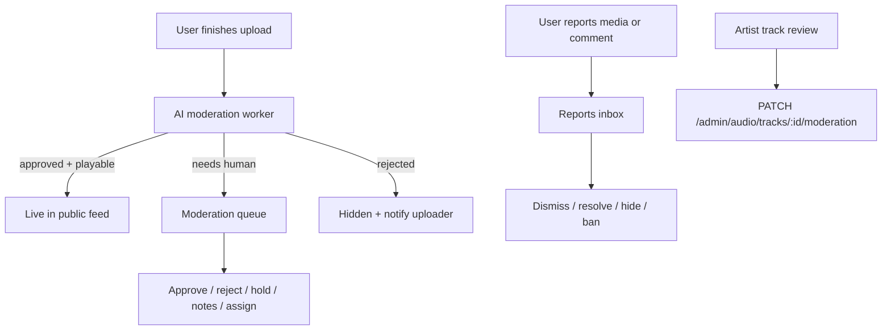

# Frontend — complete moderation system consume guide

**Audience:** Jevah admin web (Vite/React)  
**Last updated:** 26 September 2026  
**This file is the source of truth** for wiring the moderation console. Do not invent a second handoff.

Companions (do **not** mix their endpoints into this UI unless noted):

| Doc | Use |
|-----|-----|
| [FRONTEND_ADMIN.md](./FRONTEND_ADMIN.md) | Login, dashboard KPIs, users, churches, email |
| [ADMIN.md](./ADMIN.md) | Full `/api/admin/*` catalog |
| [FRONTEND_CREATOR_NOTIFICATIONS_HANDOFF.md](./FRONTEND_CREATOR_NOTIFICATIONS_HANDOFF.md) | What the **uploader** sees after you decide |
| [FRONTEND_AUDIO_TRACKS.md](./FRONTEND_AUDIO_TRACKS.md) | Artist-track catalog (sibling lane below) |
| [FRONTEND_VIDEO_DURATION_HANDOFF.md](./FRONTEND_VIDEO_DURATION_HANDOFF.md) | Why MP4 beats HLS for HTML5 players |
| [R2_CORS.md](./R2_CORS.md) | Bucket CORS so the admin origin can `GET` playback |

---

## 0. What you are building

Admins review **two content-safety lanes** plus one **music-track** sibling. All three write the same Mongo collections the public app reads. There is no separate “admin media” store.


```mermaid
flowchart TD
  Upload[User finishes upload] --> Worker[AI moderation worker]
  Worker -->|approved + playable| Live[Live in public feed]
  Worker -->|needs human| Queue[Moderation queue]
  Worker -->|rejected| Hidden[Hidden + notify uploader]

  User[User reports media or comment] --> Inbox[Reports inbox]
  Inbox --> Act[Dismiss / resolve / hide / ban]

  Queue --> Human[Approve / reject / hold / notes / assign]
  TrackQ[Artist track review] --> TrackAct[PATCH /admin/audio/tracks/:id/moderation]
```

| Lane | Meaning | Primary screen | Consume these APIs |
|------|---------|----------------|--------------------|
| **Upload queue** | New videos / sermons / ebooks / music Media held by AI or pending human | `/admin/moderation` | `/api/admin/moderation/*` + `/api/admin/media/*` |
| **Reports inbox** | Users flagged **already-published** media or comments | `/admin/reports` | `/api/admin/reports/*` |
| **Track review** | Copyright-free / artist tracks (different collection) | `/admin/audio` or a tab on moderation | `/api/admin/audio/tracks/:id/moderation` |

Admin role does **not** unlock playback. The browser loads the file from Cloudflare R2 / CDN with no Bearer token. If the URL is wrong, expired, or HLS, the player fails even for `role: "admin"`.

---

## 1. Auth (every call)

```http
Authorization: Bearer <accessToken>
```

- Login: `POST /api/auth/login` → enter dashboard only if `user.role === "admin"`.
- Boot: `GET /api/auth/me`.
- Base URL: `VITE_API_URL` must include `/api`  
  Examples: `https://api.jevahapp.com/api` · local `http://localhost:4000/api`.

Clerk `isSignedIn` alone is not enough. See [FRONTEND_ADMIN.md](./FRONTEND_ADMIN.md).

---

## 2. What to consume vs what not to consume

### Always consume (canonical)

| Need | Consume |
|------|---------|
| Queue list | `GET /api/admin/moderation/queue` → `data.media` or `data.items` (same array) |
| One item in the review pane | `GET /api/admin/moderation/:id` → `data.media` + `data.moderationCase` |
| Play / thumbnail | `data.media.preview` only — see §4 |
| Decide | `PATCH /api/admin/moderation/:id/status` |
| Bulk decide | `POST /api/admin/moderation/bulk` |
| Refresh a dead player URL | `POST /api/admin/media/:id/preview-refresh` |
| AI evidence | `GET /api/admin/moderation/:id/case` |
| Assign reviewer | `PATCH /api/admin/moderation/:id/assign` |
| Internal notes thread | `GET` / `POST /api/admin/moderation/:id/notes` |
| Re-run AI | `POST /api/admin/moderation/:id/rerun` |
| Edit labels (not the file) | `PATCH /api/admin/media/:id` |
| Hard-delete the file | `DELETE /api/admin/media/:id` |
| Find any media | `GET /api/admin/media/search` |
| Latest uploads widget | `GET /api/admin/media/recent` |
| Reports list | `GET /api/admin/reports` |
| Media report drawer | `GET /api/admin/reports/media/:reportId` |
| Close a media report | `POST /api/admin/reports/media/:reportId/review` |
| Comment report drawer | `GET /api/admin/reports/comments/:commentId` |
| Hide / unhide / dismiss comment | `POST /api/admin/reports/comments/:commentId/{hide\|unhide\|dismiss}` |
| Track approve / reject | `PATCH /api/admin/audio/tracks/:id/moderation` |
| Ban uploader | `POST /api/admin/users/:id/ban` |

### Do not consume for this UI

| Tempting field / route | Why not |
|------------------------|---------|
| `GET /api/media/:id` or public feed cards | Hidden / pending / staged items are filtered out. Admin will see 404 or an empty feed. |
| Raw `fileUrl` / `playbackUrl` / `hlsUrl` / `videoUrl` from a public serializer | Those are for the **app**. Admin cards already wrap the right URL in `preview`. |
| Stored signed URLs you cached yesterday | They die in ~1 hour. Re-fetch detail or call `preview-refresh`. |
| `/api/media/reports/*` | Legacy. Use `/api/admin/reports/*`. |
| `POST /api/admin/reports/:id/:action` | Next-compat alias only. Prefer `POST …/reports/media/:reportId/review`. |
| `POST /api/admin/moderation/backfill` | Ops heal. Not a daily moderator button. |
| Passing `fileUrl` of an ebook/PDF into `<video>` | `contentType` `ebook` / `books` is a document. Open in a new tab / PDF viewer. |
| Putting `preview.hlsUrl` (`.m3u8`) into a plain `<video src>` | Chrome/Edge cannot play HLS without hls.js. This is the usual “format isn’t supported” toast. |
| Sending the admin JWT to R2 | Playback is a naked `GET` of `preview.mediaUrl`. Auth never travels with the file. |

---

## 3. Canonical card (use this type everywhere)

Queue, detail, search, recent, status PATCH, assign, metadata PATCH, and report-detail `data.media` all return this shape.

```ts
type ModerationStatus = "pending" | "approved" | "rejected" | "under_review";
type PublicationState = "draft" | "staged" | "publishing" | "live" | "tombstoned";

type AdminMediaPreview = {
  mediaUrl: string | null;       // convenience URL — see §4 before you play it
  thumbnailUrl: string | null;
  playbackUrl: string | null;    // progressive MP4 when transcode finished
  hlsUrl: string | null;         // .m3u8 — HTML5 video cannot play this alone
  signed: boolean;               // true only when backend just minted a short-lived GET
  expiresInSeconds: number | null; // 3600 when signed, else null
};

type AdminMediaCard = {
  id: string;
  title: string;
  description: string | null;
  contentType: string;           // videos | sermon | music | audio | ebook | books | live | …
  category: string | null;
  moderationStatus: ModerationStatus;
  publicationState: PublicationState | null;
  isHidden: boolean;
  reportCount: number;
  likeCount: number;
  viewCount: number;
  adminModerationNotes: string | null;
  assignee: {
    id: string;
    firstName?: string;
    lastName?: string;
    email?: string;
  } | null;
  moderationResult: {
    isApproved: boolean;
    confidence: number | null;
    reason: string | null;
    flags: string[];
    requiresReview: boolean;
    moderatedAt: string | null;
  } | null;
  processing: {
    status: string | null;       // pending | queued | processing | ready | failed | …
    error: string | null;
    progress: number | null;
    updatedAt: string | null;
  } | null;
  preview: AdminMediaPreview;
  uploader: {
    id: string;
    firstName?: string;
    lastName?: string;
    email?: string;
    username?: string;
  } | null;
  createdAt: string;
  updatedAt: string;
};
```

List responses also alias the array as `items` so either key works:

```json
{
  "success": true,
  "data": {
    "media": [ /* AdminMediaCard[] */ ],
    "items": [ /* same array */ ],
    "pagination": { "page": 1, "limit": 20, "total": 12, "pages": 1 }
  }
}
```

---

## 4. How to play media in the admin dashboard

This is the contract that fixes “The signed link may have expired, or the format isn’t supported.”

That toast is the **browser player**, not an auth gate. Admin role never signs the file request.

### 4.1 Pick the URL (do this in one helper)

```ts
function isHttp(u?: string | null) {
  return typeof u === "string" && /^https?:\/\//i.test(u);
}

function isHls(u?: string | null) {
  return typeof u === "string" && /\.m3u8(\?|$)/i.test(u);
}

function isSigned(u?: string | null) {
  return typeof u === "string" && /X-Amz-Algorithm|X-Amz-Signature/i.test(u);
}

function looksLikeEbook(contentType: string) {
  return /ebook|books/i.test(contentType);
}

function looksLikeAudio(contentType: string, url?: string | null) {
  return /^(music|audio|podcast)$/i.test(contentType)
    || /\.(mp3|m4a|wav|aac|ogg|flac)(\?|$)/i.test(url || "");
}

/** What the admin player should actually load. */
function resolveAdminPlayable(card: AdminMediaCard): {
  kind: "video" | "audio" | "document" | "none";
  url: string | null;
  useHlsJs: boolean;
  mustRefresh: boolean;
} {
  const p = card.preview;
  const mp4 = [p.playbackUrl, p.mediaUrl].find((u) => isHttp(u) && !isHls(u)) || null;
  const hls = isHttp(p.hlsUrl) ? p.hlsUrl : isHls(p.mediaUrl) ? p.mediaUrl : null;

  if (looksLikeEbook(card.contentType)) {
    return { kind: "document", url: mp4 || p.mediaUrl, useHlsJs: false, mustRefresh: false };
  }
  if (looksLikeAudio(card.contentType, mp4 || p.mediaUrl)) {
    return { kind: "audio", url: mp4 || p.mediaUrl, useHlsJs: false, mustRefresh: p.signed };
  }

  // Prefer MP4. Only use HLS if you ship hls.js.
  if (mp4) {
    return { kind: "video", url: mp4, useHlsJs: false, mustRefresh: p.signed || isSigned(mp4) };
  }
  if (hls) {
    return { kind: "video", url: hls, useHlsJs: true, mustRefresh: p.signed || isSigned(hls) };
  }
  return { kind: "none", url: null, useHlsJs: false, mustRefresh: true };
}
```

**Why this helper exists:** today `preview.mediaUrl` is filled as `hlsUrl || playbackUrl || fileUrl`. If an `.m3u8` exists, `mediaUrl` is HLS even when an MP4 is sitting on `preview.playbackUrl`. A plain `<video src={preview.mediaUrl}>` then shows “format isn’t supported.”

### 4.2 Player rules

1. **Videos / sermons:** `<video controls playsInline preload="metadata" src={mp4}>`.  
   Use `hls.js` (or Safari native HLS) **only** when there is no MP4.
2. **Music / audio:** `<audio controls src={url}>`. Do not use the video element.
3. **Ebook / books:** “Open file” button → `window.open(url)`. Never a video player.
4. **Poster:** `preview.thumbnailUrl` on the video element. If that 404s, hide the poster; do not block play.
5. **Processing:** if `processing.status` is `queued` / `processing` / `pending` **and** there is no HTTP MP4, show “Still processing — preview may fail” instead of a broken player.
6. **CORS:** the admin origin (`https://admin.jevahapp.com` and local Vite) must be on the R2 bucket CORS allow-list (`GET` + `HEAD`). See [R2_CORS.md](./R2_CORS.md). A CORS failure also surfaces as a generic player error.

### 4.3 Signed-link refresh

`preview.signed === true` means the backend just minted a ~3600s R2 GET.

```http
POST /api/admin/media/:id/preview-refresh
Authorization: Bearer <adminToken>
```

```json
{
  "success": true,
  "data": {
    "preview": { "mediaUrl": "…", "thumbnailUrl": "…", "signed": true, "expiresInSeconds": 3600 },
    "media": { /* full AdminMediaCard */ }
  }
}
```

Call this:

- ~60s before `expiresInSeconds` if the pane stays open.
- On any player `error` (expired signature, 403, decode fail) — then retry **once**.
- After a tab has been backgrounded for more than ~50 minutes.

`GET /api/admin/moderation/:id` also rebuilds `preview`. Use that when you need the whole card anyway.

**Catch:** if the **stored** `fileUrl` itself still contains `X-Amz-Signature` and `preview.signed === false`, refresh will return the same dead URL (backend treats any `https://` as public). Treat `X-Amz-*` on the play URL as expired regardless of the flag, and surface “File URL is a stale signed link — re-upload or ask backend to heal this row” after one failed refresh.

### 4.4 Diagnose a dead player in 15 seconds

Open the failing card and log `preview`:

| What you see | Meaning | Fix in UI |
|--------------|---------|-----------|
| `mediaUrl` ends with `.m3u8` and `playbackUrl` is an `.mp4` | Player was given HLS | Play `playbackUrl` |
| URL has `X-Amz-Signature` and `signed` is `false` | Stored expired link | `preview-refresh`; if still signed-stale, show heal message |
| `signed: true`, URL is `.mov` / `.mkv` / no extension | Staging master, not transcoded | Disable play; show processing |
| `mediaUrl` is null | Nothing to play yet | Show processing / missing file |
| URL is a public `.mp4` and still fails | File missing, wrong MIME, or R2 CORS | Open the URL in a new tab. 403 = storage. Playable in tab but not in `<video>` = CORS |

---

## 5. Screen: Moderation queue

### 5.1 List

```http
GET /api/admin/moderation/queue?page=1&limit=20
GET /api/admin/moderation/queue?status=under_review&page=1
```

| Query | Default | Notes |
|-------|---------|--------|
| `status` | omit → `pending` **and** `under_review` | Or one of `pending`, `under_review`, `approved`, `rejected` |
| `page` / `limit` | 1 / 20 (max 100) | |

### 5.2 Detail pane (open when a row is selected)

```http
GET /api/admin/moderation/:mediaId
```

```json
{
  "success": true,
  "data": {
    "media": { /* AdminMediaCard */ },
    "moderationCase": {
      "id": "…",
      "decision": {
        "isApproved": false,
        "confidence": 0.62,
        "reason": "…",
        "flags": ["sexual_content"],
        "requiresReview": true
      },
      "scores": {},
      "modalityCoverage": { "title": true, "frames": true, "frameCount": 8 },
      "languageCandidates": ["en", "yo"],
      "provider": "google-gemini",
      "modelId": "…",
      "promptVersion": "v2-ng-multilingual",
      "policyVersion": "christian-platform-v2",
      "reviewerOutcome": null,
      "createdAt": "…"
    }
  }
}
```

`moderationCase` may be `null` (legacy / no AI run). Still render `media.moderationResult` if present.

### 5.3 Full AI case history

```http
GET /api/admin/moderation/:mediaId/case
```

```json
{
  "success": true,
  "data": {
    "mediaId": "…",
    "cases": [ /* newest first, up to 20 */ ]
  }
}
```

Use for an “AI evidence” panel: confidence, flags, modality coverage, languages, usage.

### 5.4 Approve / reject / hold

```http
PATCH /api/admin/moderation/:mediaId/status
Content-Type: application/json

{
  "status": "approved",
  "adminNotes": "Looks fine — gospel teaching"
}
```

| `status` you send | Effect on the public app |
|-------------------|--------------------------|
| `approved` | If an `http(s)` play URL already exists → `isHidden=false`, `publicationState=live` (feed-visible). If still only a staging key → stays hidden + `publishing` until the worker finishes. Read `data.publishable` and `message`. |
| `rejected` | `isHidden=true`, `publicationState=tombstoned`. Uploader gets `media_rejected` (in-app + email). |
| `under_review` | Held. Hidden + `staged`. Uploader gets `media_under_review`. |
| `pending` | Same hold as under_review (re-queue). |
| `flagged` | **Alias** → stored as `under_review`. |

**Response** is the updated `AdminMediaCard` plus:

```json
{
  "success": true,
  "message": "Moderation status updated — content is live on the public feed",
  "data": {
    "id": "…",
    "moderationStatus": "approved",
    "publishable": true,
    "isHidden": false,
    "publicationState": "live",
    "preview": { }
  }
}
```

Optimistic UI: remove from the default queue on approve/reject; toast `message` on success; put the row back on error.

Public feed visibility (what mobile/web users see):

`moderationStatus === "approved"` **and** `isHidden !== true` **and** `publicationState` not in `draft | staged | publishing | tombstoned`.

Approving on a gospel **title alone** does not force-publish a secular video. AI still needs visual/transcript corroboration. If you approve and it stays `under_review` after a later worker pass, that is expected (JEV-003).

### 5.5 Bulk decide

```http
POST /api/admin/moderation/bulk
{
  "mediaIds": ["…"],
  "status": "approved" | "rejected" | "under_review" | "pending" | "flagged",
  "adminNotes": "optional"
}
```

Max **50** IDs. Partial success:

```json
{ "success": true, "data": { "updated": ["id1"], "failed": [{ "id": "id2", "message": "Media not found" }] } }
```

Same side effects as the single PATCH. Confirm modal required.

### 5.6 Assign a reviewer

```http
PATCH /api/admin/moderation/:mediaId/assign
{ "assigneeId": "<adminUserId>" }
```

Pass `assigneeId: null` (or `""`) to unassign. `assigneeId` must be a user with `role: "admin"`. Returns the updated `AdminMediaCard` (`assignee` populated).

### 5.7 Internal notes thread

```http
GET  /api/admin/moderation/:mediaId/notes
POST /api/admin/moderation/:mediaId/notes
{ "body": "Checked frames 3–8 — hold for pastor review" }
```

GET:

```json
{
  "success": true,
  "data": {
    "notes": [
      { "body": "…", "authorId": "…", "authorEmail": "ada@jevahapp.com", "createdAt": "…" }
    ],
    "legacyNote": "older single-field note or null"
  }
}
```

`body` is required, max 2000 chars. This is **not** the same as `adminNotes` on the status PATCH (that one is stored on `adminModerationNotes` and can be emailed with the decision).

### 5.8 Re-run AI

```http
POST /api/admin/moderation/:mediaId/rerun
{ "reason": "Title changed — scan again" }
```

Sets status back to `pending`, enqueues the worker. Response:

```json
{
  "success": true,
  "data": {
    "mediaId": "…",
    "jobId": "rerun-…",
    "moderationStatus": "pending",
    "reason": "…"
  }
}
```

`400` + `code: "NO_MEDIA_SOURCE"` = nothing to scan. Poll detail until `moderationCase` gets a new `createdAt`.

### 5.9 Edit metadata (does not replace the file)

```http
PATCH /api/admin/media/:mediaId
{
  "title": "Corrected sermon title",
  "description": "…",
  "adminModerationNotes": "Fixed typo before approve",
  "category": "teachings",
  "speaker": "…",
  "church": "…",
  "scripture": "John 3:16",
  "series": "…",
  "language": "en",
  "mediaType": "video"
}
```

At least one field required. `title` 1–200, `description` ≤ 5000, notes ≤ 2000. `mediaType` is only `audio` | `video`. Returns `AdminMediaCard`.

There is **no** “replace video file” API. Do not build a CMS replace control.

### 5.10 Hard delete

```http
DELETE /api/admin/media/:mediaId
```

Deletes storage objects and resolves pending reports on that media. Confirm modal required.

### 5.11 Search / recent (same card)

```http
GET /api/admin/media/search?q=sermon&contentType=videos&moderationStatus=under_review&page=1&limit=20
GET /api/admin/media/recent?moderationStatus=under_review
```

Search also accepts `uploaderId`, `from`, `to`. Response: `{ items, media, pagination }`.

### 5.12 Suggested queue UX

```
┌─ Filters: Needs review | under_review | approved | rejected ─┐
├──────────────┬──────────────────────────────────────────────┤
│ List         │ Player (MP4 / audio / Open PDF)              │
│ title, type  │ AI flags · confidence · reason               │
│ uploader     │ processing.status                            │
│ assignee     │ Notes thread                                 │
│ age          │ [Approve] [Hold] [Reject]                    │
│              │ [Assign] [Re-run AI] [Edit] [Delete] [Ban]   │
└──────────────┴──────────────────────────────────────────────┘
```

Keyboard polish: `A` approve, `R` reject, `J`/`K` next/prev. Disable action buttons while a request is in flight.

---

## 6. Screen: Reports inbox

Reports are a **different** collection from the upload queue. A live video that users flag appears here even if `moderationStatus` is already `approved`.

### 6.1 List

```http
GET /api/admin/reports?type=all&status=pending&page=1&limit=20
GET /api/admin/reports?type=media&status=pending
GET /api/admin/reports?type=comment&status=pending
```

| Query | Values | Default |
|-------|--------|---------|
| `type` | `all` \| `media` \| `comment` | `all` |
| `status` | `pending` \| `reviewed` \| `resolved` \| `dismissed` \| `all` | `pending` |
| `hidden` | `true` \| `false` | comment lane only |

Each row has `kind: "media" | "comment"`.

Media row (list is **summary only** — no playable `preview` here):

```ts
{
  kind: "media",
  id: string,                 // reportId — use this for the detail GET
  status: string,
  reason: string,
  description?: string,
  media: {
    id: string,               // mediaId
    title: string,
    contentType: string,
    thumbnailUrl?: string,
    moderationStatus?: string,
    isHidden?: boolean,
    reportCount?: number
  } | null,
  reporter: { id, firstName, lastName, username, email } | null,
  createdAt: string
}
```

Comment row:

```ts
{
  kind: "comment",
  id: string,                 // commentId
  status: "hidden" | "reported",
  reportCount: number,
  content: string,
  author: object,
  media: object | null,
  isHidden: boolean,
  createdAt: string
}
```

`type=all` also returns `data.counts: { media, comments }`.

**Play happens on detail, not on the list.** List `media.thumbnailUrl` is optional and may be stale.

### 6.2 Media report detail — play here

```http
GET /api/admin/reports/media/:reportId
```

```json
{
  "success": true,
  "data": {
    "report": {
      "id": "…",
      "status": "pending",
      "reason": "spam",
      "description": "…",
      "adminNotes": null,
      "reviewedAt": null,
      "createdAt": "…",
      "reporter": { "id": "…", "firstName": "…", "email": "…" },
      "reviewedBy": null
    },
    "media": { /* AdminMediaCard with preview — play this */ },
    "uploader": { "id": "…", "email": "…" },
    "siblingReports": [ /* other reports on the same media */ ],
    "sla": { "createdAt": "…", "ageHours": 26.5, "slaHours": 24, "breached": true },
    "history": [{ "at": "…", "actorEmail": "…", "action": "created" }],
    "actions": {
      "review": ["reviewed", "resolved", "dismissed"],
      "deleteContent": true,
      "banUploader": true
    }
  }
}
```

Play with the same helper as §4 against `data.media`.

### 6.3 Close a media report

```http
POST /api/admin/reports/media/:reportId/review
{
  "status": "resolved",
  "adminNotes": "Violates community guidelines"
}
```

| Status | Meaning |
|--------|---------|
| `dismissed` | False alarm. Report closed. Media stays as-is. |
| `reviewed` | Seen / noted. Report closed. Media stays as-is. |
| `resolved` | Hide media (`rejected` + `isHidden`), notify uploader (`content_moderation`). |

### 6.4 Bulk close reports

```http
POST /api/admin/reports/media/bulk-review
{
  "reportIds": ["…"],
  "status": "dismissed" | "reviewed" | "resolved",
  "adminNotes": "…"
}
```

Max 50. Same `{ updated, failed }` shape as moderation bulk.

### 6.5 Delete the reported file

```http
DELETE /api/admin/reports/media/:mediaId/content
```

Path uses **mediaId**, not reportId. Confirm modal.

### 6.6 Ban the uploader from the drawer

```http
POST /api/admin/users/:uploaderId/ban
{
  "reason": "Repeated policy violations",
  "duration": 7,
  "revokeSessions": true
}
```

`duration` = days (omit for permanent). `revokeSessions` defaults to **true**. Next API call from that user is `403` “Account is banned”.

### 6.7 Comment reports

```http
GET  /api/admin/reports/comments?page=1&limit=20&hidden=false
GET  /api/admin/reports/comments/:commentId
POST /api/admin/reports/comments/:commentId/hide
POST /api/admin/reports/comments/:commentId/unhide
POST /api/admin/reports/comments/:commentId/dismiss
```

Hide body (optional): `{ "reason": "harassment" }`.

Comment detail:

```json
{
  "success": true,
  "data": {
    "comment": {
      "id": "…",
      "content": "full body",
      "bodyPreview": "…",
      "reportCount": 3,
      "isHidden": false,
      "hiddenReason": null,
      "imageUrl": null,
      "author": { },
      "media": { "id": "…", "title": "…", "contentType": "videos" },
      "createdAt": "…"
    },
    "actions": { "hide": true, "unhide": true, "dismiss": true }
  }
}
```

Do **not** put `comment.imageUrl` into the video player.

### 6.8 Emails & notifications (backend — no extra UI)

When a user reports **media**:

1. Resend email to every `role: "admin"` + `support@jevahapp.com`
2. In-app `content_report` for each admin
3. At **3+** reports on the same media → extra alert email; media is often forced `under_review`

The **uploader** gets `media_reported` / `media_rejected` / `media_approved` / `media_under_review`. See [FRONTEND_CREATOR_NOTIFICATIONS_HANDOFF.md](./FRONTEND_CREATOR_NOTIFICATIONS_HANDOFF.md).

Poll reports + analytics every 30–60s. There is no report websocket.

---

## 7. Artist-track moderation (sibling lane)

Tracks live in `CopyrightFreeSong`, not `Media`. Do not send a track id to `/api/admin/moderation/:id`.

```http
GET   /api/admin/audio/tracks?moderationStatus=under_review
PATCH /api/admin/audio/tracks/:id/moderation
{
  "status": "approved" | "rejected" | "under_review",
  "reason": "optional"
}
```

- `approved` + `visibility: "published"` → appears on the public Artists shelf (`publishedAt` set if missing).
- `rejected` → `visibility` forced to `draft`.
- Play the track from the track card’s `playbackUrl` / `fileUrl` (MP3). Same “no HLS in `<video>`” rule; use `<audio>`.

Full catalog/upload: [FRONTEND_AUDIO_TRACKS.md](./FRONTEND_AUDIO_TRACKS.md).

---

## 8. Overview widgets that belong on this console

| Endpoint | Use |
|----------|-----|
| `GET /api/admin/dashboard/analytics` | `moderation.pending`, `reports.pending`, `reports.comments` |
| `GET /api/admin/dashboard/feed` | Activity stream |
| `GET /api/admin/media/recent` | Latest uploads |
| `GET /api/admin/moderation/queue?limit=5` | “On review” strip |
| `GET /api/admin/users/presence?status=online` | Optional online strip |

Deep-link KPIs to `/admin/reports` and `/admin/moderation`. Users / churches / marketing email stay in [FRONTEND_ADMIN.md](./FRONTEND_ADMIN.md).

---

## 9. `adminApi.ts` methods to implement

```ts
// Queue
getModerationQueue(params)                          // GET  /admin/moderation/queue
getModerationMedia(mediaId)                         // GET  /admin/moderation/:id
getModerationCase(mediaId)                          // GET  /admin/moderation/:id/case
updateModerationStatus(mediaId, { status, adminNotes? })
bulkUpdateModeration(payload)                       // POST /admin/moderation/bulk
assignModeration(mediaId, { assigneeId })
getModerationNotes(mediaId)
addModerationNote(mediaId, { body })
rerunModeration(mediaId, { reason? })

// Media helpers
refreshMediaPreview(mediaId)                        // POST /admin/media/:id/preview-refresh
updateMediaMetadata(mediaId, fields)                // PATCH /admin/media/:id
deleteMedia(mediaId)                                // DELETE /admin/media/:id
searchAdminMedia(params)                            // GET  /admin/media/search
getRecentMedia(params)                              // GET  /admin/media/recent

// Reports
getReports(params)                                  // GET  /admin/reports
getMediaReportDetail(reportId)                      // GET  /admin/reports/media/:reportId
reviewMediaReport(reportId, { status, adminNotes? })
bulkReviewMediaReports(payload)
deleteReportedMedia(mediaId)                        // DELETE /admin/reports/media/:mediaId/content
listCommentReports(params)
getCommentReportDetail(commentId)
hideComment(commentId, { reason? })
unhideComment(commentId)
dismissCommentReports(commentId)

// Track sibling
listAdminTracks(params)
reviewTrackModeration(trackId, { status, reason? })

// Escalation
banUser(userId, { reason, duration?, revokeSessions? })
```

---

## 10. Error handling

| Status | `code` (when present) | UI |
|--------|------------------------|-----|
| 401 | — | Clear session → `/login` |
| 403 | — | Not admin / banned |
| 404 | — | Toast + drop the row from the list |
| 400 | `NO_MEDIA_SOURCE` | Cannot re-run AI — no file |
| 400 | — | Show `message` |
| 500 | — | Retry button |

Disable Approve / Reject / Resolve / Hide while the request is in flight.

---

## 11. QA script

1. Admin login (`role: "admin"`) → Overview KPIs load.
2. Upload a short MP4 from mobile → appears in Recent / Queue after finalize.
3. Open the row. Player uses **MP4** (`preview.playbackUrl` or non-HLS `mediaUrl`). Video plays.
4. If you only see `.m3u8` in `mediaUrl`, confirm the helper falls back to `playbackUrl` and plays.
5. Approve → `publishable: true` → item appears on the public feed.
6. Reject another → uploader email + `media_rejected` inbox item; feed hides it.
7. Report that live item from a second user → admin email + Reports list.
8. Open report detail → same player helper → Resolve → media hidden. Dismiss another → media stays.
9. Hide a reported comment; unhide; dismiss.
10. Assign yourself; add a note; re-run AI; wait for a new case.
11. Edit title via `PATCH /admin/media/:id` then approve.
12. Leave a signed preview open > 60 min → player errors → `preview-refresh` recovers **or** you show the stale-link message.
13. Open an ebook row → “Open file”, not `<video>`.
14. Open a track in under_review → `PATCH /admin/audio/tracks/:id/moderation`.

---

## 12. Capability checklist

| Capability | Backend | Frontend must |
|------------|---------|---------------|
| See uploads pending review | ✅ queue / recent / search | List + filters |
| Play private / staged / live media | ✅ `preview.*` | §4 helper — **MP4 first**, refresh on error |
| Approve / reject / hold | ✅ status PATCH | Optimistic + `publishable` toast |
| Bulk decide | ✅ | Confirm + partial-fail list |
| Assign reviewer | ✅ | Assignee chip |
| Notes thread | ✅ | Thread UI + legacy note |
| Re-run AI | ✅ | Button + poll detail |
| Edit title / description / notes | ✅ | Drawer; no file replace |
| AI evidence | ✅ detail + `/case` | Evidence panel |
| Hard delete | ✅ | Confirm modal |
| Reports list + play + resolve | ✅ | Detail drawer using `preview` |
| Comment hide / unhide / dismiss | ✅ | Wire actions |
| Ban uploader | ✅ | From report + queue |
| Track approve / reject | ✅ | Separate tab / page |
| Replace the video file | ❌ | Do not build |

---

**Bottom line:** consume `/api/admin/moderation/*`, `/api/admin/media/*`, and `/api/admin/reports/*`. Play from `preview`, but **never** blindly stuff `preview.mediaUrl` into `<video>` — prefer `preview.playbackUrl` (MP4), refresh signed URLs on error, and keep ebooks/audio out of the video element. Admin login does not make a bad or expired file URL playable.
